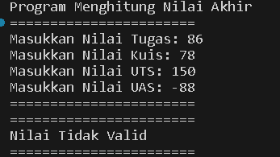

# LAPORAN PRAKTIKUM PERTEMUAN 1

- Nama: Muhammad Afif Al Ghifari
- Kelas: TI-1H
- NIM: 2341720168

## Praktikum Pemilihan

#### Hasil output jika lulus:

 

#### Hasil output jika tidak lulus:

 

#### Hasil output jika invalid

 

 

 

## Praktikum Perulangan

#### Hasil output program

 

## Praktikum Array
#### Hasil output program:
 
 

 

## Praktikum Fungsi
#### Hasil output pendapatan:
 
 

#### Hasil output stok toko:
 
 

 

# Tugas
## Tugas 1
#### Hasil output program:
 
 

 

## Tugas 2
#### Hasil output program:
 
 

 