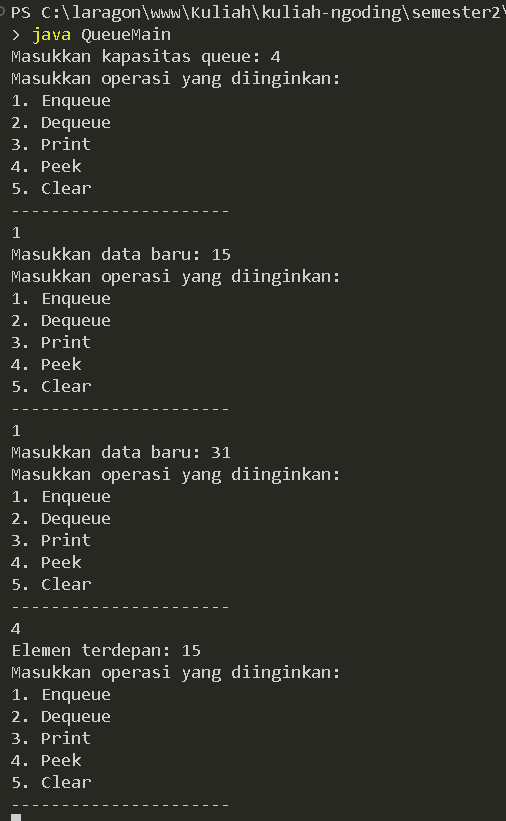
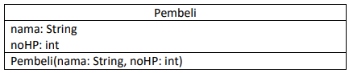
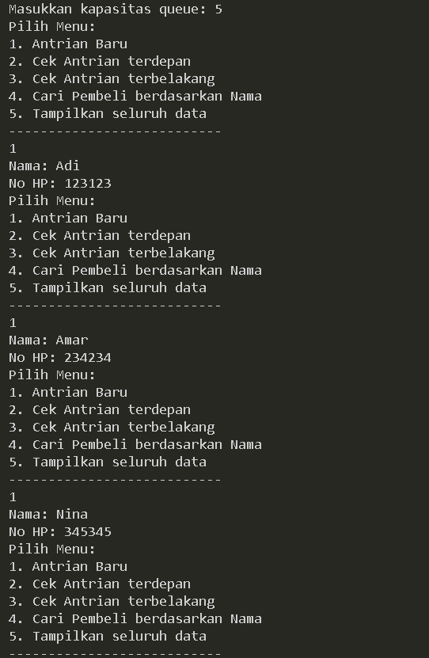

# LAPORAN PRAKTIKUM PERTMUAN 10

- Nama: Muhammad Afif Al Ghifari
- Kelas: TI-1H
- NIM: 2341720168

## 1. PERCOBAAN 1

### 1.1 Praktikum

```java
    //Queue.java

    public class Queue {
    int data[], front, rear, size, max;

    public Queue(int n) {
        max = n;
        data = new int[max];
        size = 0;
        front = rear = -1;
    }

    public boolean isEmpty() {
        if (size == 0) {
            return true;
        }
        return false;
    }

    public boolean isFull() {
        if (size == max) {
            return true;
        }
        return false;
    }

    public void peek() {
        if (!isEmpty()) {
            System.out.println("Elemen terdepan: " + data[front]);
        } else {
            System.out.println("Queue masih kosong");
        }
    }

    public void print() {
        if (isEmpty()) {
            System.out.println("Queue masih kosong");
        } else {
            int i = front;
            while (i != rear) {
                System.out.println(data[i] + " ");
                i = (i + 1) % max;
            }
            System.out.println(data[i] + " ");
            System.out.println("Jumlah elemen = " + size);
        }
    }

    public void clear(){
        if (!isEmpty()) {
            front = rear = -1;
            size = 0;
            System.out.println("Queue berhasil dikosongkan");
        } else {
            System.out.println("Queue masih kosong");
        }
    }

    public void Enqueue(int dt) {
        if (isFull()) {
            System.out.println("Queue sudah penuh");
        } else {
            if (isEmpty()) {
                front = rear = 0;
            } else {
                if (rear == max - 1) {
                    rear = 0;
                } else {
                    rear++;
                }
            }
            data[rear] = dt;
            size++;
        }
    }

    public int Dequeue() {
        int dt = 0;
        if (isEmpty()) {
            System.out.println("Queue masih kosong");
        } else {
            dt =  data[front];
            size--;
            if (isEmpty()) {
                front = rear = -1;
            } else {
                if (front == max - 1) {
                    front = 0;
                } else {
                    front++;
                }
            }
        }
        return dt;
    }
}


```

```java
    //QueueMain.java

    import java.util.Scanner;

public class QueueMain {
    public static void menu() {
        System.out.println("Masukkan operasi yang diinginkan: ");
        System.out.println("1. Enqueue");
        System.out.println("2. Dequeue");
        System.out.println("3. Print");
        System.out.println("4. Peek");
        System.out.println("5. Clear");
        System.out.println("----------------------");
    }

    public static void main(String[] args) {
        Scanner sc = new Scanner(System.in);
        Scanner sc2 = new Scanner(System.in);
        Scanner sc3 = new Scanner(System.in);

        System.out.print("Masukkan kapasitas queue: ");
        int n = sc.nextInt();

        Queue Q = new Queue(n);

        int pilih;

        do {
            menu();
            pilih = sc2.nextInt();

            switch (pilih) {
                case 1:
                    System.out.print("Masukkan data baru: ");
                    int dataMasuk = sc3.nextInt();
                    Q.Enqueue(dataMasuk);
                    break;
                case 2:
                    int dataKeluar = Q.Dequeue();
                    if (dataKeluar !=0) {
                        System.out.println("Data yang dikeluaran: " + dataKeluar);
                        break;
                    }
                case 3:
                    Q.print();
                    break;
                case 4:
                    Q.peek();
                    break;
                case 5:
                    Q.clear();
                    break;
            }
        } while (pilih == 1 || pilih == 2 || pilih == 3 || pilih == 4 || pilih == 5);
    }
}


```



#### Kode program dan output

### 1.2 Pertanyaan

1.  Pada konstruktor, mengapa nilai awal atribut front dan rear bernilai -1, sementara atribut size bernilai 0?

    #### Jawab:
        -1 merupakan nilai yang menandakan data awal front dan rear yang masih kosong, sedangkan size yang bernilai 0 berarti ukuran array saat itu. 

2.  Pada method Enqueue, jelaskan maksud dan kegunaan dari potongan kode berikut!

    ```java
        if (rear == max - 1) {
            rear = 0;
    ```

    #### Jawab:
        Ketika nilai rear yang sudah mencapai batas yaitu max - 1, maka nilai rear kembali menjadi 0. Sehingga data baru yang dimasukkan akan diletakkan di posisi 0.
        

3.  Pada method Dequeue, jelaskan maksud dan kegunaan dari potongan kode berikut!

    ```java
        if (front == max - 1) {
            front = 0;
    ```

    #### Jawab:
        Ketika nilai front yang sudah mencapai batas yaitu max - 1, maka nilai front kembali menjadi 0. Jikia ada data baru yang dimasukkan akan diletakkan ke posisi 0.

4.  Pada method print, mengapa pada proses perulangan variabel i tidak dimulai dari 0 (int i=0), melainkan int i=front?

    #### Jawab:
        Karena dalam queue, data terdepan atau yang paling awal letaknya tidak selalu pada indeks 0.

5.  Perhatikan kembali method print, jelaskan maksud dari potongan kode berikut!

    ```java
        i = (i + 1) % max;
    ```

    #### Jawab:
        Potongan kode i = (i + 1) % max; bertujuan untuk menggeser indeks i ke elemen berikutnya dalam array sirkular yang menyimpan elemen antrian.

6.  Tunjukkan potongan kode program yang merupakan queue overflow!

    #### Jawab:

    ```java
        public void Enqueue(int dt) {
        if (isFull()) {
            System.out.println("Queue sudah penuh");
    ```


7.  Pada saat terjadi queue overflow dan queue underflow, program tersebut tetap dapat berjalan dan hanya menampilkan teks informasi. Lakukan modifikasi program sehingga pada saat terjadi queue overflow dan queue underflow, program dihentikan!

    #### Jawab:
    
    ```java
        // QueueMain.java

        case 1:
            System.out.print("Masukkan data baru: ");
            int dataMasuk = sc3.nextInt();
            if (!Q.isFull()) {
                Q.Enqueue(dataMasuk);
            } else {
                System.out.println("Queue sudah penuh");
            }
            break;
        case 2:
            if (!Q.isEmpty()) {
                int dataKeluar = Q.Dequeue();
                if (dataKeluar !=0) {
                    System.out.println("Data yang dikeluaran: " + dataKeluar);
                    }    
            } else {
                System.out.println("Queue masih kosong");
            }
            break;
    ```
    
    

    #### Kode program dan output

    
<br>

## 2. PERCOBAAN 2

### 2.1 Praktikum 2

```java
    //Nasabah.java

    public class Nasabah {
    String norek, nama, alamat;
    int umur;
    double saldo;

    Nasabah(){

    }

    Nasabah(String norek, String nama, String alamat, int umur, double saldo) {
        this.norek = norek;
        this.nama = nama;
        this.alamat = alamat;
        this.umur = umur;
        this.saldo = saldo;
    }
}

```

```java
    //Queue.java

    public class Queue {
    Nasabah[] data;
    int front, rear, size, max;

    public Queue(int n) {
        max = n;
        data = new Nasabah[max];
        size = 0;
        front = rear = -1;
    }

    public boolean isEmpty() {
        if (size == 0) {
            return true;
        }
        return false;
    }

    public boolean isFull() {
        if (size == max) {
            return true;
        }
        return false;
    }

    public void peek() {
        if (!isEmpty()) {
            System.out.println("Elemen terdepan: " + data[front].norek + " " + data[front].nama + " "
                    + data[front].alamat + " " + data[front].umur + " " + data[front].saldo);
        } else {
            System.out.println("Queue masih kosong");
        }
    }

    public void print() {
        if (isEmpty()) {
            System.out.println("Queue masih kosong");
        } else {
            int i = front;
            while (i != rear) {
                System.out.println(data[i].norek + " " + data[i].nama + " "
                        + data[i].alamat + " " + data[i].umur + " " + data[i].saldo);
                i = (i + 1) % max;
            }
            System.out.println(data[i].norek + " " + data[i].nama + " "
                        + data[i].alamat + " " + data[i].umur + " " + data[i].saldo);
            System.out.println("Jumlah elemen = " + size);
        }
    }

    public void clear() {
        if (!isEmpty()) {
            front = rear = -1;
            size = 0;
            System.out.println("Queue berhasil dikosongkan");
        } else {
            System.out.println("Queue masih kosong");
        }
    }

    public void Enqueue(Nasabah dt) {
        if (isFull()) {
            System.out.println("Queue sudah penuh");
        } else {
            if (isEmpty()) {
                front = rear = 0;
            } else {
                if (rear == max - 1) {
                    rear = 0;
                } else {
                    rear++;
                }
            }
            data[rear] = dt;
            size++;
        }
    }

    public Nasabah Dequeue() {
        Nasabah dt = new Nasabah();
        if (isEmpty()) {
            System.out.println("Queue masih kosong");
        } else {
            dt = data[front];
            size--;
            if (isEmpty()) {
                front = rear = -1;
            } else {
                if (front == max - 1) {
                    front = 0;
                } else {
                    front++;
                }
            }
        }
        return dt;
    }
}

```

```java
    //QueueMain.java

    import java.util.Scanner;

public class QueueMain {
    public static void menu() {
        System.out.println("Pilih menu: ");
        System.out.println("1. Antrian baru");
        System.out.println("2. Antrian keluar");
        System.out.println("3. Cek antrian terdepan");
        System.out.println("4. Cek semua antrian");
        System.out.println("----------------------");
    }

    public static void main(String[] args) {
        Scanner sc = new Scanner(System.in);
        Scanner sc2 = new Scanner(System.in);
        Scanner sc3 = new Scanner(System.in);

        System.out.print("Masukkan kapasitas queue: ");
        int Jumlah = sc.nextInt();

        Queue antri = new Queue(Jumlah);

        int pilih;

        do {
            menu();
            pilih = sc2.nextInt();

            switch (pilih) {
                case 1:
                    System.out.print("No rekening: ");
                    sc3.nextLine();
                    String norek = sc3.nextLine();
                    System.out.print("nama: ");
                    sc3.nextLine();
                    String nama = sc3.nextLine();
                    System.out.print("Alamat: ");
                    sc3.nextLine();
                    String alamat = sc3.nextLine();
                    System.out.print("Umur: ");
                    sc3.nextLine();
                    int umur = sc3.nextInt();
                    System.out.print("Saldo: ");
                    double saldo = sc3.nextDouble();
                    Nasabah nb = new Nasabah(norek, nama, alamat, umur, saldo);
                    sc.nextLine();
                    antri.Enqueue(nb);
                    break;
                case 2:
                    Nasabah data = antri.Dequeue();
                    if (!"".equals(data.norek) && !"".equals(data.nama) && !"".equals(data.alamat) && data.umur != 0
                            && data.saldo != 0) {
                        System.out.println("Antrian yang keluar: " + data.norek + " " + data.nama + " " + data.alamat
                                + " " + data.umur + " " + data.saldo);
                        break;
                    }
                case 3:
                antri.peek();
                break;
                case 4:
                antri.print();
                    break;
            }
        } while (pilih == 1 || pilih == 2 || pilih == 3 || pilih == 4);
    }
}

```


#### Kode dan output program

### 2.2 Pertanyaan

1.  Pada class QueueMain, jelaskan fungsi IF pada potongan kode program berikut!

    ```java
        if (!"".equals(data.norek) && !"".equals(data.nama) && !"".equals(data.alamat) && data.umur != 0 && data.saldo != 0) {
            System.out.println("Antrian yang keluar: " + data.norek + " " + data.nama + " " + data.alamat + " " + data.umur + " " + data.saldo);
    ```

    #### jawab:
        Jika kondisi terpenuhi yaitu ketika semua nilai atribut dari objek data tidak kosong dan umur serta saldo tidak nol, maka program akan mencetak data nasabah. 

2.  Lakukan modifikasi program dengan menambahkan method baru bernama peekRear pada class Queue yang digunakan untuk mengecek antrian yang berada di posisi belakang! Tambahkan pula daftar menu 5. Cek Antrian paling belakang pada class QueueMain sehingga method peekRear dapat dipanggil!

    #### jawab:
    
    ```java
    // Queue.java

    //...
    public void peekRear() {
        if (!isEmpty()) {
            System.out.println("Elemen paling belakang: " + data[rear].norek + " " + data[rear].nama + " "
                    + data[rear].alamat + " " + data[rear].umur + " " + data[rear].saldo);
        } else {
            System.out.println("Queue masih kosong");
        }
    }
    //...

    ```

    ```java
    // QueueMain.java

    //...
        case 3:
            antri.peek();
            break;
        case 4:
            antri.peekRear();
            break;
        case 5:
            antri.print();
            break;
    //...
    ```

    

    #### Kode dan output program

<br >

## 3. TUGAS 

### 3.1 Soal

1. Buatlah program antrian untuk mengilustasikan pesanan disebuah warung. Ketika seorang pembeli akan mengantri, maka dia harus mendaftarkan nama, dan nomor HP seperti yang digambarkan pada Class diagram berikut:



Class diagram Queue digambarkan sebagai berikut:


keterangan: 

- Method create(), isEmpty(), isFull(), enqueue(), dequeue() dan print(), kegunaannya sama seperti yang telah dibuat pada Praktikum
- Method peek(): digunakan untuk menampilkan data Pembeli yang berada di posisi antrian paling 
depan
- Method peekRear(): digunakan untuk menampilkan data Pembeli yang berada di posisi antrian 
paling belakang
- Method peekPosition(): digunakan untuk menampilkan seorang pembeli (berdasarkan nama)  posisi antrian ke berapa
- Method daftarPembeli(): digunakan untuk menampilkan data seluruh pembeli

### jawab:

```java
    // pembeli.java

    public class pembeli {
    String nama;
    int noHP;

    public pembeli(String nama, int noHP) {
        this.nama = nama;
        this.noHP = noHP;
    }
    
    pembeli(){
        
    }
}

```

```java
    // queue.java
    public class queue {
    pembeli[] antrian;
    int front, rear, size, max;

    public queue(int n){
        max = n;
        antrian = new pembeli[max];
        size = 0;
        front = rear = -1;  
    }

    public boolean isEmpty(){
        if (size == 0) {
            return true;
        } else {
            return false;            
        }
    }

    public boolean isFull(){
        if (size == max) {
            return true;
        } else {
            return false;
        }
    }

    public void enqueue(pembeli antri){
        if (isFull()) {
            System.out.println("Queue sudah penuh");
            System.exit(0); //menghentikan program
        } else {
            if (isEmpty()) {
                front = rear = 0;
            } else {
                if (rear == max - 1) {
                    rear = 0;
                } else {
                    rear++;
                }
            }
            antrian[rear] = antri;
            size++;
        }
    }

    public pembeli dequeue(){
        pembeli antri = new pembeli();
        if (isEmpty()) {
            System.out.println("Queue masih kosong");
            System.exit(0); //menghentikan program
        } else {
            antri = antrian[front];
            size--;
            if (isEmpty()) {
                front = rear = -1;
            } else {
                if (front == max - 1) {
                    front = 0;
                } else {
                    front++;
                }
            }
        }
        return antri;
    }

    public void print(){
        if (isEmpty()) {
            System.out.println("Queue masih kosong");
        } else {
            int i = front;
            while (i != rear) {
                System.out.println(antrian[i].nama + " ");
                i = (i + 1) % max;
            }
            System.out.println(antrian[i].nama + " ");
            System.out.println("Jumlah elemen = " + size);
        }
    }

    public void peek(){
        if (!isEmpty()) {
            System.out.println("Elemen terdepan: " +  "\nNama: "+antrian[front].nama + "\nNo HP" + antrian[front].noHP);
        } else {
            System.out.println("Queue masih kosong");
        }
    }

    public void peekRear(){
        if (!isEmpty()) {
            System.out.println("Elemen terbelakang: " + "\nNama: " + antrian[rear].nama + " \nNo HP: " + antrian[rear].noHP);
        } else {
            System.out.println("Queue masih kosong");
        }
    }

    public int peekPosition(String nama){
        if (isEmpty()) {
            return -1; // Kembalikan -1 jika antrian kosong
        }
        int pos = -1; // Inisialisasi posisi dengan -1 (tidak ditemukan)
        int index = front;
        int count = 0;
        while (index != rear){
            if (antrian[index].nama.equals(nama)) {
                pos = count; // Simpan posisi saat nama ditemukan
                break;
            }
            index = (index + 1) % max; // Geser ke elemen berikutnya dalam antrian
            count++;
        } if (antrian[index].nama.equals(nama)) {
            pos = count;
        }
        if (pos != -1) {
            System.out.println("Pembeli dengan nama " + nama + " ditemukan di antrian ke-" + (pos + 1));
            System.out.println("Detail Pembeli:");
            System.out.println("Nama: " + antrian[(front + pos) % max].nama);
            System.out.println("No HP: " + antrian[(front + pos) % max].noHP);
        } else {
            System.out.println("Pembeli dengan nama " + nama + " tidak ditemukan dalam antrian");
        }
        return pos; // Kembalikan posisi, -1 jika tidak ditemukan
    }

    public void daftarPembeli(){
        if (isEmpty()) {
            System.out.println("Queue masih kosong");
        } else {
            System.out.println("Daftar Pembeli:");
            int i = front;
            do {
                System.out.println("Nama: " + antrian[i].nama + " \nNo HP: " + antrian[i].noHP);
                i = (i + 1) % max;
                System.out.println("===============");
            } while (i != (rear + 1) % max);
        }
    }
}

```

```java
    // pembeliMain.java
    import java.util.Scanner;

public class pembeliMain {
    public static void menu(){
        System.out.println("Pilih Menu: ");
        System.out.println("1. Antrian Baru");
        System.out.println("2. Cek Antrian terdepan");
        System.out.println("3. Cek Antrian terbelakang");
        System.out.println("4. Cari Pembeli berdasarkan Nama");
        System.out.println("5. Tampilkan seluruh data");
        System.out.println("---------------------------");
    }

    public static void main(String[] args) {
        Scanner sc = new Scanner(System.in);

        System.out.print("Masukkan kapasitas queue: ");
        int jumlah = sc.nextInt();
        queue antri = new queue(jumlah);

        int pilih;

        do {
            menu();
            pilih = sc.nextInt();
            sc.nextLine();
            switch (pilih) {
                case 1:
                    System.out.print("Nama: ");
                    String nama = sc.nextLine();
                    System.out.print("No HP: ");
                    int noHP = sc.nextInt();
                    pembeli pb = new pembeli(nama, noHP);
                    sc.nextLine();
                    antri.enqueue(pb);
                    break;
                case 2:
                    antri.peek();
                    break;
                case 3:
                    antri.peekRear();
                    break;
                case 4:
                    System.out.print("Cari Nama Pembeli: ");
                    String cari = sc.nextLine();
                    int pos = antri.peekPosition(cari);
                    break;
                case 5:
                    antri.daftarPembeli();
                    break;
            }
        } while (pilih != 0);
        sc.close();
    }
}
    
```




#### Kode dan output program
