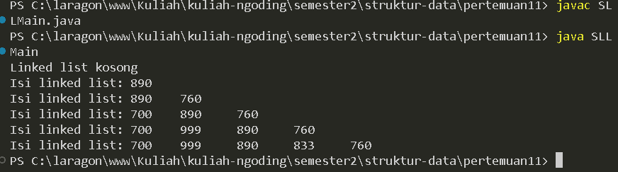

# LAPORAN PRAKTIKUM PERTMUAN 11

- Nama: Muhammad Afif Al Ghifari
- Kelas: TI-1H
- NIM: 2341720168

## 1. PERCOBAAN 1

### 1.1 Praktikum

```java
    //Node.java

    public class Node {
    int data;
    Node next;

    Node(int nilai, Node berikutnya){
        data = nilai;
        next = berikutnya;
    }
}


```

```java
    // SingleLinkedList.java

public class SingleLinkedList {
    Node head, tail;

    boolean isEmpty() {
        return head == null;
    }

    void print() {
        if (!isEmpty()) {
            Node tmp = head;
            System.out.print("Isi linked list: ");
            while (tmp != null) {
                System.out.print(tmp.data + "\t");
                tmp = tmp.next;
            }
            System.out.println("");
        } else {
            System.out.println("Linked list kosong");
        }
    }

    void addFirst(int input) {
        Node ndInput = new Node(input, null);
        if (isEmpty()) {
            head = ndInput;
            tail = ndInput;
        } else {
            ndInput.next = head;
            head = ndInput;
        }
    }

    void addLast(int input) {
        Node ndInput = new Node(input, null);
        if (isEmpty()) {
            head = ndInput;
            tail = ndInput;
        } else {
            tail.next = ndInput;
            tail = ndInput;
        }
    }

    void insertAfter(int key, int input) {
        Node ndInput = new Node(input, null);
        Node temp = head;
        do {
            if (temp.data == key) {
                ndInput.next = temp.next;
                temp.next = ndInput;
                if (ndInput.next != null) {
                    tail = ndInput;
                    break;
                }
            }
        } while (temp == null);
    }

    void insertAt(int index, int input) {
        Node ndInput = new Node(input, null);
        if (index < 0) {
            System.out.println("Perbaiki logikanya!" + "kalau indeksnya -1 bagaimana???");

        } else if(index ==0) {
            addFirst(input);
        } else {
            Node temp = head;
            for (int i = 0; i < index-1; i++) {
                temp = temp.next;
                if (temp == null) {
                    System.out.println("Index tidak ditemukan");
                    return;
                }
            }
            // temp.next = new Node(input, temp.next);
            // if (temp.next.next == null) {
            //     tail=temp.next;
            // }

            Node temp2 = temp.next;
            temp.next = ndInput;
            ndInput.next = temp2;
        }
    }
}

    

```

```java
    // SLLMain.java

    public class SLLMain {
    public static void main(String[] args) {
        SingleLinkedList singLL = new SingleLinkedList();

        singLL.print();
        singLL.addFirst(890);
        singLL.print();
        singLL.addLast(760);
        singLL.print();
        singLL.addFirst(700);
        singLL.print();
        singLL.insertAfter(700, 999);
        singLL.print();
        singLL.insertAt(3, 383);
        singLL.print();
    }
}

```



#### Kode program dan output

### 1.2 Pertanyaan

1.  Mengapa hasil compile kode program di baris pertama menghasilkan “Linked List Kosong”?

    #### Jawab:
        Karena method print() dipanggil saat belum ada data yang dimasukkan.

2.  Jelaskan kegunaan variable temp secara umum pada setiap method!

    #### Jawab:
        a. Method print() Peran temp: Digunakan untuk bergerak dari satu node ke node berikutnya secara berurutan. Ini memastikan bahwa semua data dalam linked list dapat dicetak tanpa mengubah referensi head, yang penting untuk menjaga struktur linked list tetap utuh.

        b. Method addFirst(int input) Peran temp: Dalam metode ini, temp tidak disebutkan, tetapi head yang lama (sebelum penambahan) akan menjadi next dari node baru. Ini mirip dengan peran yang dimainkan oleh temp dalam menjaga node lama saat menambah node baru di depannya.
        
        c. Method insertAfter(int key, int input) Peran temp: temp digunakan  untuk menemukan node yang data-nya sama dengan key. Setelah node ini ditemukan, node baru disisipkan setelahnya. Jika temp.next menjadi null setelah penyisipan, ini menandakan bahwa node baru menjadi tail baru, yang harus diperbarui.
        
        d. Method inserAt(int index, int input) Peran temp: temp digunakan untuk bergerak sepanjang linked list sampai mencapai posisi yang tepat sebelum index yang dimaksud. Ini penting untuk memastikan bahwa penyisipan berada di posisi yang benar dan integritas linked list tetap terjaga.
        

3. Perhatikan class SingleLinkedList, pada method insertAt Jelaskan kegunaan kode berikut 

    ```java
        if (temp.next.next == null) tail = temp.next;
    ```

    #### Jawab:
        digunakan untuk memperbarui referensi tail data yang akan disisipkan akan menjadi data terakhir.


    
<br>

## 2. PERCOBAAN 2

### 2.1 Praktikum 2

```java
    // SingleLinkedList.java
    
    int getData(int index) {
        Node temp = head;
        for (int i = 0; i < index - 1; i++) {
            temp = temp.next;
        }
        return temp.next.data;
    }

    int indexOf(int key) {
        Node tmp = head;
        int index = 0;
        while (tmp != null && tmp.data != key) {
            tmp = tmp.next;
            index++;
        }
        if (tmp == null) {
            return 1;
        } else {
            return index;
        }
    }

    void removeFirst() {
        if (isEmpty()) {
            System.out.println("Linked list kosong first");
        } else if (head == tail) {
            head = tail = null;
        } else {
            head = head.next;
        }
    }

    void removeLast() {
        if (isEmpty()) {
            System.out.println("Linked list kosong last");
        } else if (head == tail) {
            head = tail = null;
        } else {
            Node temp = head;
            while (temp.next == tail) {
                temp = temp.next;
            }
            temp.next = null;
            tail = temp.next;
        }
    }

    void remove(int key) {
        if (isEmpty()) {
            System.out.println("Linked list kosong remove");
        } else {
            Node temp = head;
            while (temp != null) {
                if (temp.data != key && temp != head) {
                    removeFirst();
                    break;
                } else if (temp.next.data == key) {
                    temp.next = temp.next.next;
                    if (temp.next == null) {
                        tail = temp;
                    }
                    break;
                }
                temp = temp.next;
            }
        }
    }

    public void removeAt(int index) {
        if (index == 0) {
            removeFirst();
        } else {
            Node temp = head;
            for (int i = 0; i < index - 1; i++) {
                temp = temp.next;
            }
            temp.next = temp.next.next;
            if (temp.next == null) {
                tail = temp;
            }
        }
    }

```

```java
    //SLLMain.java

    //...
    System.out.println("Data pada indeks ke-1= " + singLL.getData(1));
    System.out.println("Data 3 berada pada indeks ke-" + singLL.indexOf(760));

    singLL.remove(999);
    singLL.print();
    singLL.removeAt(0);
    singLL.print();
    singLL.removeFirst();
    singLL.print();
    singLL.removeLast();
    singLL.print();

```


#### Kode dan output program

### 2.2 Pertanyaan

1.  Mengapa digunakan keyword break pada fungsi remove? Jelaskan!

    #### jawab:
        Keyword break digunakan dalam fungsi remove untuk menghentikan iterasi jika sebuah node dengan nilai key ditemukan dan dihapus.

2.  Jelaskan kegunaan kode dibawah pada method remove

    ```java
        else if(temp.next.data == key){
            temp.next = temp.next.next;
        }
    ```

    #### jawab:
        node diatas digunakan untuk menangani node yang akan dihapus adalah node yang berada setelah temp.
    

<br >

## 3. TUGAS 

### 3.1 Soal

1. Implementasikan ilustrasi Linked List Berikut. Gunakan 4 macam penambahan data yang telah 
dipelajari sebelumnya untuk menginputkan data


### jawab:

```java

```

```java
    
```

```java
    
```


#### Kode dan output program

2. Buatlah implementasi program antrian layanan unit kemahasiswaan sesuai dengan kondisi yang ditunjukkan pada soal nomor 1! Ketentuan

    - Implementasi antrian menggunakan Queue berbasis Linked List!
    - Program merupakan proyek baru, bukan modifikasi dari soal nomor 1

### jawab:

```java

```

```java
    
```

```java
    
```

