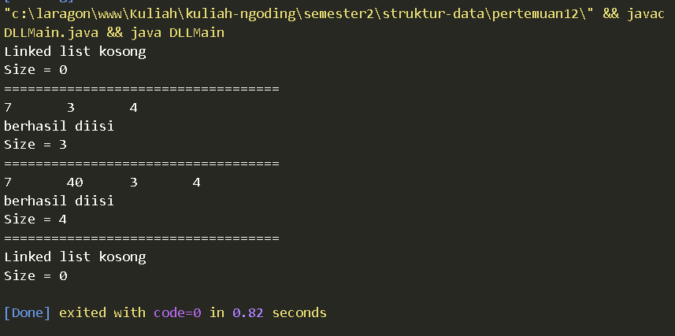
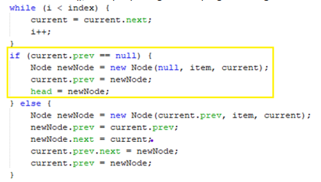
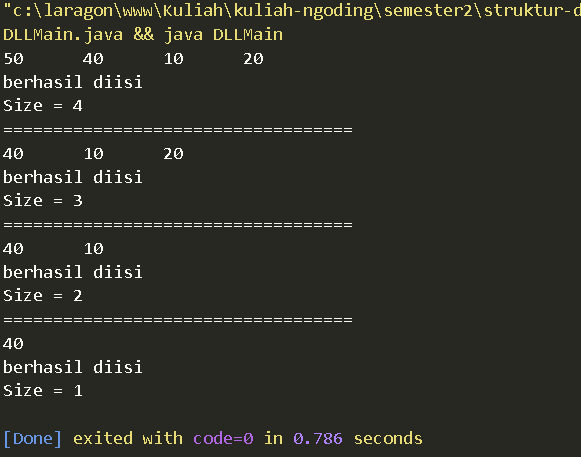
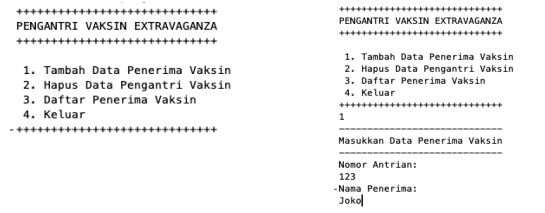
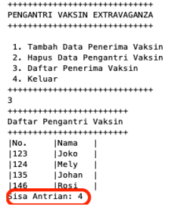
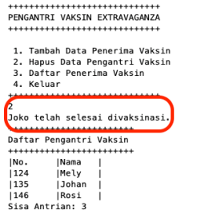
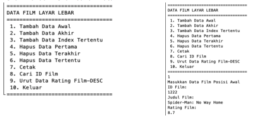
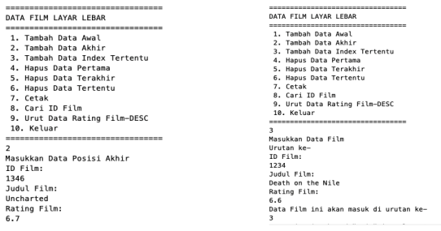
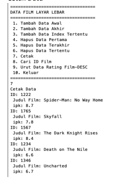
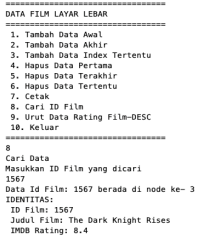

# LAPORAN PRAKTIKUM PERTMUAN 12

- Nama: Muhammad Afif Al Ghifari
- Kelas: TI-1H
- NIM: 2341720168

## 1. PERCOBAAN 1

### 1.1 Praktikum

```java
    //Node.java
public class Node {
    int data;
    Node prev, next;

    Node(Node prev, int data, Node next) {
        this.prev = prev;
        this.data = data;
        this.next = next;
    }
}

```

```java
    // DoubleLinkedLists.java    
public class DoubleLinkedLists {
    Node head;
    int size;

    public DoubleLinkedLists() {
        head = null;
        size = 0;
    }

    public boolean isEmpty(){
        return head == null;
    }

    public void addFirst(int item){
        if (isEmpty()) {
            head = new Node(null, item, null);
        } else {
            Node newNode = new Node(null, item, head);
            head.prev = newNode;
            head = newNode;
        }
        size++;
    }

    public void addLast(int item){
        if (isEmpty()) {
            addFirst(item);
        } else {
            Node current = head;
            while (current.next != null) {
                current = current.next;
            }
            Node newNode = new Node(current, item, null);
            current.next = newNode;
            size++;
        }
    }

    public void add(int item, int index) throws Exception{
        if (isEmpty()) {
            addFirst(item);
        } else if(index < 0 || index > size){
            throw new Exception("Nilai indeks diluar batas");
        } else {
            Node current = head;
            int i = 0;
            while (i < index) {
                current = current.next;
                i++;
            }
            if (current.prev == null) {
                Node newNode = new Node(current.prev, item, current);
                current.prev = newNode;
                head = newNode;
            } else {
                Node newNode = new Node(current.prev, item, current);
                newNode.prev = current.prev;
                newNode.next = current;
                current.prev.next = newNode;
                current.prev = newNode;
            }
        }
        size++;
    }

    public int size(){
        return size;
    }

    public void clear(){
        head = null;
        size = 0;
    }

    public void print(){
        if (!isEmpty()) {
            Node tmp = head;
            while (tmp != null) {
                System.out.print(tmp.data + "\t");
                tmp = tmp.next;
            }
            System.out.println("\nberhasil diisi");
        } else {
            System.out.println("Linked list kosong");
        }
    }
}

```

```java
    // DLLMain.java
public class DLLMain {
    public static void main(String[] args) throws Exception {
        DoubleLinkedLists dll = new DoubleLinkedLists();
        dll.print();
        System.out.println("Size = " + dll.size());
        System.out.println("===================================");
        dll.addFirst(3);
        dll.addLast(4);
        dll.addFirst(7);
        dll.print();
        System.out.println("Size = " + dll.size());
        System.out.println("===================================");
        dll.add(40, 1);
        dll.print();
        System.out.println("Size = " + dll.size());
        System.out.println("===================================");
        dll.clear();
        dll.print();
        System.out.println("Size = " + dll.size());
    }
}


```



#### Kode program dan output

### 1.2 Pertanyaan

1.  Jelaskan perbedaan antara single linked list dengan double linked lists!

    #### Jawab:
        Node single linked list memiliki satu pointer yang mengarahkan ke node selanjutnya, sedangkan double linked list memiliki dua node yang menagarahkan ke node sebelum atau sesudahnya.
        

2.  Perhatikan class Node, di dalamnya terdapat atribut next dan prev. Untuk apakah atribut tersebut?

    #### Jawab:
        Atribut next dan prev merupakan pointer yang menunjuk pada node setelah dan sebelumnya.
        

3. Perhatikan konstruktor pada class DoubleLinkedLists. Apa kegunaan inisialisasi atribut head dan size seperti pada gambar berikut ini? 

    ```java
    public DoubleLinkedLists() {
        head = null;
        size = 0;
    }
    ```

    #### Jawab:
        Inisialisasi atribut head dan size pada konstruktor class DoubleLinkedLists bertujuan untuk menginisialisasi linked list kosong

4. Pada method addFirst(), kenapa dalam pembuatan object dari konstruktor class Node prev dianggap sama dengan null? 

    ```java
        Node newNode = new Node(null, item, head);
    ```

    #### Jawab:
        Pembuatan objek dari konstruktor class Node dengan prev dianggap sama dengan null karena kita menambahkan elemen baru di awal linked list.

5. Perhatikan pada method addFirst(). Apakah arti statement head.prev = newNode ?

    #### Jawab:
      head.prev = newNode; 
      bertujuan untuk menghubungkan elemen yang sebelumnya adalah elemen pertama (head) ke elemen baru yang ditambahkan di awal linked lis

6. Perhatikan isi method addLast(), apa arti dari pembuatan object Node dengan mengisikan parameter prev dengan current, dan next dengan null? 

    ```java
        Node newNode = new Node(current, item, null);
    ```

    #### Jawab:
       Pembuatan objek Node dengan mengisikan parameter prev dengan current dan next dengan null bertujuan untuk menambahkan elemen baru di akhir linked list. 

7. Pada method add(), terdapat potongan kode program sebagai berikut: 

    

    jelaskan maksud dari bagian yang ditandai dengan kotak kuning.
    #### Jawab:
        Kode program tersebut berfungsi untuk menambahkan elemen baru di akhir linked list. Pertama, kode memeriksa apakah node saat ini merupakan elemen pertama dalam linked list. Jika iya, maka elemen baru ditambahkan di awal linked list. Jika tidak, elemen baru dibuat dengan mengatur referensi prev dari node terakhir ke elemen baru, lalu elemen pertama diatur untuk menunjuk ke elemen baru tersebut. Dengan demikian, langkah-langkah tersebut memastikan bahwa elemen baru berhasil ditambahkan di akhir linked list.

<br>

## 2. PERCOBAAN 2

### 2.1 Praktikum 2

```java
    // DoubleLinkedLists.java

    // ...
    public void removeFirst() throws Exception {
        if (isEmpty()) {
            throw new Exception("Linked list masih kosong, tidak dapat dihapus");
        } else if (size == 1) {
            removeLast();
        } else {
            head = head.next;
            head.prev = null;
            size--;
        }
    }

    public void removeLast() throws Exception {
        if (isEmpty()) {
            throw new Exception("Linked list masih kosong, tidak dapat dihapus");
        } else if (head.next == null) {
            head = null;
            size--;
            return;
        }
        Node current = head;
        while (current.next.next != null) {
            current = current.next;
        }
        current.next = null;
        size--;
    }

    public void remove(int index) throws Exception{
        if (isEmpty() || index >= size) {
            throw new Exception("Nilai indeks diluar batas");
        } else if(index == 0){
            removeFirst();
        } else {
            Node current = head;
            int i = 0;
            while (i < index) {
                current = current.next;
                i++;
            }
            if (current.next == null) {
                current.prev.next = null;
            } else if(current.prev == null){
                current = current.next;
                head.prev = null;
                head = current;
            } else {
                current.prev.next = current.next;
                current.next.prev = current.prev;
            }
            size--;
        }
    }

```

```java
    //DLLMain.java

    dll.addLast(50);
    dll.addLast(40);
    dll.addLast(10);
    dll.addLast(20);
    dll.print();
    System.out.println("Size = " + dll.size());
    System.out.println("===================================");
    dll.removeFirst();
    dll.print();
    System.out.println("Size = " + dll.size());
    System.out.println("===================================");
    dll.removeLast();
    dll.print();
    System.out.println("Size = " + dll.size());
    System.out.println("===================================");
    dll.remove(1);
    dll.print();
    System.out.println("Size = " + dll.size());

```




#### Kode dan output program

### 2.2 Pertanyaan

1.  Apakah maksud statement berikut pada method removeFirst()?
    
    ```java
        head = head.next;

        head.prev = null;
    ```
    #### jawab:
        Statement di atas merupakan proses pemindahan head ke node setelahnya, yang kemudian node sebelumnya dijadikan null.

2.  Bagaimana cara mendeteksi posisi data ada pada bagian akhir pada method removeLast()?

    #### jawab:
    1. Pertama, kita memeriksa apakah linked list masih kosong atau hanya memiliki satu node. Jika linked list masih kosong, kita melempar exception. Jika linked list hanya memiliki satu node, kita mengatur head menjadi null dan mengurangi ukuran linked list.
    2. Jika linked list memiliki lebih dari satu node, kita perlu menelusuri linked list dari node pertama hingga node terakhir. Kita menggunakan variabel current untuk mencatat node saat ini selama perulangan.
    3. Dalam perulangan, kita mengecek apakah current.next bernilai null. Jika current.next bernilai null, artinya kita mencapai node terakhir dalam linked list.
    4. Jika kita mencapai node terakhir, kita mengatur current.next menjadi null untuk menghapus node terakhir dari linked list.
    5. Setelah menghapus node terakhir, kita mengurangi ukuran linked list.


3.  Jelaskan alasan potongan kode program di bawah ini tidak cocok untuk perintah remove!

    ```java
        Node tmp = head.next;

        head.next = tmp.next;
        tmp.next.prev = head;
    ```

    #### jawab:
        Pada potongan kode ini, kita menghubungkan head.next ke node setelah node yang akan dihapus. Tetapi, tidak mengatur tmp.next menjadi null, sehingga masih ada referensi ke node yang akan dihapus dari linked list. Dalam penghapusan node, kita harus memastikan bahwa atribut prev dari node setelah node yang dihapus juga diperbarui dengan benar.

4.  Jelaskan fungsi kode program berikut ini pada fungsi remove!

    ```java
        current.prev.next = current.next;
        current.next.prev = current.prev;
    ```

    #### jawab:
        Kode tersebut digunakan untuk menghapus node yang ditunjuk oleh variabel current dari linked list.

<br >


## Percobaan 3

### 2.1 Praktikum 3

```java
    // DoubleLinkedLists.java
    public int getFirst() throws Exception {
        if (isEmpty()) {
            throw new Exception("Linked list kosong");
        }
        return head.data;
    }

    public int getLast() throws Exception {
        if (isEmpty()) {
            throw new Exception("Linked list kosong");
        }
        Node tmp = head;
        while (tmp.next != null) {
            tmp = tmp.next;
        }
        return tmp.data;
    }

    public int get(int index) throws Exception {
        if (isEmpty() || index >= size) {
            throw new Exception("Nilai indeks diluar batas");
        }
        Node tmp = head;
        for (int i = 0; i < index; i++) {
            tmp = tmp.next;
        }
        return tmp.data;
    }

```

```java
    //DLLMain.java

        dll.print();
        System.out.println("Size = " + dll.size());
        System.out.println("===================================");
        dll.addFirst(3);
        dll.addLast(4);
        dll.addFirst(7);
        dll.print();
        System.out.println("Size = " + dll.size());
        System.out.println("===================================");
        dll.add(40, 1);
        dll.print();
        System.out.println("Size = " + dll.size());
        System.out.println("===================================");
        System.out.println("Data awal pada linked list: " + dll.getFirst());
        System.out.println("Data akhir pada linked list: " + dll.getLast());
        System.out.println("Data indeks ke-1 adalah: " + dll.get(1));

```


#### Kode dan output program


### 2.2 Pertanyaan

1.  Jelaskan method size() pada class DoubleLinkedLists!

    #### jawab:
        Method size() digunakan untuk mengembalikan nilai jumlah elemen pada linked list.

2.  Jelaskan cara mengatur indeks pada double linked lists supaya dapat dimulai dari indeks ke-1!

    #### jawab:
        Dengan cara mengubah perulangan pada method get() menjadi berikut:

    ```java
    //...
    for (int i = 1; i <= index; i++) {
            tmp = tmp.next;
    }
    //...
    ```

3. Jelaskan perbedaan karakteristik fungsi Add pada Double Linked Lists dan Single Linked Lists!

    #### jawab:
    
        1) Single Linked List: Membutuhkan iterasi dari awal linked list untuk menambahkan elemen baru di akhir atau di tengah linked list, serta penggantian head untuk menambahkan elemen baru di awal linked list.

        2.) Double Linked List: Memiliki kemampuan untuk langsung mengakses elemen terakhir dan elemen sebelumnya, sehingga tidak perlu iterasi dari awal untuk menambahkan elemen baru di akhir atau di tengah linked list. Tidak perlu penggantian head untuk menambahkan elemen baru di awal linked list.

4.  Jelaskan perbedaan logika dari kedua kode program di bawah ini!
    
    
    
    #### jawab:
        1) Pada metode a, isEmpty() menggunakan variabel size yang merupakan jumlah elemen dalam linked list. Metode ini melakukan pengecekan apakah size sama dengan 0. Jika size adalah 0, itu berarti tidak ada elemen dalam linked list, dan metode akan mengembalikan true. Namun, jika size tidak 0, itu berarti ada elemen dalam linked list, dan metode akan mengembalikan false. Metode kedua memerlukan pemeliharaan variabel size, yang harus diperbarui setiap kali ada perubahan dalam linked list, seperti penambahan atau penghapusan elemen.

        2) Pada metode b, isEmpty() langsung memeriksa apakah variabel head yang menandakan elemen pertama dalam linked list, sama dengan null. Jika head adalah null, itu berarti tidak ada elemen dalam linked list, dan metode akan mengembalikan true, menunjukkan bahwa linked list kosong. Sebaliknya, jika head tidak null, itu berarti linked list tidak kosong, dan metode akan mengembalikan false.


<br>

## 4. TUGAS 

### 4.1 Soal

1. Buat program antrian vaksinasi menggunakan queue berbasis double linked list sesuai ilustrasi 
dan menu di bawah ini! (counter jumlah antrian tersisa di menu cetak(3) dan data orang yang telah divaksinasi di menu Hapus Data(2) harus ada)

    Contoh Ilustrasi Program

    Menu awal dan penambahan data

    

    Cetak Data (Komponen di area merah harus ada)

    

    Hapus Data (Komponen di area merah harus ada)

    


    ### jawab:

    ```java

    ```

    ```java
        
    ```

    ```java
        
    ```

    ##### Menu awal dan penambahan data
    

    ##### Cetak Data 
    

    ##### Hapus Data 
    

    #### Kode dan output program

2. Buatlah program daftar film yang terdiri dari id, judul dan rating menggunakan double linked lists, bentuk program memiliki fitur pencarian melalui ID Film dan pengurutan Rating secara descending. Class Film wajib diimplementasikan dalam soal ini.

    Contoh Ilustrasi Program

    Menu awal dan penambahan data

    
    

    Cetak Data

    

    Pencarian Data

    


    ### jawab:

    ```java

    ```

    ```java
        
    ```

    ```java
        
    ```

    ##### Menu awal dan penambahan data
    

    ##### Cetak Data 
    

    ##### Pencarian Data 
    

    #### Kode dan output program