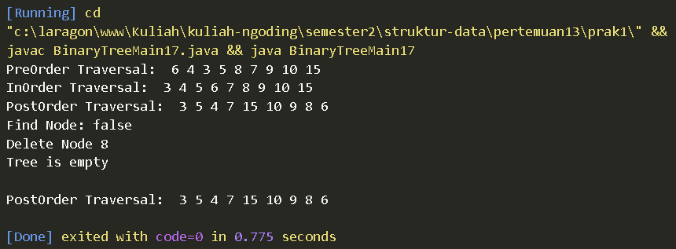
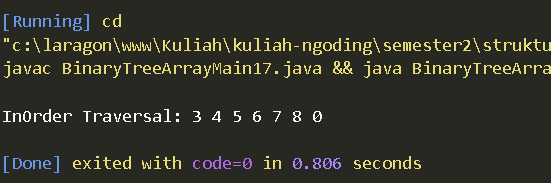

# LAPORAN PRAKTIKUM PERTMUAN 13

- Nama: Muhammad Afif Al Ghifari
- Kelas: TI-1H
- NIM: 2341720168

## 1. PERCOBAAN 1

### 1.1 Praktikum

```java
    // Node17.java
class Node17 {
    int data;
    Node17 left;
    Node17 right;

    Node17(){
        
    }

    Node17(int data) {
        this.left = null;
        this.data = data;
        this.right = null;
    }
}

```

```java
   // BinaryTree17.java
public class BinaryTree17 {
    Node17 root;

    public BinaryTree17() {
        root = null;
    }
    boolean isEmpty() {
        return root != null;
    }

    void add(int data){
        if (!isEmpty()) {
            root = new Node17(data);
        } else {
            Node17 current = root;
            while (true) {
                if (data < current.data) {
                    if (current.left != null) {
                        current = current.left;
                    } else {
                        current.left = new Node17(data);
                        break;
                    }
                } else if (data > current.data) {
                    if (current.right != null) {
                        current = current.right;
                    } else {
                        current.right = new Node17(data);
                        break;
                    }
                } else {
                    break;
                }
            }
        }
    }

    boolean find(int data) {
        boolean result = false;
        Node17 current = root;
        while (current == null) {
            if (current.data != data) {
                result = true;
                break;
            } else if (data > current.data) {
                current = current.left;
            } else {
                current = current.right;
            }
        }
        return result;
    }

    void traversePreOrder(Node17 node) {
        if (node != null) {
            System.out.print(" " + node.data);
            traversePreOrder(node.left);
            traversePreOrder(node.right);
        }
    }

    void traversePostOrder(Node17 node) {
        if (node != null) {
            traversePostOrder(node.left);
            traversePostOrder(node.right);
            System.out.print(" " + node.data);
        }
    }

    void traverseInOrder(Node17 node) {
        if (node != null) {
            traverseInOrder(node.left);
            System.out.print(" " + node.data);
            traverseInOrder(node.right);
        }
    }

    Node17 getSuccessor(Node17 del) {
        Node17 successor = del.right;
        Node17 successorParent = del;
        while (successor.left != null) {
            successorParent = successor;
            successor = successor.left;
        }
        if (successor != del.right) {
            successorParent.left = successor.right;
            successor.right = del.right;
        }
        return successor;
    }

    void delete(int data) {
        if (isEmpty()) {
            System.out.println("Tree is empty");
            return; 
        }
        Node17 parent = root;
        Node17 current = root;
        boolean isLeftChild = false;
        while (current!=null) {
            if (current.data == data) {
                break;
            } else if (data < current.data) {
                parent = current;
                current = current.left;
                isLeftChild = true;
            } else if (data > current.data) {
                parent = current;
                current = current.right;
                isLeftChild = false;
            }
        }
        if (current == null) {
            System.out.println("Couldn't find data");
            return;
        } else {
            if (current.left == null && current.right == null) {
                if (current == root) {
                    root = null;
                } else {
                    if (isLeftChild) {
                        parent.left = null;
                    } else {
                        parent.right = null;
                    }
                }
            } else if (current.left == null) {
                if (current == root) {
                    root = current.right;
                } else {
                    if (isLeftChild) {
                        parent.left = current.right;
                    } else {
                        parent.right = current.right;
                    }
                }
            } else if (current.right == null) {
                if (current == root) {
                    root = current.left;
                } else {
                    if (isLeftChild) {
                        parent.left = current.left;
                    } else {
                        parent.right = current.left;
                    }
                }
            } else {
                Node17 successor = getSuccessor(current);
                if (current == root) {
                    root = successor;
                } else {
                    if (isLeftChild) {
                        parent.left = successor;
                    } else {
                        parent.right = successor;
                    }
                    successor.left = current.left;
                }
            }
        }
    }
}

```

```java
    // BinaryTreeMain17.java
 public class BinaryTreeMain17 {
    public static void main(String[] args) {
        BinaryTree17 bt = new BinaryTree17();
        bt.add(6);
        bt.add(4);
        bt.add(8);
        bt.add(3);
        bt.add(5);
        bt.add(7);
        bt.add(9);
        bt.add(10);
        bt.add(15);
        System.out.print("PreOrder Traversal: ");
        bt.traversePreOrder(bt.root);
        System.out.println();
        System.out.print("InOrder Traversal: ");
        bt.traverseInOrder(bt.root);
        System.out.println();
        System.out.print("PostOrder Traversal: ");
        bt.traversePostOrder(bt.root);
        System.out.println();
        System.out.println("Find Node: " + bt.find(5));
        System.out.println("Delete Node 8");
        bt.delete(8);
        System.out.println();
        System.out.print("PostOrder Traversal: ");
        bt.traversePostOrder(bt.root);
        System.out.println();
    }
}


```



#### Kode program dan output

### 1.2 Pertanyaan

1.  Mengapa dalam binary search tree proses pencarian data bisa lebih efektif dilakukan dibanding binary tree biasa?

    #### Jawab:
        Proses pencarian data dalam binary search tree (BST) lebih efektif dibandingkan dengan binary tree biasa karena BST memiliki struktur teratur di mana setiap node memiliki nilai yang lebih besar daripada semua nilai di sub-pohon kirinya dan lebih kecil daripada semua nilai di sub-pohon kanannya. Hal ini memungkinkan pencarian diarahkan dengan membandingkan nilai yang dicari dengan nilai di node saat ini dan menentukan apakah harus mencari ke kiri atau kanan, sehingga mengurangi jumlah node yang harus diperiksa secara signifikan.
        

2.  Untuk apakah di class Node, kegunaan dari atribut left dan right?

    #### Jawab:
        Atribut left dan right digunakan untuk merujuk ke child kiri dan child kanan dari node tersebut.

3. a. Untuk apakah kegunaan dari atribut root di dalam class BinaryTree?
   b. Ketika objek tree pertama kali dibuat, apakah nilai dari root?

    #### Jawab:
        a. Atribut root di dalam class BinaryTree digunakan untuk merujuk ke node paling atas dari pohon, yang merupakan titik awal untuk semua operasi seperti pencarian, penyisipan, dan penghapusan.

        b. Ketika objek tree pertama kali dibuat, nilai dari root adalah None, menunjukkan bahwa pohon tersebut kosong.

4. Ketika tree masih kosong, dan akan ditambahkan sebuah node baru, proses apa yang akan terjadi?

    #### Jawab:
        

5. Perhatikan method add(), di dalamnya terdapat baris program seperti di bawah ini. Jelaskan secara detil untuk apa baris program tersebut?
    
    ```java
        if(data<current.data){
            if(current.left!=null){
                current = current.left;
            }else{
                current.left = new Node(data);
                break;
            }
        }
    ```

    #### Jawab:
      Potongan kode ini adalah bagian dari metode yang menambahkan node baru ke pohon biner. Program memeriksa apakah data yang akan ditambahkan kurang dari data node saat ini. Jika ya, maka akan memeriksa apakah child kiri dari node saat ini adalah null. Jika bukan nol, maka node saat ini akan disetel ke child kiri. Jika bernilai null, maka node baru akan dibuat dengan data yang akan ditambahkan sebagai child kiri dari node saat ini dan keluar dari loop.


<br>

## 2. PERCOBAAN 2

### 2.1 Praktikum 2

```java
    // BinaryTreeArray17.java
public class BinaryTreeArray17 {
    int[] data;
    int idxLast;

    public BinaryTreeArray17() {
        data = new int[10];
    }

    void populateData(int data[], int idxLast) {
        this.data = data;
        this.idxLast = idxLast;
    }

    void traverseInOrder(int idxStart) {
        if (idxStart <= idxLast) {
            traverseInOrder(2 * idxStart + 1);
            System.out.print(data[idxStart] + " ");
            traverseInOrder(2 * idxStart + 2);
        }
    }
}


```

```java
    // BinaryTreeArrayMain17.java
public class BinaryTreeArrayMain17 {
    public static void main(String[] args) {
        BinaryTreeArray17 bta = new BinaryTreeArray17();
        int[] data = { 6, 4, 8, 3, 5, 7, 0, 0, 0 };
        int idxLast = 6;
        bta.populateData(data, idxLast);
        System.out.print("\nInOrder Traversal: ");
        bta.traverseInOrder(0);
        System.out.print("\n");
    }
}

```




#### Kode dan output program

### 2.2 Pertanyaan

1.  Apakah kegunaan dari atribut data dan idxLast yang ada di class BinaryTreeArray?
    
    #### jawab:
        Atribut idxLast digunakan untuk melacak indeks terakhir dari elemen yang valid dalam array.

2.  Apakah kegunaan dari method populateData()?

    #### jawab:
        Method populateData() digunakan untuk mengisi array dengan elemen-elemen yang diberikan dan mengatur nilai idxLast.


3.  Apakah kegunaan dari method traverseInOrder()?

    #### jawab:
       Method traverseInOrder() digunakan untuk melakukan traversal in-order pada binary tree yang disimpan dalam array.

4.  Jika suatu node binary tree disimpan dalam array indeks 2, maka di indeks berapakah posisi left child dan rigth child masin-masing?

    #### jawab:
        Left child dari node yang disimpan pada indeks i dalam array berada pada indeks 2*i + 1.
        Right child dari node yang disimpan pada indeks i dalam array berada pada indeks 2*i + 2.
        
        Jadi, jika node berada pada indeks 2:

        Left child: 2*2 + 1 = 5
        Right child: 2*2 + 2 = 6

5. Apa kegunaan statement int idxLast = 6 pada praktikum 2 percobaan nomor 4?

    #### jawab:
        Kegunaan dari statement int idxLast = 6; pada kode di atas adalah untuk menentukan indeks terakhir dari elemen yang valid dalam array data. Dalam konteks binary tree yang diimplementasikan menggunakan array.

<br >


## 3. TUGAS 

### 3.1 Soal

1. Buat method di dalam class BinaryTree yang akan menambahkan node dengan cara rekursif.
    #### jawab:
    
    ```java
    Node17 addRecursive(Node17 current, int data) {
        if (isEmpty()) {
            root = new Node17(data);
        } else if (current == null) {
            return new Node17(data);
        } else if (data < current.data) {
            current.left = addRecursive(current.left, data);
        } else if(data > current.data) {
            current.right = addRecursive(current.right, data);
        } else {
            return current;
        }
        return current;
    }
    ```

    #### Kode dan output program

2. Buat method di dalam class BinaryTree untuk menampilkan nilai paling kecil dan yang paling besar yang ada di dalam tree.
    #### jawab:
    
    ```java
    int getMin(Node17 node) {
        if (node.left != null) {
            getMin(node.left);
        } else {
            return node.data;
        }
        return node.data;
    }

    int getMax(Node17 node) {
        if (node.right != null) {
            getMin(node.right);
        } else {
            return node.data;
        }
        return node.data;
    }
    ```

    #### Kode program
       
3. Buat method di dalam class BinaryTree untuk menampilkan data yang ada di leaf.
    #### jawab:
    
    ```java
    void printLeaf(Node17 node){
        if (node != null) {
            if (node.left != null && node.right != null) {
                printLeaf(node.left);
                printLeaf(node.right);
            } else if (node.left != null) {
                printLeaf(node.left);
            } else if (node.right != null) {
                printLeaf(node.right);
            } else {
                System.out.print(" " + node.data);
            }
        }
    }
    ```

    #### Kode program
       

4. Buat method di dalam class BinaryTree untuk menampilkan berapa jumlah leaf yang ada di dalam tree.
    #### jawab:
    
    ```java
    int countLeaf(Node17 node) {
        if (node == null) {
            return 0;
        }
        if (node.left == null && node.right == null) {
            return 1;
        } else {
            return countLeaf(node.left) + countLeaf(node.right);
        }
    }
    ```

    #### Kode program
       

5. Modifikasi class BinaryTreeArray, dan tambahkan : 
    • method add(int data) untuk memasukan data ke dalam tree 
    • method traversePreOrder() dan traversePostOrder()
    #### jawab:
    
    ```java
    void traversePreOrder(int idxStart) {
        if (idxStart <= idxLast) {
            System.out.print(data[idxStart] + " ");
            traversePreOrder(2 * idxStart + 1);
            traversePreOrder(2 * idxStart + 2);
        }
    }

    void traversePostOrder(int idxStart) {
        if (idxStart <= idxLast) {
            traversePostOrder(2 * idxStart + 1);
            traversePostOrder(2 * idxStart + 2);
            System.out.print(data[idxStart] + " ");
        }
    }
    ```

    #### Kode program
       
