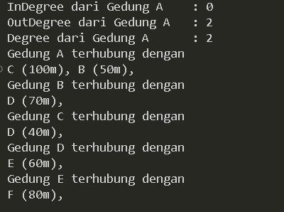
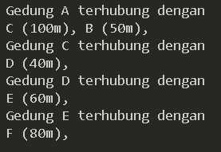
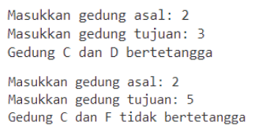
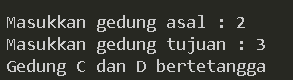
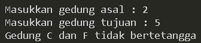
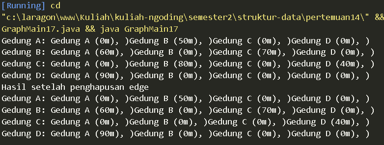

# LAPORAN PRAKTIKUM PERTMUAN 14

- Nama: Muhammad Afif Al Ghifari
- Kelas: TI-1H
- NIM: 2341720168

## 1. PERCOBAAN 1

### 1.1 Praktikum

```java
    // Node17.java
public class Node17 {
    int data;
    Node17 prev, next;
    int jarak;

    public Node17(Node17 prev, int data, int jarak, Node17 next) {
        this.prev = prev;
        this.data = data;
        this.next = next;
        this.jarak = jarak;
    }
}

```

```java
   // DoubleLinkedLists.java
public class DoubleLinkedLists {
    Node17 head;
    int size;

    public DoubleLinkedLists() {
        head = null;
        size = 0;
    }

    public boolean isEmpty() {
        return head == null;
    }

    public void addFirst(int item, int jarak) {
        if (isEmpty()) {
            head = new Node17(null, item, jarak, null);
        } else {
            Node17 newNode = new Node17(null, item, jarak, head);
            head.prev = newNode;
            head = newNode;
        }
        size++;
    }

    public int getJarak(int index) throws Exception {
        if (isEmpty() || index >= size) {
            throw new Exception("Nilai indeks di luar batas");
        }
        Node17 tmp = head;
        for (int i = 0; i < index; i++) {
            tmp = tmp.next;
        }

        return tmp.jarak;
    }

    public int get(int index) throws Exception {
        if (index >= size || index < 0) {
            throw new Exception("Nilai indeks di luar batas");
        }

        if (head == null) {
            throw new Exception("List is empty");
        }

        Node17 tmp = head;
        for (int i = 0; i < index; i++) {
            if (tmp.next == null) {
                throw new Exception("Unexpected null node encountered");
            }
            tmp = tmp.next;
        }

        return tmp.data;
    }

    public int size() {
        return size;
    }

    public void clear() {
        head = null;
        size = 0;
    }

    public void print() {
        if (!isEmpty()) {
            Node17 tmp = head;
            while (tmp != null) {
                System.out.print(tmp.data + "\t");
                tmp = tmp.next;
            }
            System.out.println("\nberhasil diisi");
        } else {
            System.out.println("Linked list kosong");
        }
    }

    // Praktikum 2
    public void removeFirst() throws Exception {
        if (isEmpty()) {
            throw new Exception("Linked list masih kosong, tidak dapat dihapus");
        } else if (size == 1) {
            removeLast();
        } else {
            head = head.next;
            head.prev = null;
            size--;
        }
    }

    public void removeLast() throws Exception {
        if (isEmpty()) {
            throw new Exception("Linked list masih kosong, tidak dapat dihapus");
        } else if (head.next == null) {
            head = null;
            size--;
            return;
        }
        Node17 current = head;
        while (current.next.next != null) {
            current = current.next;
        }
        current.next = null;
        size--;
    }

    public void remove(int index) {
        Node17 current = head;
        while (current != null) {
            if (current.data == index) {
                if (current.prev != null) {
                    current.prev.next = current.next;
                } else {
                    head = current.next;
                }
                if (current.next != null) {
                    current.next.prev = current.prev;
                }
                break;
            }
            current = current.next;
        }
        size--;
    }
}
```

```java
    // Graph17.java
public class Graph17 {
    int vertex;
    DoubleLinkedLists list[];

    public Graph17(int v) {
        vertex = v;
        list = new DoubleLinkedLists[v];
        for (int i = 0; i < v; i++) {
            list[i] = new DoubleLinkedLists();
        }
    }

    public void addEdge(int asal, int tujuan, int jarak) {
        list[asal].addFirst(tujuan, jarak); // jika directed graph
        // list[tujuan].addFirst(asal, jarak); // Jika undirected graph

    }

    public void degree(int asal) throws Exception {
        int k, totalIn = 0, totalOut = 0;
        for (int i = 0; i < vertex; i++) {
            // inDegree
            for (int j = 0; j < list[i].size(); j++) {
                if (list[i].get(j) == asal) {
                    ++totalIn;
                }
            }

            // outDegree
            for (k = 0; k < list[asal].size(); k++) {
                list[asal].get(k);
                ++totalOut;
            }
            totalOut = k;
        }

        System.out.println("InDegree dari Gedung " + (char) ('A' + asal) + "    : " + totalIn);
        System.out.println("OutDegree dari Gedung " + (char) ('A' + asal) + "   : " + totalOut);
        System.out.println("Degree dari Gedung " + (char) ('A' + asal) + "      : " + (totalIn + totalOut));
        // System.out.println("Degree dari gedung " + (char) ('A' + asal) + " : " + list
        // [asal].size);
    }

    public void removeEdge(int asal, int tujuan) throws Exception {
        for (int i = 0; i < vertex; i++) {
            if (i == tujuan) {
                list[asal].remove(tujuan);
            }
        }
    }

    public void removeAllEdges() {
        for (int i = 0; i < vertex; i++) {
            list[i].clear();
        }
        System.out.println("Graf berhasil dikosongkan");
    }

    public void printGraph() throws Exception {
        for (int i = 0; i < vertex; i++) {
            if (list[i].size() > 0) {
                System.out.println("Gedung " + (char) ('A' + i) + " terhubung dengan ");
                for (int j = 0; j < list[i].size(); j++) {
                    System.out.print((char) ('A' + list[i].get(j)) + " (" + list[i].getJarak(j) + "m), ");
                }
                System.out.println("");
            }
        }
        System.out.println("");
    }

}

```

```java
public class GraphMain17 {
    public static void main(String[] args) throws Exception {
        Graph17 gedung = new Graph17(6);

        gedung.addEdge(0, 1, 50);
        gedung.addEdge(0, 2, 100);
        gedung.addEdge(1, 3, 70);
        gedung.addEdge(2, 3, 40);
        gedung.addEdge(3, 4, 60);
        gedung.addEdge(4, 5, 80);
        gedung.degree(0);
        gedung.printGraph();
        gedung.removeEdge(1, 3);
        gedung.printGraph();
    }
}
```




#### Kode program dan output

### 1.2 Pertanyaan

1.  Perbaiki kode program Anda apabila terdapat error atau hasil kompilasi kode tidak sesuai!

    #### Jawab:

        Selesai

2.  Pada class Graph, terdapat atribut list[] bertipe DoubleLinkedList. Sebutkan tujuan pembuatan variabel tersebut!

    #### Jawab:

        tujuan variabel atribut list[] bertipe DoubleLinkedList berfungsi untuk melakukan penyimpanan pada informasi mengenai koneksi antara vertex yang ada dalam grafik

3.  Jelaskan alur kerja dari method removeEdge!

    #### Jawab:

        alur kerja dari method removeEdge berfungsi untuk menghilangkan edge diantara dua vertex yang ada dalam grafik. dan menerima parameter asal lalu tujuan. lalu method ini akan melakukan perulangan dan menghilangkan edge jika ada kondisi yang sudah terpenuhi.

4.  Apakah alasan pemanggilan method addFirst() untuk menambahkan data, bukan method add jenis lain saat digunakan pada method addEdge pada class Graph?

    #### Jawab:

        alasan pemanggilan method addFirst() untuk menambahkan data adalah untuk melakukan pemastian apakah edge yang baru dibuat sudah berada pada head atau awal node. Dan Penggunaan addFirst() daripada metode add() lainnya pada LinkedList biasanya dilakukan untuk mempertahankan urutan tetangga yang ada dalam graf.

5.  Modifikasi kode program sehingga dapat dilakukan pengecekan apakah terdapat jalur antara suatu node dengan node lainnya, seperti contoh berikut (Anda dapat memanfaatkan Scanner).
    

    #### Jawab:

    ```java
    //Graph17.java

    // ...
    public void cekEdge(int asal, int tujuan) throws Exception {
        boolean cek = false;
        for (int i = 0; i < list[asal].size(); i++) {
            if (list[asal].get(i) == tujuan) {
                cek = true;
            }
        }
        if (cek == true) {
            System.out.println("Gedung " + (char) ('A' + asal) + " dan " + (char) ('A' + tujuan) + " bertetangga");
        } else {
            System.out.println("Gedung " + (char) ('A' + asal) + " dan " + (char) ('A' + tujuan) + " tidak bertetangga");
        }
    }
    ```

    
    

    <b>Kode program dan jawaban</b>

<br>

## 2. PERCOBAAN 2

### 2.1 Praktikum 2

```java
// GraphMatriks17.java
public class GraphMatriks17 {
    int vertex;
    int[][] matriks;

    public GraphMatriks17(int v) {
        vertex = v;
        matriks = new int[v][v];
    }

    public void makeEdge(int asal, int tujuan, int jarak) {
        matriks[asal][tujuan] = jarak;
    }

    public void removeEdge(int asal, int tujuan) {
        matriks[asal][tujuan] = 0;
    }

    public void printGraph() {
        for (int i = 0; i < vertex; i++) {
            System.out.print("Gedung " + (char) ('A' + i) + ": ");
            for (int j = 0; j < vertex; j++) {
                if (matriks[i][j] != -1) {
                    System.out.print("Gedung " + (char) ('A' + j) + " (" + matriks[i][j] + "m), )");
                }
            }
            System.out.println();
        }
    }
}

```

```java
// GraphMain17.java
public class GraphMain17 {
    public static void main(String[] args) throws Exception {
        GraphMatriks17 gdg = new GraphMatriks17(4);
        gdg.makeEdge(0, 1, 50);
        gdg.makeEdge(1, 0, 60);
        gdg.makeEdge(1, 2, 70);
        gdg.makeEdge(2, 1, 80);
        gdg.makeEdge(2, 3, 40);
        gdg.makeEdge(3, 0, 90);
        gdg.printGraph();

        System.out.println("Hasil setelah penghapusan edge");
        gdg.removeEdge(2, 1);
        gdg.printGraph();
    }
}

```



#### Kode dan output program

### 2.2 Pertanyaan

1.  Perbaiki kode program Anda apabila terdapat error atau hasil kompilasi kode tidak sesuai!

    #### jawab:

        Sudah

2.  Apa jenis graph yang digunakan pada Percobaan 2?

    #### jawab:

        jenis graph yang digunakan pada Percobaan 2 adalah Graph Matriks

3.  Apa maksud dari dua baris kode berikut?

    ```java
    gdg.makeEdge(1, 2, 70);
    gdg.makeEdge(2, 1, 80);
    ```

    #### jawab:

    maksud dari dua baris kode diatas berfungsi untuk membuat edge dari gedung B pada ke gedung C yang memiliki jarak 70 meter lalu gedung C pada gedung B yang memiliki jarak 80 meter

4.  Modifikasi kode program sehingga terdapat method untuk menghitung degree, termasuk inDegree dan outDegree!

    #### jawab:

    ```java
    // GraphMatriks17.java
    public class GraphMatriks17 {
        // ...

        public void degree(int asal) {
            int totalIn = 0, totalOut = 0;
            for (int i = 0; i < vertex; i++) {
                //indegree
                if (matriks[i][asal] != 0) {
                    totalIn++;
                }
                //outdegree
                if (matriks[asal][i] != 0) {
                    totalOut++;
                }
            }
            System.out.println("InDegree dari Gedung " + (char) ('A' + asal) + "    : " + totalIn);
            System.out.println("OutDegree dari Gedung " + (char) ('A' + asal) + "   : " + totalOut);
            System.out.println("Degree dari Gedung " + (char) ('A' + asal) + "      : " + (totalIn + totalOut));
        }
    }

    ```

    ```java
    // GraphMain17.java
    public class GraphMain17 {
        public static void main(String[] args) throws Exception {
            // ...

            System.out.println("Menggunakan degree");
            gdg.degree(2);
        }
    }
    ```

    

    <b>Kode program dan jawaban</b>

<br >

