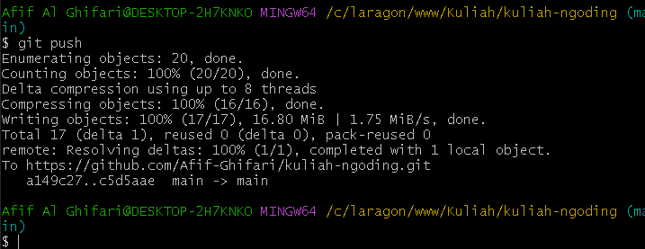
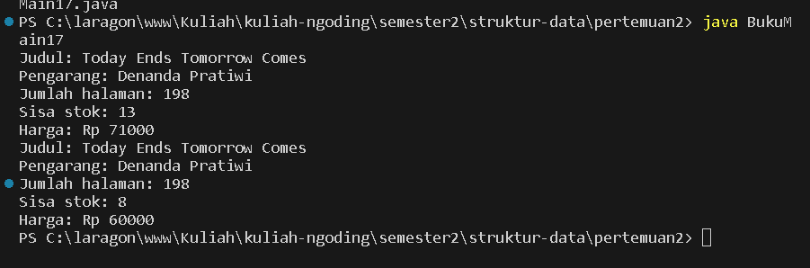
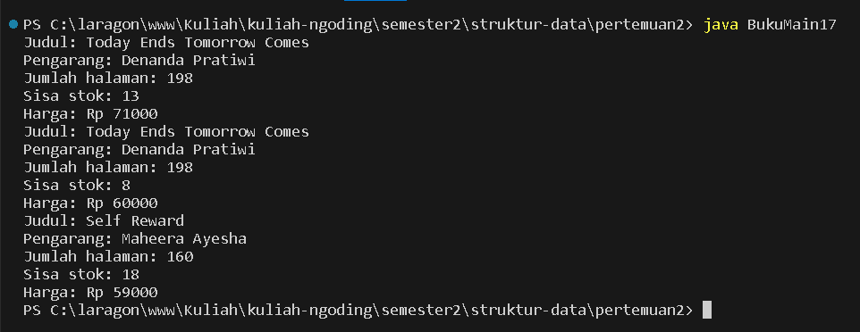
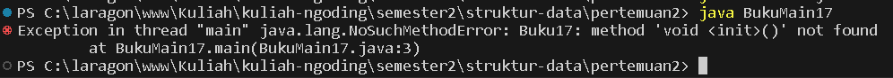
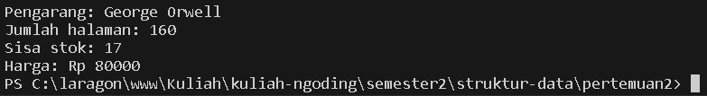
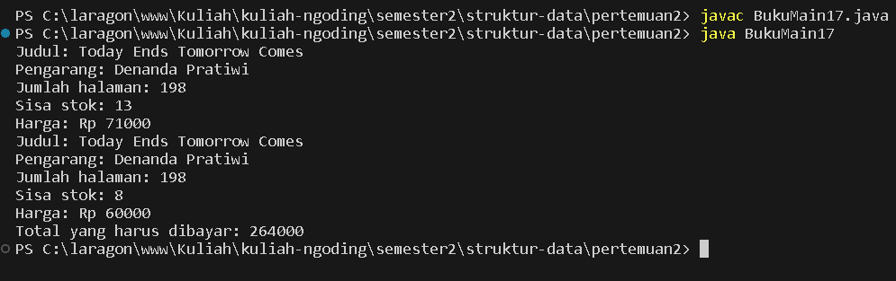
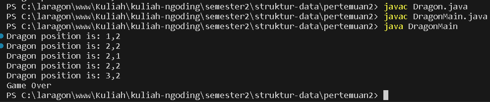

# LAPORAN PRAKTIKUM PERTMUAN 2

- Nama: Muhammad Afif Al Ghifari
- Kelas: TI-1H
- NIM: 2341720168

## 1. PERCOBAAN 1

### 1.1 Praktikum

```java
public class Buku17 {

    String judul, pengarang;
    int halaman, stok, harga;

    void tampilnformasi() {
        System.out.println("Judul: " + judul);
        System.out.println("Pengarang: " + pengarang);
        System.out.println("Jumlah halaman: " + halaman);
        System.out.println("Sisa stok: " + stok);
        System.out.println("Harga: Rp " + harga);
    }

    void terjual(int jml) {
        stok -= jml;
    }

    void restock(int jml) {
        stok += jml;
    }

    void gantiHarga(int hrg) {
        harga = hrg;
    }
}
```

#### Kode program


#### Output program

### 1.2 Pertanyaan

1. Sebutkan dua karakteristik class atau object!
   ##### Mempunyai atribut dan method.
2. Perhatikan class Buku pada Praktikum 1 tersebut, ada berapa atribut yang dimiliki oleh class Buku? Sebutkan apa saja atributnya!
   ##### judul (string), pengarang (string), halaman (int), stok(int), harga (int).
3. Ada berapa method yang dimiliki oleh class tersebut? Sebutkan apa saja methodnya!

   ##### tampilInformasi(), terjual(jml: int), restock(n: int), gantiHarga(hrg: int).

4. Perhatikan method terjual() yang terdapat di dalam class Buku. Modifikasi isi method tersebut sehingga proses pengurangan hanya dapat dilakukan jika stok masih ada (lebih besar dari 0)!

```java
    void terjual(int jml) {
        if (stok > 0 || jml > stok) {
            stok -= jml;
        }
    }
```

5. Menurut Anda, mengapa method restock() mempunyai satu parameter berupa bilangan int?

   ##### Karena int merupakan tipa data yang akn digunakan menyimpan nilai ke dalam parameter.

6. Commit dan push kode program ke Github
   

<br>

## 2. PERCOBAAN 2

### 2.1 Praktikum 2

```java
public class BukuMain17 {
    public static void main(String[] args) {
        Buku17 bk1 = new Buku17();
        bk1.judul = "Today Ends Tomorrow Comes";
        bk1.pengarang = "Denanda Pratiwi";
        bk1.halaman = 198;
        bk1.stok = 13;
        bk1.harga = 71000;

        bk1.tampilnformasi();
        bk1.terjual(5);
        bk1.gantiHarga(60000);
        bk1.tampilnformasi();
    }
}
```

#### Kode program



#### Output program

### 2.2 Pertanyaan

1. Pada class BukuMain, tunjukkan baris kode program yang digunakan untuk proses instansiasi! Apa nama object yang dihasilkan?

   ##### Instantiasi objek terdapat pada baris:

   ```java
   Buku17 bk1 = new Buku17();
   ```

   ##### yang menghasilkn objek bernama bk1.

2. Bagaimana cara mengakses atribut dan method dari suatu objek?

   ##### Atribut dan method objek bisa diakses dengan cara memanggil objek dengan atribut atau method tersebut

   ```java
   <objek>.<atribut> = nilai;
   <objek>.<method>();

   bk1.judul = "Today Ends Tomorrow Comes";
   bk1.tampilnformasi();
   ```

3. Mengapa hasil output pemanggilan method tampilInformasi() pertama dan kedua berbeda?
   ##### Karena method terjual() dan gantiHarga() telah diakses dan dijalankan sehingga terdapat perubahan di nilai atribut.

## 3. PERCOBAAN 3

### 3.1 Praktikum 3

```java
public class Buku17 {

    String judul, pengarang;
    int halaman, stok, harga;

    void tampilnformasi() {
        System.out.println("Judul: " + judul);
        System.out.println("Pengarang: " + pengarang);
        System.out.println("Jumlah halaman: " + halaman);
        System.out.println("Sisa stok: " + stok);
        System.out.println("Harga: Rp " + harga);
    }

    void terjual(int jml) {
        if (stok > 0 || jml > stok) {
            stok -= jml;
        }
    }

    void restock(int jml) {
        stok += jml;
    }

    void gantiHarga(int hrg) {
        harga = hrg;
    }

    public Buku17(){

    }

    public Buku17(String jud, String pg, int hal, int stok, int har) {
        judul = jud;
        pengarang = pg;
        halaman = hal;
        this.stok = stok;
        harga = har;
    }
}
```

```java
public class BukuMain17 {
    public static void main(String[] args) {
        Buku17 bk1 = new Buku17();
        bk1.judul = "Today Ends Tomorrow Comes";
        bk1.pengarang = "Denanda Pratiwi";
        bk1.halaman = 198;
        bk1.stok = 13;
        bk1.harga = 71000;

        bk1.tampilnformasi();
        bk1.terjual(5);
        bk1.gantiHarga(60000);
        bk1.tampilnformasi();

        Buku17 bk2 = new Buku17("Self Reward", "Maheera Ayesha", 160, 29, 59000);
        bk2.terjual(11);
        bk2.tampilnformasi();
    }
}

```

#### Kode program



#### Output program

### 3.2 Pertanyaan

1. Pada class Buku di Percobaan 3, tunjukkan baris kode program yang digunakan untuk mendeklarasikan konstruktor berparameter!

##### Konstruktor berparameter:

```java
public Buku17(String jud, String pg, int hal, int stok, int har) {
        judul = jud;
        pengarang = pg;
        halaman = hal;
        this.stok = stok;
        harga = har;
    }
```

2. Perhatikan class BukuMain. Apa sebenarnya yang dilakukan pada baris program berikut?

```java
Buku17 bk2 = new Buku17("Self Reward", "Maheera Ayesha", 160, 29, 59000);
```

##### Baris tersebut merupakan instansiasi objek menggunakan konstruktor berparameter.

3. Hapus konstruktor default pada class Buku, kemudian compile dan run program. Bagaimana hasilnya? Jelaskan mengapa hasilnya demikian!
   

##### Terjadi Error yang disebabkan karena program mencoba untuk memanggil konstruktor default yang tidak ada.

4. Setelah melakukan instansiasi object, apakah method di dalam class Buku harus diakses secara berurutan? Jelaskan alasannya!

##### Method di dalam sebuah class tidak harus diakses secara kebutuhan. Method bisa diakses sesuai dengan kebutuhan.

5. Buat object baru dengan nama buku < NamaMahasiswa> menggunakan konstruktor berparameter dari class Buku!

```java
Buku17 bukuAfif = new Buku17("1984", "George Orwell", 160, 17, 80000);
bukuAfif.tampilnformasi();
```


6. Commit dan push kode program ke Github

## 4. LATIHAN PRAKTIKUM

### 4.1 Latihan 1

```java
public class BukuMain17 {
    public static void main(String[] args) {
        int bukuTerjual = 5;

        Buku17 bk1 = new Buku17();
        bk1.judul = "Today Ends Tomorrow Comes";
        bk1.pengarang = "Denanda Pratiwi";
        bk1.halaman = 198;
        bk1.stok = 13;
        bk1.harga = 71000;

        bk1.tampilnformasi();
        bk1.terjual(bukuTerjual);
        bk1.gantiHarga(60000);
        bk1.tampilnformasi();

        int totalTerjual = bk1.hitungHargaTotal(bukuTerjual);
        int totalDiskon = (int)bk1.hitungDiskon(totalTerjual);
        int totalBayar = bk1.hitungHargaBayar(totalDiskon, totalTerjual);
        System.out.println("Total yang harus dibayar: "+totalBayar);

    }
}
```

#### Kode program BukuMain17.java

```java
public class Buku17 {

    // Kode lainnya

    int hitungHargaTotal(int terjual) {
        int total = harga * terjual;
        return total;
    }

    double hitungDiskon(int total) {
        double diDiskon = 0;
        if (total > 150000) {
            diDiskon = total * 0.12;
        } else if (total > 75000) {
            diDiskon = total * 0.5;
        }
        return diDiskon;
    }

    int hitungHargaBayar(int hargaDiskon, double hargaTotal) {
        int tagihan = (int)hargaTotal - hargaDiskon;
        return tagihan;
    }

    // Kode lainnya

}
```

#### Kode program Buku17.java



#### Output program

### 4.2 Latihan 2

```java
public class DragonMain {
    public static void main(String[] args) {
        Dragon blue = new Dragon(2, 2, 3, 3);

        blue.moveLeft();
        blue.moveRight();
        blue.moveUp();
        blue.moveDown();

        blue.moveRight();
    }
}
```

#### Kode program DragonMain.java

```java
public class Dragon {
    int x, y, width, height;

    public Dragon(int xDragon, int yDragon, int mapWidth, int mapHeight) {
        x = xDragon;
        y = yDragon;
        width = mapWidth;
        height = mapHeight;
    }

    void moveLeft() {
        x -= 1;
        printPosition();
    }

    void moveRight() {
        x += 1;
        printPosition();
    }

    void moveUp() {
        y -= 1;
        printPosition();
    }

    void moveDown() {
        y += 1;
        printPosition();
    }

    void printPosition() {
        System.out.println("Dragon position is: " + x + "," + y);
        detectCollision(x, y);
    }

    void detectCollision(int x, int y) {
        if (x < 0  || x == this.width || y < 0 || y == height) {
            System.out.println("Game Over");
        }
    }
}

```

#### Kode program Dragon.java



#### Output program
