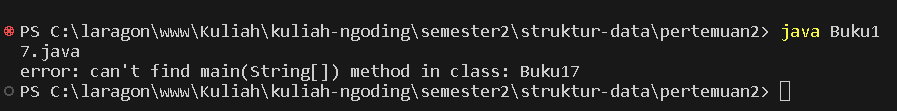

# LAPORAN PRAKTIKUM PERTMUAN 2

- Nama: Muhammad Afif Al Ghifari
- Kelas: TI-1H
- NIM: 2341720168

## PERCOBAAN 1

### Praktikum
public class Buku17 {

    String judul, pengarang;
    int halaman, stok, harga;

    void tampilnformasi() {
        System.out.println("Judul: " + judul);
        System.out.println("Pengarang: " + pengarang);
        System.out.println("Jumlah halaman: " + halaman);
        System.out.println("Sisa stok: " + stok);
        System.out.println("Harga: Rp " + harga);
    }

    void terjual(int jml) {
        stok -= jml;
    }

    void restock(int jml) {
        stok += jml;
    }

    void gantiHarga(int hrg) {
        harga = hrg;
    }
}
#### Kode program

#### Output program

### Pertanyaan

1. Sebutkan dua karakteristik class atau object!
    ##### Mempunyai atribut dan method
2. Perhatikan class Buku pada Praktikum 1 tersebut, ada berapa atribut yang dimiliki oleh class Buku? Sebutkan apa saja atributnya!
    ##### judul (string), pegarang (string), halaman (int), stok(int), harga (int)
3. Ada berapa method yang dimiliki oleh class tersebut? Sebutkan apa saja methodnya!
    ##### tampilInformasi(), terjual(jml: int), restock(n: int), gantiHarga(hrg: int)

4. Perhatikan method terjual() yang terdapat di dalam class Buku. Modifikasi isi method tersebut sehingga proses pengurangan hanya dapat dilakukan jika stok masih ada (lebih besar dari 0)!

---
    void terjual(int jml) {
        if (stok > 0 || jml > stok) {
            stok -= jml;
        }
    }
    
5. Menurut Anda, mengapa method restock() mempunyai satu parameter berupa bilangan int?
    ##### Karena 

6. Commit dan push kode program ke Github
