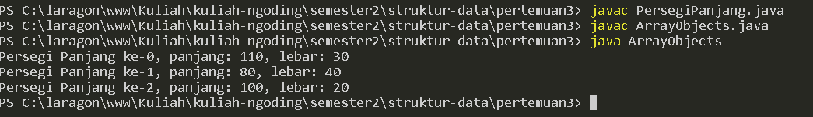
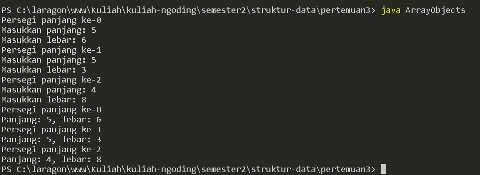
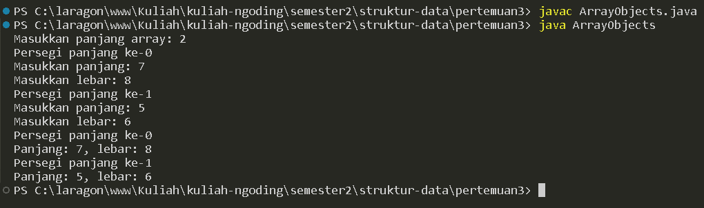
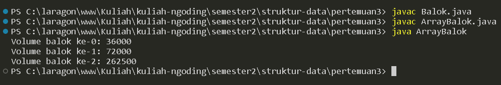
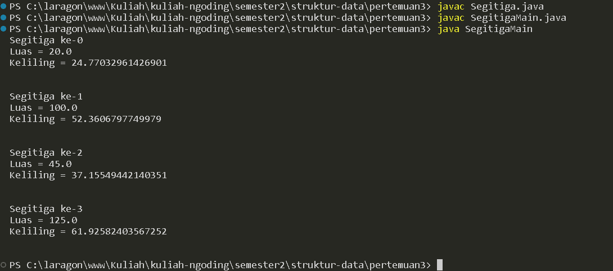
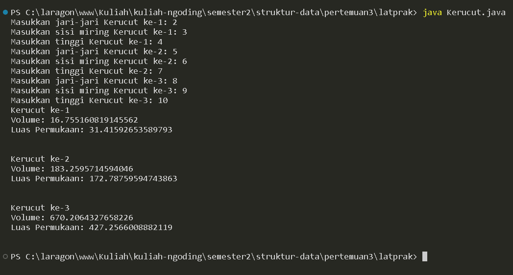
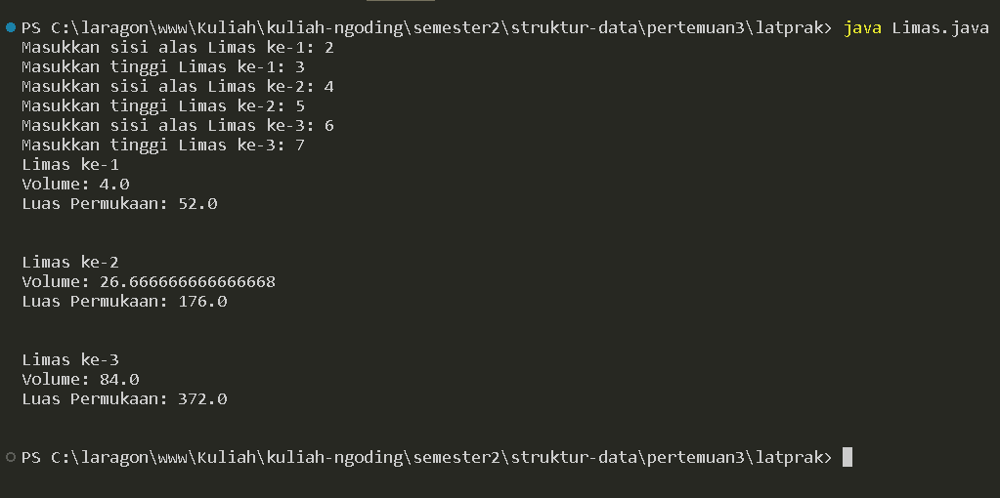
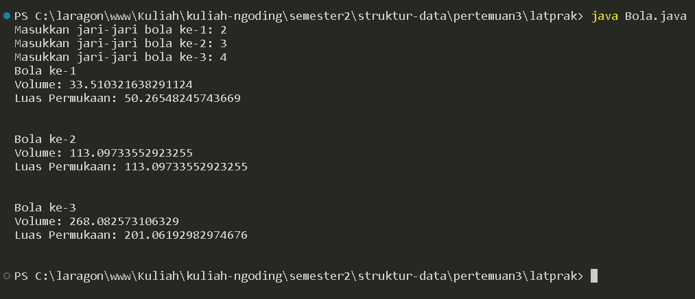
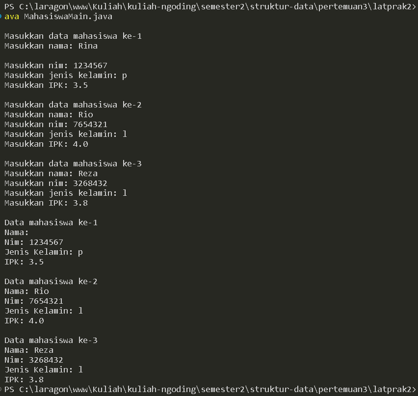
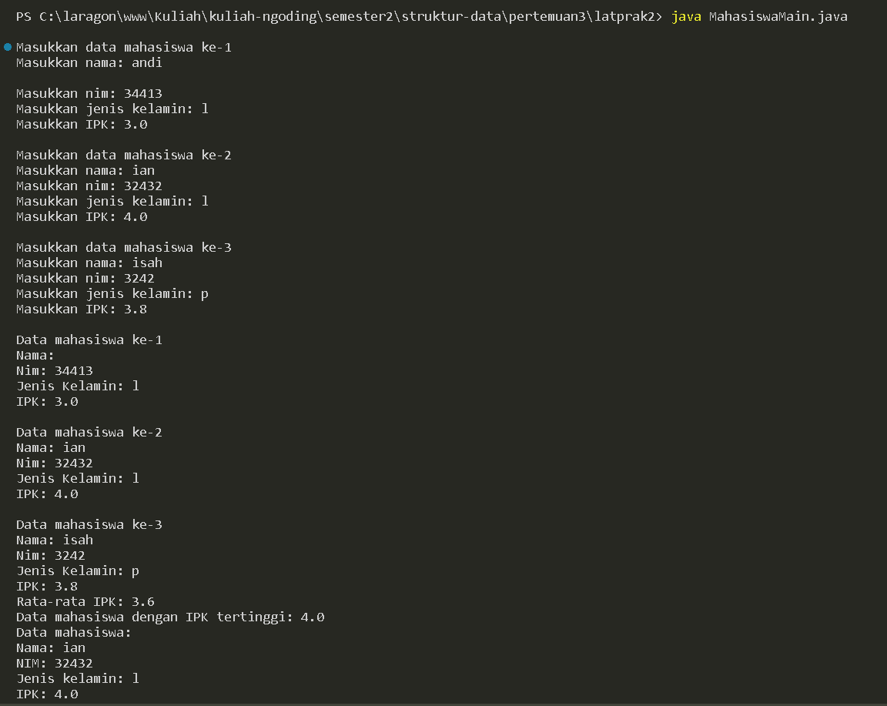

# LAPORAN PRAKTIKUM PERTMUAN 3

- Nama: Muhammad Afif Al Ghifari
- Kelas: TI-1H
- NIM: 2341720168

## 1. PERCOBAAN 1

### 1.1 Praktikum

```java
public class ArrayObjects {

    public static void main(String[] args) {
        PersegiPanjang[] ppArray = new PersegiPanjang[3];

        ppArray[0] = new PersegiPanjang();
        ppArray[0].panjang = 110;
        ppArray[0].lebar = 30;

        ppArray[1] = new PersegiPanjang();
        ppArray[1].panjang = 80;
        ppArray[1].lebar = 40;

        ppArray[2] = new PersegiPanjang();
        ppArray[2].panjang = 100;
        ppArray[2].lebar = 20;

        System.out.println("Persegi Panjang ke-0, panjang: " + ppArray[0].panjang+ ", lebar: "+ppArray[0].lebar);
        System.out.println("Persegi Panjang ke-1, panjang: " + ppArray[1].panjang+ ", lebar: "+ppArray[1].lebar);
        System.out.println("Persegi Panjang ke-2, panjang: " + ppArray[2].panjang+ ", lebar: "+ppArray[2].lebar);
    }
}
```

#### Kode program class ArrayObjects

```java
public class PersegiPanjang {
    public int panjang;
    public int lebar;

}
```

#### Kode program class PersegiPanjang



#### Output program

### 1.2 Pertanyaan

1.  Berdasarkan uji coba 3.2, apakah class yang akan dibuat array of object harus selalu memiliki atribut dan sekaligus method? Jelaskan!

    #### Jawab:

        Setiap object harus memiliki atribut agar bisa digunakan, namun object tidak harus memiliki method.

2.  Apakah class PersegiPanjang memiliki konstruktor? Jika tidak, kenapa dilakukan pemanggilan konstruktur pada baris program berikut :

    ```java
        ppArray[1] = new PersegiPanjang();
    ```

    #### Jawab:

        Class PersegiPanjang tidak memiliki konstruktor melainkan hanya mempunyai konstruktor default untuk membuat object baru

3.  Apa yang dimaksud dengan kode berikut ini:

    ```java
        PersegiPanjang[] ppArray = new PersegiPanjang[3];
    ```

    #### Jawab:

        Kode tersebut digunakan untuk menginstantiasi array of object

4.  Apa yang dimaksud dengan kode berikut ini:

    ```java
        ppArray[1] = new PersegiPanjang();
        ppArray[1].panjang = 80;
        ppArray[1].lebar = 40;
    ```

    #### Jawab:

        Baris kode tersebut merupakan proses pembuatan object dan mengisi atribut dari object tersebut

5.  Mengapa class main dan juga class PersegiPanjang dipisahkan pada uji coba 3.2?
    #### Jawab:
        Karena class PersegiPanjang merupakan konstruktor object

<br>

## 2. PERCOBAAN 2

### 2.1 Praktikum 2

```java
import java.util.Scanner;

public class ArrayObjects {

    public static void main(String[] args) {
        Scanner sc = new Scanner(System.in);
        PersegiPanjang[] ppArray = new PersegiPanjang[3];

        for (int i = 0; i < 3; i++) {
            ppArray[i] = new PersegiPanjang();
            System.out.println("Persegi panjang ke-" + i);
            System.out.print("Masukkan panjang: ");
            ppArray[i].panjang = sc.nextInt();
            System.out.print("Masukkan lebar: ");
            ppArray[i].lebar = sc.nextInt();
        }

        for (int i = 0; i < 3; i++) {
            System.out.println("Persegi panjang ke-" + i);
            System.out.println("Panjang: " + ppArray[i].panjang + ", lebar: " + ppArray[i].lebar);
        }
    }
}
```

#### Kode program



#### Output program

### 2.2 Pertanyaan

1.  Apakah array of object dapat diimplementasikan pada array 2 Dimensi?

    #### jawab:

        Array of objects dapat diimplementasikan pada array 2 dimensi seperti halnya dengan menggunakan nilai biasa

2.  Jika jawaban soal no satu iya, berikan contohnya! Jika tidak, jelaskan!

    #### jawab:

        ClassOrang[][] arrOrang = {
            {
                new ClassOrang("Orang 1"),
                new ClassOrang("Orang 2")
            },
            {
                new ClassOrang("Orang 3"),
                new ClassOrang("Orang 4")
            }
        };

3.  Jika diketahui terdapat class Persegi yang memiliki atribut sisi bertipe integer, maka kode dibawah ini akan memunculkan error saat dijalankan. Mengapa?

    ```java
        Persegi[] ppArray = new Persegi[100];
        pgArray[5].sisi = 20;
    ```

    #### jawab:

        Karena object belum diinstantiasi, sedangkan yang sudah diinstantiasi hanyalah array

4.  Modifikasi kode program pada praktikum 3.3 agar length array menjadi inputan dengan Scanner!

    #### jawab:

    ```java
        import java.util.Scanner;

        public class ArrayObjects {

            public static void main(String[] args) {
                Scanner sc = new Scanner(System.in);
                int pjgArr;

                System.out.print("Masukkan panjang array: ");
                pjgArr = sc.nextInt();

                PersegiPanjang[] ppArray = new PersegiPanjang[pjgArr];

                for (int i = 0; i < ppArray.length; i++) {
                    ppArray[i] = new PersegiPanjang();
                    System.out.println("Persegi panjang ke-" + i);
                    System.out.print("Masukkan panjang: ");
                    ppArray[i].panjang = sc.nextInt();
                    System.out.print("Masukkan lebar: ");
                    ppArray[i].lebar = sc.nextInt();
                }

                for (int i = 0; i < ppArray.length; i++) {
                    System.out.println("Persegi panjang ke-" + i);
                    System.out.println("Panjang: " + ppArray[i].panjang + ", lebar: " + ppArray[i].lebar);
                }
            }
        }
    ```

    

#### Kode dan output program

5.  Apakah boleh Jika terjadi duplikasi instansiasi array of objek, misalkan saja instansiasi dilakukan pada ppArray[i] sekaligus ppArray[0]?Jelaskan !
    #### jawab:
        Tidak diperbolehkan, karena akan mendapatkan kompilasi yang menghasilkan kesalahan (compile-time error).

<br>

## 3. PERCOBAAN 3

### 3.1 Praktikum 3

```java
public class ArrayBalok {
    public static void main(String[] args) {
        Balok[] blArray = new Balok[3];

        blArray[0] = new Balok(100, 30, 12);
        blArray[1] = new Balok(120, 40, 15);
        blArray[2] = new Balok(210, 50, 25);

        for (int i = 0; i < 3; i++) {
            System.out.println("Volume balok ke-" + i + ": " + blArray[i].hitungVolume());
        }
    }
}
```

#### Kode program ArrayBalok.java

```java
public int hitungVolume() {
        return panjang * lebar * tinggi;
    }
```

#### Kode program Balok.java



#### Output program

### 3.2 Pertanyaan

1.  Dapatkah konstruktor berjumlah lebih dalam satu kelas? Jelaskan dengan contoh!

    #### Jawab:

        Konstruktor dapat berjumlah lebih dari satu dalam suatu kelas

    ```java
    //konstruktor default
    public Buku17() {

    }

    //Konstruktor berparameter
    public Buku17(String jud, String pg, int hal, int stok, int har) {
        judul = jud;
        pengarang = pg;
        halaman = hal;
        this.stok = stok;
        harga = har;
    }
    ```

2.  Jika diketahui terdapat class Segitiga seperti berikut ini:

    ```java
        public class Segitiga {
            public int alas;
            public int tinggi;
        }

    ```

    Tambahkan konstruktor pada class Segitiga tersebut yang berisi parameter int a, int t yang masing-masing digunakan untuk mengisikan atribut alas dan tinggi.

    #### Jawab:

    ```java
        public class Segitiga {
            public int alas;
            public int tinggi;

            public Segitiga(int a, int t){
                alas = a;
                tinggi = t;
            }
        }
    ```

3.  Tambahkan method hitungLuas() dan hitungKeliling() pada class Segitiga tersebut. Asumsi segitiga adalah segitiga siku-siku. (Hint: Anda dapat menggunakan bantuan library Math pada Java untuk mengkalkulasi sisi miring)

    #### Jawab:

    ```java
    public class Segitiga {
        public int alas;
        public int tinggi;

        public Segitiga(int a, int t) {
            alas = a;
            tinggi = t;
        }

        double hitungLuas(int a, int t) {
            return a * t / 2;
        }

        double hitungKeliling(int a, int t) {
            double miring = Math.sqrt(a * a + t * t);
            return a + t + miring;
        }

    }
    ```

4.  Pada fungsi main, buat array Segitiga sgArray yang berisi 4 elemen, isikan masing-masing
    atributnya sebagai berikut:

        - sgArray ke-0 alas: 10, tinggi: 4
        - sgArray ke-1 alas: 20, tinggi: 10
        - sgArray ke-2 alas: 15, tinggi: 6
        - sgArray ke-3 alas: 25, tinggi: 10

    #### Jawab:

    ```java
    public class SegitigaMain {
        public static void main(String[] args) {
            Segitiga[] sgArray = new Segitiga[4];

            sgArray[0] = new Segitiga(10, 4);
            sgArray[1] = new Segitiga(20, 10);
            sgArray[2] = new Segitiga(15, 6);
            sgArray[3] = new Segitiga(25, 10);
        }
    }

    ```

5.  Kemudian menggunakan looping, cetak luas dan keliling dengan cara memanggil method hitungLuas() dan hitungKeliling()

    #### Jawab:

    ```java
    public class SegitigaMain {
    public static void main(String[] args) {
    Segitiga[] sgArray = new Segitiga[4];

            sgArray[0] = new Segitiga(10, 4);
            sgArray[1] = new Segitiga(20, 10);
            sgArray[2] = new Segitiga(15, 6);
            sgArray[3] = new Segitiga(25, 10);

            for (int i = 0; i < sgArray.length; i++) {
                System.out.println("Segitiga ke-"+i);
                System.out.println("Luas = "+ sgArray[i].hitungLuas(sgArray[i].alas, sgArray[i].tinggi ));
                System.out.println("Keliling = "+ sgArray[i].hitungKeliling(sgArray[i].alas, sgArray[i].tinggi )+"\n\n");
            }
        }

    }
    ```

    

    #### Kode dan output program

<br >

## 4. LATIHAN PRAKTIKUM

### 4.1 Soal 1

Buatlah program yang dapat menghitung luas permukaan dan volume bangun ruang kerucut, limas segi empat sama sisi, dan bola. Buatlah 3 (tiga) class sesuai dengan jumlah jenis bangun ruang. Buatlah satu main class untuk membuat array of objects yang menginputkan atribut-atribut yang ada menggunakan konstruktor semua bangun ruang tersebut. Dengan ketentuan,

a. Buat looping untuk menginputkan masing-masing atributnya, kemudian tampilkan luas permukaan dan volume dari tiap jenis bangun ruang tersebut.

b. Pada kerucut, inputan untuk atribut hanya jari-jari dan sisi miring

c. Pada limas segi empat sama sisi, inputan untuk atribut hanya panjang sisi alas dan tinggi limas

d. Pada bola, inpuntan untuk atribut hanya jari-jari

#### Jawab:

```java
package latprak;

import java.util.Scanner;

public class Kerucut {
    double r, sisiMiring, tinggi;

    double hitungVolume(double jr, double sm, double t) {
        return (Math.PI * jr * jr) * t / 3;
    }

    double hitungLuasPermukaan(double jr, double sm, double t) {
        return Math.PI * jr * (sm + jr);
    }

    public static void main(String[] args) {
        Scanner sc = new Scanner(System.in);

        Kerucut[] kerucut = new Kerucut[3];

        for (int i = 0, j = 1; i < kerucut.length; i++, j++) {
            kerucut[i] = new Kerucut();
            System.out.print("Masukkan jari-jari Kerucut ke-" + j + ": ");
            kerucut[i].r = sc.nextDouble();
            System.out.print("Masukkan sisi miring Kerucut ke-" + j + ": ");
            kerucut[i].sisiMiring = sc.nextDouble();
            System.out.print("Masukkan tinggi Kerucut ke-" + j + ": ");
            kerucut[i].tinggi = sc.nextDouble();
        }

        for (int i = 0, j = 1; i < kerucut.length; i++, j++) {
            System.out.println("Kerucut ke-" + j);
            System.out.println("Volume: " + kerucut[i].hitungVolume(kerucut[i].r, kerucut[i].sisiMiring, kerucut[i].tinggi));
            System.out.println("Luas Permukaan: "+ kerucut[i].hitungLuasPermukaan(kerucut[i].r, kerucut[i].sisiMiring, kerucut[i].tinggi) + "\n\n");
        }
    }
}

```



#### Kode program dan output Kerucut.java

```java
package latprak;

import java.util.Scanner;

public class Limas {
    double sisiAlas, tinggi;

    double hitungVolume(double a, double t) {
        return a * a * t / 3;
    }

    double hitungLuasPermukaan(double a, double t) {
        return (a * a) + 4 * ((a * t) * 2);
    }

    public static void main(String[] args) {
        Scanner sc = new Scanner(System.in);

        Limas[] limas = new Limas[3];

        for (int i = 0, j = 1; i < limas.length; i++, j++) {
            limas[i] = new Limas();
            System.out.print("Masukkan sisi alas Limas ke-" + j + ": ");
            limas[i].sisiAlas = sc.nextDouble();
            System.out.print("Masukkan tinggi Limas ke-" + j + ": ");
            limas[i].tinggi = sc.nextDouble();
        }

        for (int i = 0, j = 1; i < limas.length; i++, j++) {
            System.out.println("Limas ke-" + j);
            System.out.println("Volume: " + limas[i].hitungVolume(limas[i].sisiAlas, limas[i].tinggi));
            System.out.println("Luas Permukaan: " + limas[i].hitungLuasPermukaan(limas[i].sisiAlas, limas[i].tinggi) + "\n\n");
        }
    }
}
```



#### Kode program dan output Limas.java

```java
package latprak;

import java.util.Scanner;

public class Bola {
    double r;

    double hitungVolume(double r) {
        return (4 * Math.PI * r * r * r) / 3;
    }

    double hitungLuasPermukaan(double r) {
        return 4 * Math.PI * r * r;
    }

    public static void main(String[] args) {
        Scanner sc = new Scanner(System.in);

        Bola[] bola = new Bola[3];

        for (int i = 0, j = 1; i < bola.length; i++, j++) {
            bola[i] = new Bola();
            System.out.print("Masukkan jari-jari bola ke-" + j + ": ");
            bola[i].r = sc.nextDouble();
        }

        for (int i = 0, j = 1; i < bola.length; i++, j++) {
            System.out.println("Bola ke-" + j);
            System.out.println("Volume: " + bola[i].hitungVolume(bola[i].r));
            System.out.println("Luas Permukaan: " + bola[i].hitungLuasPermukaan(bola[i].r)+"\n\n");
        }
    }
}

```



#### Kode program dan output bola.java

### 4.2 Soal 2

Sebuah kampus membutuhkan program untuk menampilkan informasi mahasiswa berupa nama, nim, jenis kelamin dan juga IPK mahasiswa. Program dapat menerima input semua informasi tersebut, kemudian menampilkanya kembali ke user. Implementasikan program tersebut jika dimisalkan terdapat 3 data mahasiswa yang tersedia. Contoh output program:

#### Jawab:

```java
public class Mahasiswa{
    public String nama;
    public int nim;
    public char jenisKelamin;
    public double IPK;
}

```

#### Kode program Mahasiswa.java

```java

import java.util.Scanner;

public class MahasiswaMain {
    public static void main(String[] args) {
        Scanner sc = new Scanner(System.in);

        Mahasiswa[] mhs = new Mahasiswa[3];

        for (int i = 0, j = 1; i < mhs.length; i++, j++) {
            System.out.println("\nMasukkan data mahasiswa ke-" + j);
            mhs[i] = new Mahasiswa();
            System.out.print("Masukkan nama: ");
            sc.nextLine();
            mhs[i].nama = sc.nextLine();
            System.out.print("Masukkan nim: ");
            mhs[i].nim = sc.nextInt();
            System.out.print("Masukkan jenis kelamin: ");
            mhs[i].jenisKelamin = sc.next().charAt(0);
            System.out.print("Masukkan IPK: ");
            mhs[i].IPK = sc.nextDouble();
        }

        for (int i = 0, j = 1; i < mhs.length; i++, j++) {
            System.out.println("\nData mahasiswa ke-" + j);
            System.out.println("Nama: " + mhs[i].nama);
            System.out.println("Nim: " + mhs[i].nim);
            System.out.println("Jenis Kelamin: " + mhs[i].jenisKelamin);
            System.out.println("IPK: " + mhs[i].IPK);
        }
    }
}

```

#### Kode program Mahasiswa.java



#### Output program

### 4.3 Soal 3

Modifikasi program Latihan no.2 di atas, sehingga bisa digunakan untuk menghitung rata-rata IPK, serta menampilkan data mahasiswa dengan IPK terbesar! (gunakan method untuk masing-masing
proses tersebut)

#### Jawab:
```java
public class Mahasiswa{
    public String nama;
    public int nim;
    public char jenisKelamin;
    public double IPK;
}

```

#### Kode program Mahasiswa.java

```java
import java.util.Scanner;

public class MahasiswaMain {

    public static void main(String[] args) {
        Scanner sc = new Scanner(System.in);

        Mahasiswa[] mhs = new Mahasiswa[3];

        for (int i = 0, j = 1; i < mhs.length; i++, j++) {
            System.out.println("\nMasukkan data mahasiswa ke-" + j);
            mhs[i] = new Mahasiswa();
            System.out.print("Masukkan nama: ");
            sc.nextLine();
            mhs[i].nama = sc.nextLine();
            System.out.print("Masukkan nim: ");
            mhs[i].nim = sc.nextInt();
            System.out.print("Masukkan jenis kelamin: ");
            mhs[i].jenisKelamin = sc.next().charAt(0);
            System.out.print("Masukkan IPK: ");
            mhs[i].IPK = sc.nextDouble();
        }

        double rataRata = 0, 
               ipkTertinggi = 0;
        int dataMhsTertinggi = 0;

        for (int i = 0; i < mhs.length; i++) {
            rataRata += mhs[i].IPK;
        }
        rataRata /= mhs.length;

        for (int i = 0; i < mhs.length; i++) {
            if (mhs[i].IPK > ipkTertinggi) {
                ipkTertinggi = mhs[i].IPK;
                dataMhsTertinggi = i;
            }
        }

        for (int i = 0, j = 1; i < mhs.length; i++, j++) {
            System.out.println("\nData mahasiswa ke-" + j);
            System.out.println("Nama: " + mhs[i].nama);
            System.out.println("Nim: " + mhs[i].nim);
            System.out.println("Jenis Kelamin: " + mhs[i].jenisKelamin);
            System.out.println("IPK: " + mhs[i].IPK);
        }
        
        System.out.println();
        System.out.println("Rata-rata IPK: " + rataRata);
        System.out.println("Data mahasiswa dengan IPK tertinggi: " + ipkTertinggi);
        System.out.println("Data mahasiswa:");
        System.out.println("Nama: " + mhs[dataMhsTertinggi].nama);
        System.out.println("NIM: " + mhs[dataMhsTertinggi].nim);
        System.out.println("Jenis kelamin: " + mhs[dataMhsTertinggi].jenisKelamin);
        System.out.println("IPK: " + mhs[dataMhsTertinggi].IPK);
    }
}

```
#### Kode program Mahasiswa.java



#### Output program