# LAPORAN PRAKTIKUM PERTMUAN 5

- Nama: Muhammad Afif Al Ghifari
- Kelas: TI-1H
- NIM: 2341720168

## 1. PERCOBAAN 1

### 1.1 Praktikum

```java
    public class Faktorial {

    public int nilai;

    int faktorialBF(int n){
        int fakto = 1;
        for (int i = 1; i <= n; i++) {
            fakto *= i;
        }
        return fakto;
    }

    int faktorialDC(int n){
        if (n == 0) {
            return 1;
        } else {
            int fakto = n * faktorialDC(n - 1);
            return fakto;
        }
    }
}

```

#### Kode program Faktorial.java

```java
import java.util.Scanner;

public class MainFaktorial {
    public static void main(String[] args) {
        Scanner sc = new Scanner(System.in);
        System.out.println("----------------");
        System.out.println("Masukkan jumlah elemen: ");
        int iJml = sc.nextInt();

        Faktorial[] fk = new Faktorial[10];
        for (int i = 0; i < iJml; i++) {
            fk[i] = new Faktorial();
            System.out.println("Masukkan elemen ke-" + (i + 1) + ": ");
            fk[i].nilai = sc.nextInt();
        }

        for (int i = 0; i < iJml; i++) {
            System.out.println(fk[i].nilai);
        }

        System.out.println("HASIL - BRUTE FORCE");
        for (int i = 0; i < iJml; i++) {
            System.out.println("Hasil perhitungan faktorial menggunakan Brute Force adalah " + fk[i].faktorialBF(fk[i].nilai));
        }
        System.out.println("HASIL - DIVIDE AND CONQUER");
        for (int i = 0; i < iJml; i++) {
            System.out.println("Hasil perhitungan faktorial menggunakan Divide and Conquer adalah " + fk[i].faktorialDC(fk[i].nilai));
        }
    }
}

```

#### Kode program MainFaktorial.java

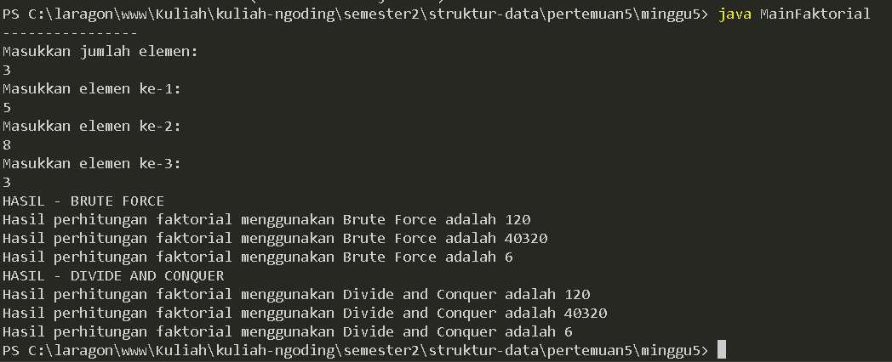

#### Output program

### 1.2 Pertanyaan

1.  Pada base line Algoritma Divide Conquer untuk melakukan pencarian nilai faktorial, jelaskan perbedaan bagian kode pada penggunaan if dan else!

    #### Jawab:

        Jika nilai n sama dengan 0 maka akan mengembalikan nilai 1, jika selain dari 0 maka akan melakukan operasi 'fakto = n * faktorialDC(n - 1)' yang mana menggunakan fungsi rekursif.

2.  Apakah memungkinkan perulangan pada method faktorialBF() dirubah selain menggunakan for? Buktikan!

    #### Jawab:
        Bisa dengan menggunakan while.

    ```java
    int faktorialBF(int n){
        int fakto = 1;
        int i = 1;
        while (i <= n) {
            fakto *= i;
            i++;
        }
        return fakto;
    }
    ```
    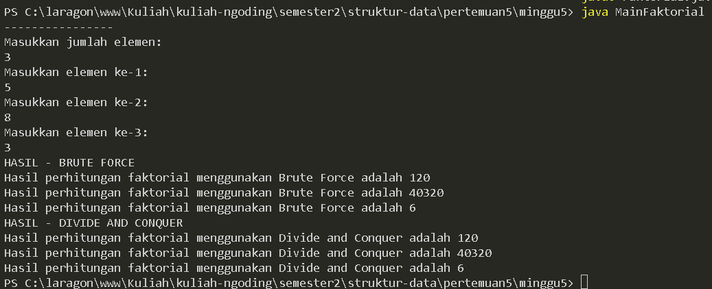
    #### kode program dan hasil
        

3.  Jelaskan perbedaan antara fakto *= i; dan int fakto = n * faktorialDC(n-1); !

    #### Jawab:

        'fakto *= i;' adalah operasi penggandaan dalam loop, sementara 'int fakto = n * faktorialDC(n - 1);' adalah pemanggilan fungsi rekursif untuk menghitung nilai faktorial.

<br>

## 2. PERCOBAAN 2

### 2.1 Praktikum 2

```java
public class Pangkat {
    public int nilai, pangkat;

    int pangkatBF(int a, int n) {
        int hasil = 1;
        for (int i = 0; i < n; i++) {
            hasil *= a;
        }
        return hasil;
    }

    int pangkatDC(int a, int n) {
        if (n == 0) {
            return 1;
        } else {
            if (n % 2 == 1) {
                return (pangkatDC(a, n / 2) * pangkatDC(a, n / 2) * a);
            } else {
                return (pangkatDC(a, n / 2) * pangkatDC(a, n / 2));
            }
        }
    }
}
```

#### Kode program Pangkat.java

```java
import java.util.Scanner;

public class MainPangkat {
    public static void main(String[] args) {
        Scanner sc = new Scanner(System.in);
        System.out.println("==============================");
        System.out.println("Masukkan jumlah elemen yang dihitung: ");
        int element = sc.nextInt();

        Pangkat[] png = new Pangkat[element];
        for (int i = 0; i < element; i++) {
            png[i] = new Pangkat();
            System.out.println("Masukkan nilai yang hendak dipangkatkan: ");
            png[i].nilai = sc.nextInt();
            System.out.println("Masukkan nilai pemangkat: ");
            png[i].pangkat = sc.nextInt();
        }

        System.out.println("HASIL PANGKAT- BRUTE FORCE");
        for (int i = 0; i < element; i++) {
            System.out.println("Hasil dari: " + png[i].nilai + " pangkat " + png[i].pangkat + " adalah "
                    + png[i].pangkatBF(png[i].nilai, png[i].pangkat));
        }
        System.out.println("HASIL PANGKAT- DIVIDE AND CONQUER");
        for (int i = 0; i < element; i++) {
            System.out.println("Hasil dari: " + png[i].nilai + " pangkat " + png[i].pangkat + " adalah "
                    + png[i].pangkatDC(png[i].nilai, png[i].pangkat));
        }
    }
}
```

#### Kode program MainPangkat.java

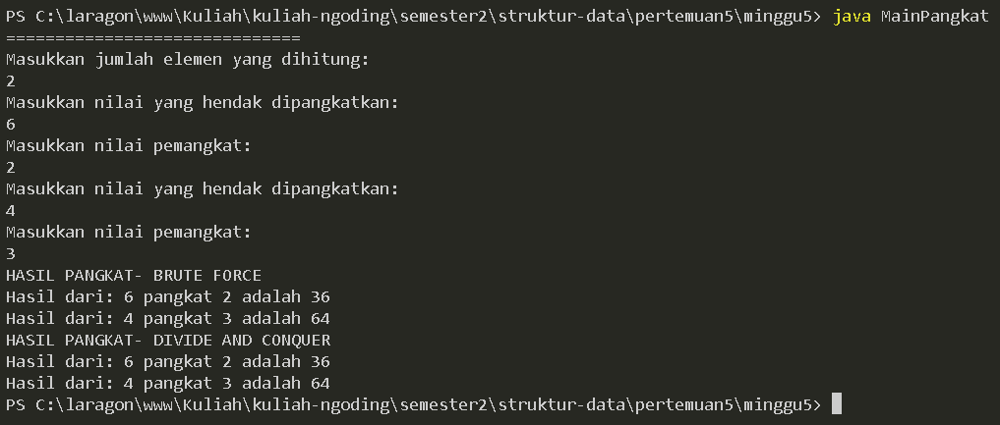

#### Output program

### 2.2 Pertanyaan

1.  Jelaskan mengenai perbedaan 2 method yang dibuat yaitu PangkatBF() dan PangkatDC()!

    #### jawab:

        method 'pangkatBF()' menggunakan cara iteratif, sedangkan method 'pangkatDC()' menggunakan cara fungsi rekursif.

2.  Apakah tahap combine sudah termasuk dalam kode tersebut? Tunjukkan!

    #### jawab:
        Ya, tahap combine terjadi ketika hasil dari dua penggunaan rekursif pangkatDC(a, n/2) dikalikan. Jika n merupakan bilangan ganjil maka hasilnya juga dikalikan dengan a.
        
        contoh:
    ```java
    if (n % 2 == 1) {
        return (pangkatDC(a, n / 2) * pangkatDC(a, n / 2) * a);
    } else {
        return (pangkatDC(a, n / 2) * pangkatDC(a, n / 2));
    }
    ```
        

3.  Modifikasi kode program tersebut, anggap proses pengisian atribut dilakukan dengan konstruktor.

    #### jawab:

    ```java
    //Pangkat.java
    public Pangkat(int nilai, int pangkat){
        this.nilai = nilai;
        this.pangkat = pangkat;
    }
    ```

    ```java
    //MainPangkat.java
    for (int i = 0; i < element; i++) {
            System.out.println("Masukkan nilai yang hendak dipangkatkan: ");
            int nilai = sc.nextInt();
            System.out.println("Masukkan nilai pemangkat: ");
            int pangkat = sc.nextInt();
            png[i] = new Pangkat(nilai, pangkat);
        }
    ```

    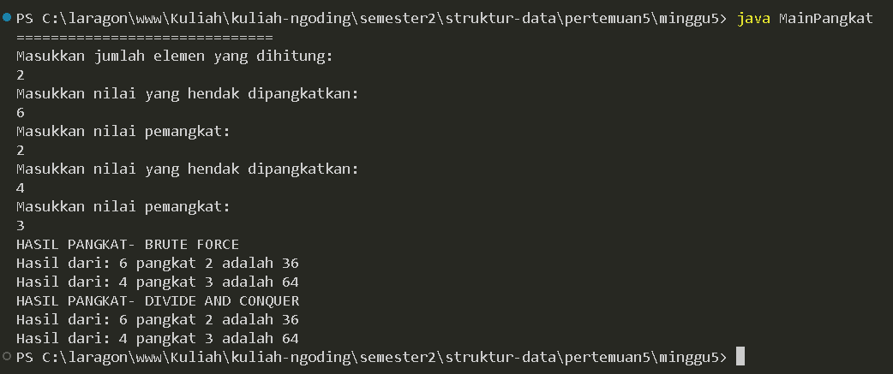
    
    #### Kode program dan output

4.  Tambahkan menu agar salah satu method yang terpilih saja yang akan dijalankan menggunakan switch-case!

    #### jawab:

    ```java
    //MainPangkat.java
    System.out.println("Pilih metode pemangkatan:");
        System.out.println("1. Brute Force");
        System.out.println("2. Divide and Conquer");
        System.out.println("pilih: ");
        int pilihan = sc.nextInt();
        switch (pilihan) {
            case 1:
                System.out.println("HASIL PANGKAT- BRUTE FORCE");
                for (int i = 0; i < element; i++) {
                    System.out.println("Hasil dari: " + png[i].nilai + " pangkat " + png[i].pangkat + " adalah "
                            + png[i].pangkatBF(png[i].nilai, png[i].pangkat));
                }
                break;
            case 2:
                System.out.println("HASIL PANGKAT- DIVIDE AND CONQUER");
                for (int i = 0; i < element; i++) {
                    System.out.println("Hasil dari: " + png[i].nilai + " pangkat " + png[i].pangkat + " adalah "
                            + png[i].pangkatDC(png[i].nilai, png[i].pangkat));
                }
                break;
            default:
                System.out.println("Pilihan tidak valid");
                break;
        }
    ```
    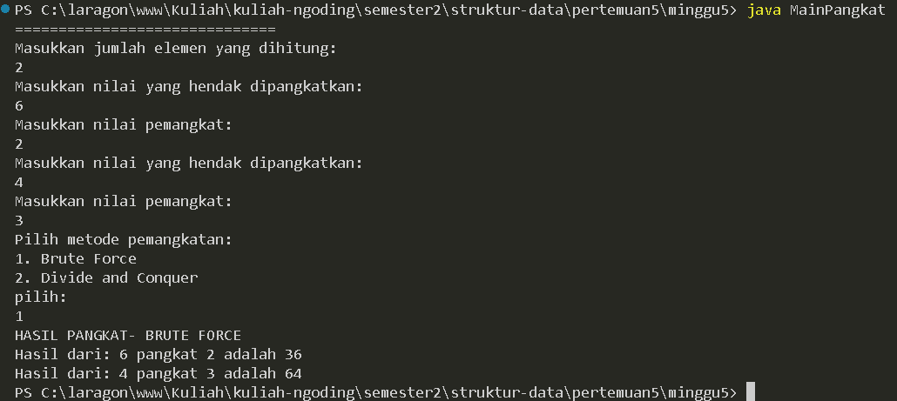
    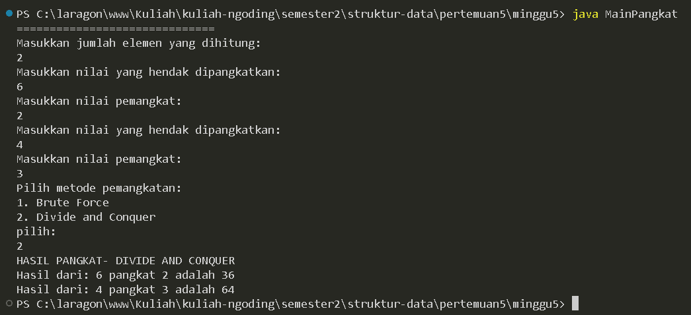

    #### Kode program dan output 


<br>

## 3. PERCOBAAN 3

### 3.1 Praktikum 3

```java
public class Sum {
    int elemen;
    double keuntungan[], total;

    Sum(int elemen) {
        this.elemen = elemen;
        keuntungan = new double[elemen];
        total = 0;
    }

    double totalBF(double arr[]) {
        for (int i = 0; i < elemen; i++) {
            total = total + arr[i];
        }
        return total;
    }

    double totalDC(double arr[], int l, int r) {
        if (l == r) {
            return arr[l];
        } else if (l < r) {
            int mid = (l + r) / 2;
            double lSum = totalDC(arr, l, mid);
            double rSum = totalDC(arr, mid + 1, r);
            return lSum + rSum;
        }
        return 0;
    }
}

```

#### Kode program Sum.java

```java
import java.util.Scanner;

public class MainSum {
    public static void main(String[] args) {
        Scanner sc = new Scanner(System.in);

        System.out.println("=======================================");
        System.out.println("Program menghitung keuntungan total (satuan juta, misal 5.9)");
        System.out.print("Masukkan jumlah bulan: ");
        int elm = sc.nextInt();

        Sum sm = new Sum(elm);
        System.out.println("=======================================");
        for (int i = 0; i < sm.elemen; i++) {
            System.out.print("Masukkan keuntungan bulan ke-" + (i + 1) + " = ");
            sm.keuntungan[i] = sc.nextDouble();
        }

        System.out.println("=======================================");
        System.out.println("Algoritma brute force");
        System.out.println("Total keuntungan perusahaan selama " + sm.elemen + " bulan adalah = " + sm.totalBF(sm.keuntungan));
        System.out.println("=======================================");
        System.out.println("Algoritma divide conquer");
        System.out.println("Total keuntungan perusahaan selama " + sm.elemen + " bulan adalah = " + sm.totalDC(sm.keuntungan, 0, sm.elemen-1));
    }
}

```

#### Kode program MainSum.java

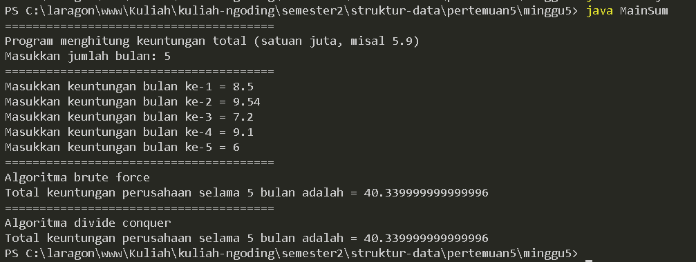

#### Output program

### 3.2 Pertanyaan

1.  Mengapa terdapat formulasi return value berikut?Jelaskan!

    ```java
        return lsum+rsum+arr[mid];
    ```

    #### Jawab:

        Untuk menjumlahkan masing-masing nilai yang telah dimasukkan menjadi total akhir dari keuntungan perusahaan.

2.  Kenapa dibutuhkan variable mid pada method TotalDC()?

    #### Jawab:

        Sebagai nilai tengah dan pembagi bagian kanan serta kiri sebelum dilakukan perhitungan.

3.  Program perhitungan keuntungan suatu perusahaan ini hanya untuk satu perusahaan saja. Bagaimana cara menghitung sekaligus keuntungan beberapa bulan untuk beberapa perusahaan. (Setiap perusahaan bisa saja memiliki jumlah bulan berbeda-beda)? Buktikan dengan program!

    #### Jawab:

    ```java
    import java.util.Scanner;

    public class MainSum {
        public static void main(String[] args) {
            Scanner sc = new Scanner(System.in);

            System.out.println("=======================================");
            System.out.println("Program menghitung keuntungan total (satuan juta, misal 5.9)");
            
            System.out.print("Masukkan jumlah bulan: ");
            int elm = sc.nextInt();

            System.out.print("Masukkan jumlah perusahaan: ");
            int jmlPerusahaan = sc.nextInt();
            Sum[] sm = new Sum[jmlPerusahaan];

            System.out.println("=======================================");
            for (int i = 0; i < jmlPerusahaan; i++) {
                sm[i] = new Sum(elm);
                System.out.println("Perusahaan " + (i + 1));
                for (int j = 0; j < elm; j++) {
                    System.out.print("Masukkan keuntungan bulan ke-" + (j + 1) + " = ");
                    sm[i].keuntungan[j] = sc.nextDouble();
                }
            }

            for (int i = 0; i < jmlPerusahaan; i++) {   
                System.out.println("=======================================");
                System.out.println("Algoritma brute force");
                System.out.println("Perusahaan " + (i + 1));
                System.out.println("Total keuntungan perusahaan selama " + sm[i].elemen + " bulan adalah = " + sm[i].totalBF(sm[i].keuntungan));
            }
            for (int i = 0; i < jmlPerusahaan; i++) {   
                System.out.println("=======================================");
                System.out.println("Algoritma divide conquer");
                System.out.println("Perusahaan " + (i + 1));
                System.out.println("Total keuntungan perusahaan selama " + sm[i].elemen + " bulan adalah = " + sm[i].totalDC(sm[i].keuntungan, 0, sm[i].elemen-1));
            }
        }
    }
    ```
    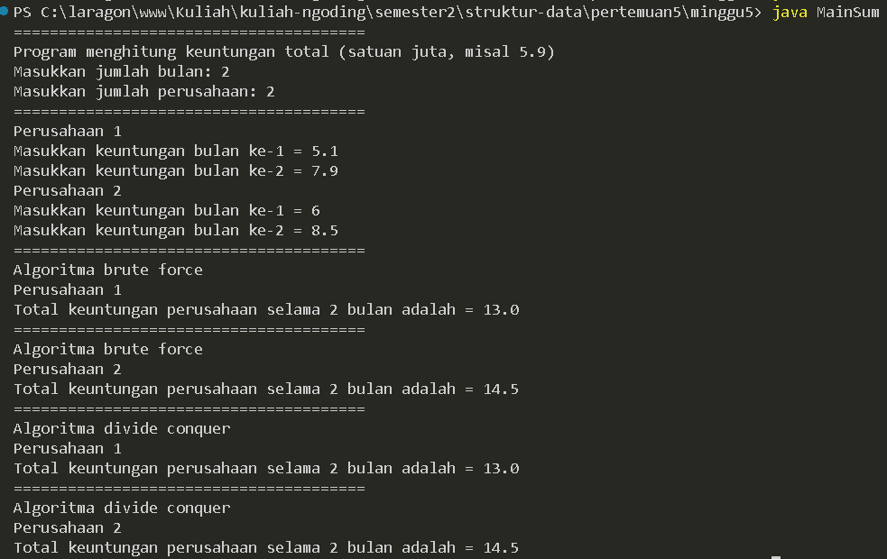

    #### Kode program dan output


<br >

## 4. LATIHAN PRAKTIKUM

### 4.1 Soal

Sebuah showroom memiliki daftar mobil dengan data sesuai tabel di bawah ini


tentukan:
<br>
a) top_acceleration tertinggi menggunakan Divide and Conquer!
<br>
b) top_acceleration terendah menggunakan Divide and Conquer!
<br>
c) Rata-rata top_power dari seluruh mobil menggunakan Brute Force!

#### Jawab:

```java
// Car.java
    public class Car {
    double variant, power[];
    int accel[];

    Car(int variant) {
        this.variant = variant;
        this.power = new double[variant];
        this.accel = new int[variant];
    }

    double mean(double arr[]) {
        double total = 0;
        for (int i = 0; i < this.variant; i++) {
            total += arr[i];
        }
        return total /= variant;
    }

    void accel(int arr[], int x, int y) {
        if (x < y) {
            int mid = partition(arr, x, y);
            accel(arr, x, mid - 1);
            accel(arr, mid + 1, y);
        }
    }

    void swap(int[] arr, int i, int j) {
        int x = arr[i];
        arr[i] = arr[j];
        arr[j] = x;
    }

    int partition(int[] arr, int x, int y) {
        int highest = arr[y];
        int i = x - 1;

        for (int j = x; j < y; j++) {
            if (arr[j] <= highest) {
                i++;
                swap(arr, i, j);
            }
        }
        swap(arr, i + 1, y);
        return i + 1;
    }
}
```

```java
    //MainCar.java
    import java.util.Scanner;

public class MainCar {
    public static void main(String[] args) {
        Scanner sc = new Scanner(System.in);

        System.out.print("Masukkan jumlah mobil : ");
        int x = sc.nextInt();
        Car variant = new Car(x);

        System.out.println("================================");

        System.out.println("Apa yang ingin Anda hitung?");
        System.out.println("1. Akselerasi tertinggi");
        System.out.println("2. Akselerasi terendah");
        System.out.println("3. Rata-rata power");
        System.out.print("pilih: ");

        int pilihan = sc.nextInt();

        switch (pilihan) {
            case 1:
                System.out.println("=============================================");
                System.out.println("Menghitung akselerasi tertinggi dari mobil-mobil yang telah diinput");

                for (int i = 0; i < x; i++) {
                    System.out.print("Masukkan akselerasi untuk mobil ke-" + (i + 1) + " : ");
                    variant.accel[i] = sc.nextInt();
                }

                variant.accel(variant.accel, 0, variant.accel.length - 1);
                System.out.println("Akselerasi tertinggi adalah : " + variant.accel[variant.accel.length - 1]);

                break;

            case 2:
                System.out.println("=============================================");
                System.out.println("Menghitung rata-rata power dari mobil-mobil yang telah diinput");

                for (int i = 0; i < x; i++) {
                    System.out.print("Masukkan power untuk mobil ke-" + (i + 1) + " : ");
                    variant.accel[i] = sc.nextInt();
                }

                variant.accel(variant.accel, 0, variant.accel.length - 1);
                System.out.println("Akselerasi terendah adalah : " + variant.accel[0]);

                break;

            case 3:
                System.out.println("=============================================");
                System.out.println("Menghitung rata-rata power dari mobil-mobil yang telah diinput");

                for (int i = 0; i < x; i++) {
                    System.out.print("Masukkan power untuk mobil ke-" + (i + 1) + " : ");
                    variant.power[i] = sc.nextDouble();
                }
                System.out
                        .println("Rata-rata power dari mobil-mobil tersebut adalah : " + variant.mean(variant.power));

                break;
        }
    }
}
```

a) Akselerasi tertinggi 
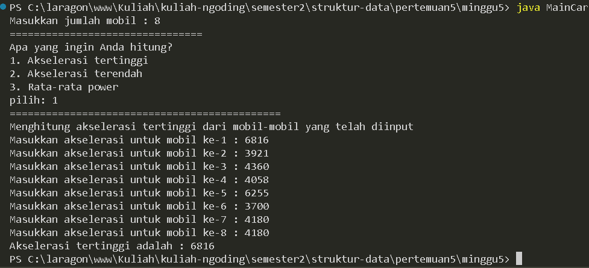

b) Akselerasi terendah 
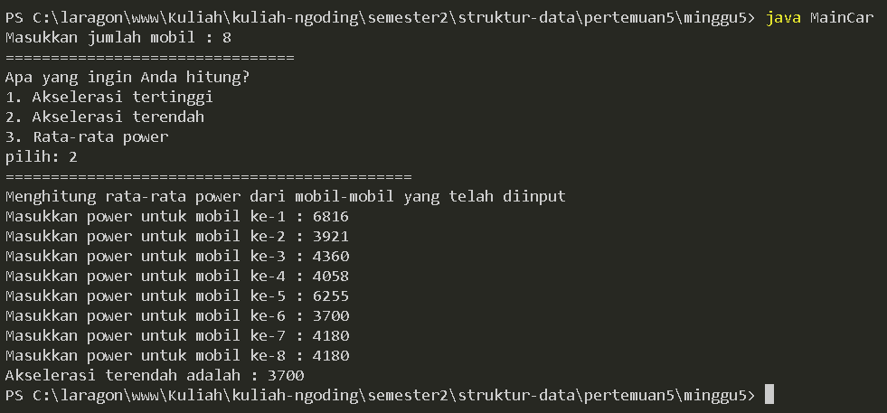

c) Rata-rata power 
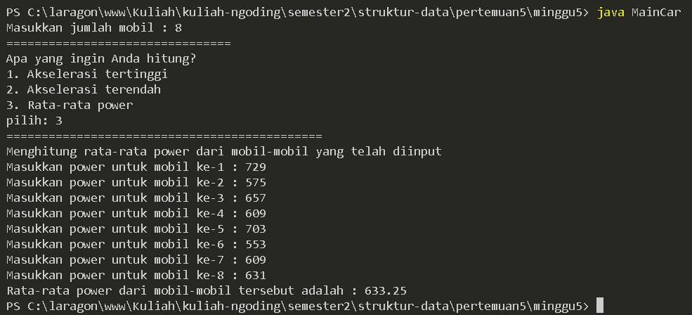

#### Kode program dan output
