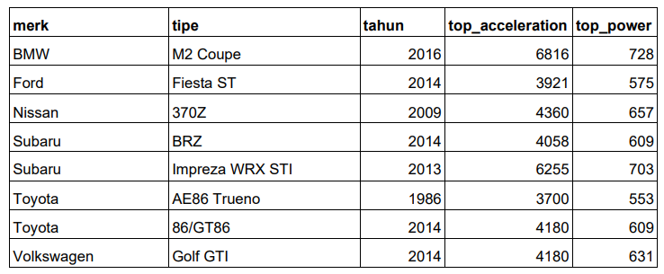

# LAPORAN PRAKTIKUM PERTMUAN 5

- Nama: Muhammad Afif Al Ghifari
- Kelas: TI-1H
- NIM: 2341720168

## 1. PERCOBAAN 1

### 1.1 Praktikum

```java

```

#### Kode program 

```java
```

#### Kode program


#### Output program

### 1.2 Pertanyaan

1.  Pada base line Algoritma Divide Conquer untuk melakukan pencarian nilai faktorial, jelaskan perbedaan bagian kode pada penggunaan if dan else!

    #### Jawab:

        Setiap 

2.  Apakah memungkinkan perulangan pada method faktorialBF() dirubah selain menggunakan for? Buktikan!

    #### Jawab:

        Class 

3.  Jelaskan perbedaan antara fakto *= i; dan int fakto = n * faktorialDC(n-1); !

    #### Jawab:

        Kode 

<br>

## 2. PERCOBAAN 2

### 2.1 Praktikum 2

```java
```

#### Kode program


#### Output program

### 2.2 Pertanyaan

1.  Jelaskan mengenai perbedaan 2 method yang dibuat yaitu PangkatBF() dan PangkatDC()!

    #### jawab:

        Array 

2.  Apakah tahap combine sudah termasuk dalam kode tersebut?Tunjukkan!

    #### jawab:
        a   

3.  Modifikasi kode program tersebut, anggap proses pengisian atribut dilakukan dengan konstruktor.

    #### jawab:

        Karena 

4.  Tambahkan menu agar salah satu method yang terpilih saja yang akan dijalankan menggunakan switch-case!

    #### jawab:
        a
    
<br>

## 3. PERCOBAAN 3

### 3.1 Praktikum 3

```java
```

#### Kode program 

```java
```

#### Kode program


#### Output program

### 3.2 Pertanyaan

1.  Mengapa terdapat formulasi return value berikut?Jelaskan!
    ```java
        return lsum+rsum+arr[mid];
    ```

    #### Jawab:

        Konstruktor

2.  Kenapa dibutuhkan variable mid pada method TotalDC()?

    #### Jawab:
        a

3.  Program perhitungan keuntungan suatu perusahaan ini hanya untuk satu perusahaan saja. Bagaimana cara menghitung sekaligus keuntungan beberapa bulan untuk beberapa perusahaan. (Setiap perusahaan bisa saja memiliki jumlah bulan berbeda-beda)? Buktikan dengan program!

    #### Jawab:
        a

<br >

## 4. LATIHAN PRAKTIKUM

### 4.1 Soal 

Sebuah showroom memiliki daftar mobil dengan data sesuai tabel di bawah ini


tentukan:
<br>
a) top_acceleration tertinggi menggunakan Divide and Conquer!
<br>
b) top_acceleration terendah menggunakan Divide and Conquer!
<br>
c) Rata-rata top_power dari seluruh mobil menggunakan Brute Force!

#### Jawab:
        ```java
        ```
