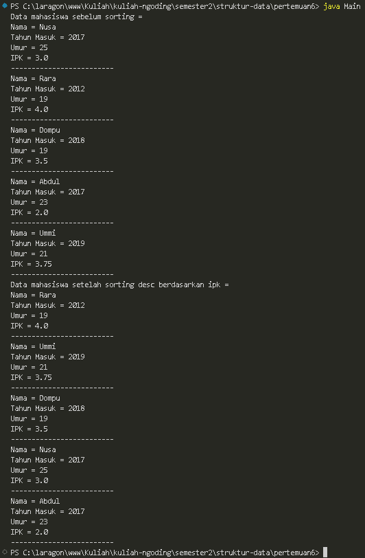
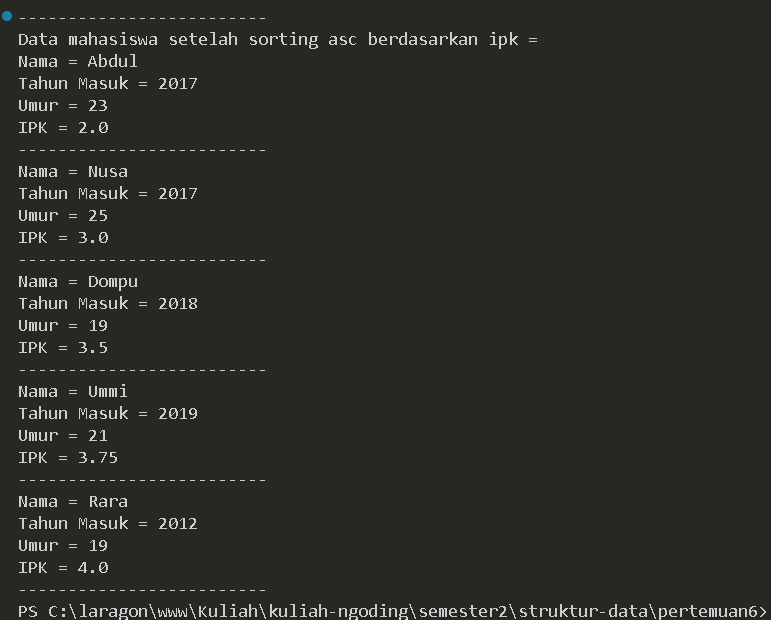
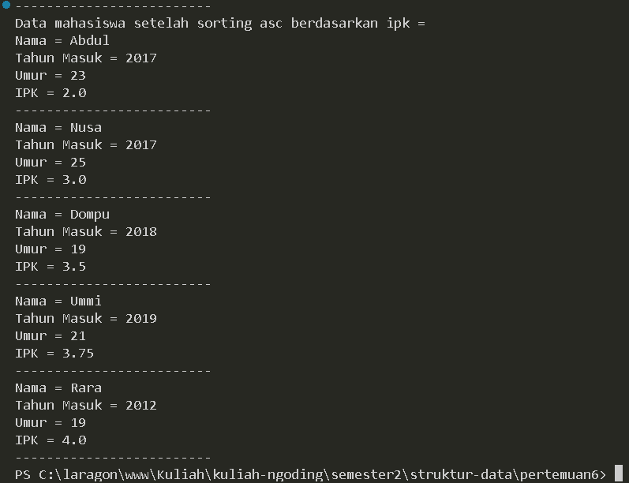
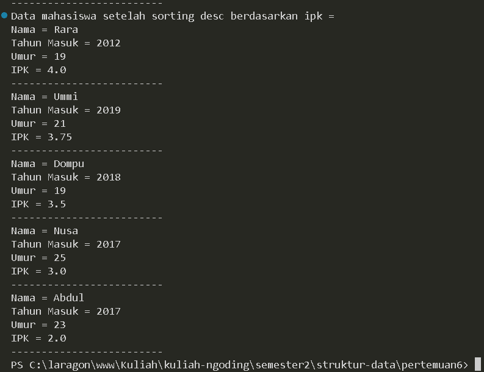
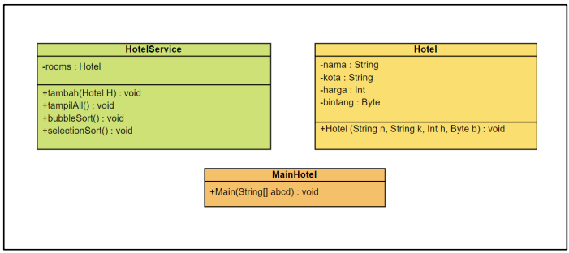
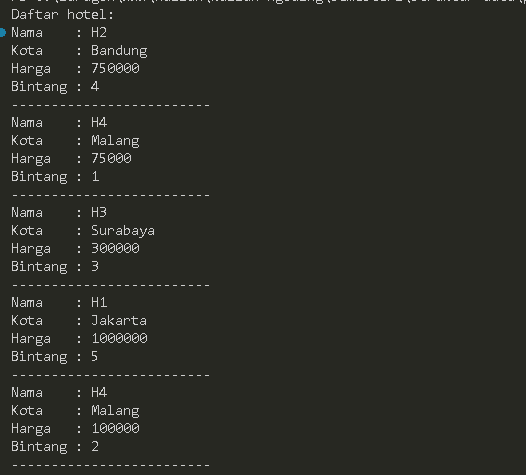
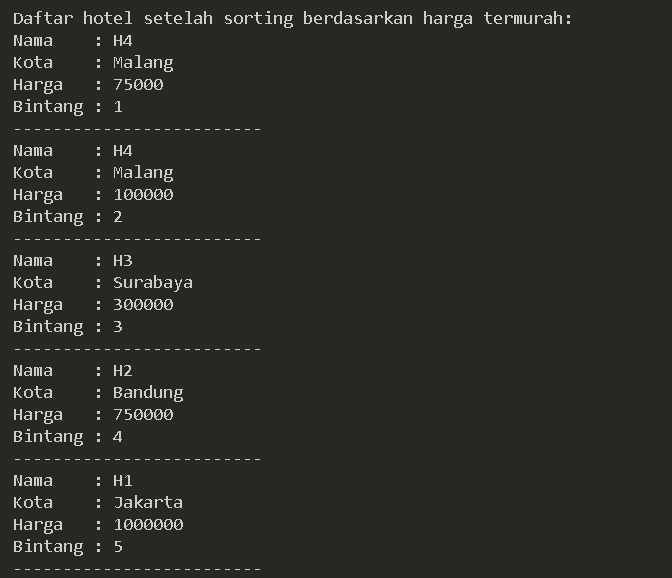
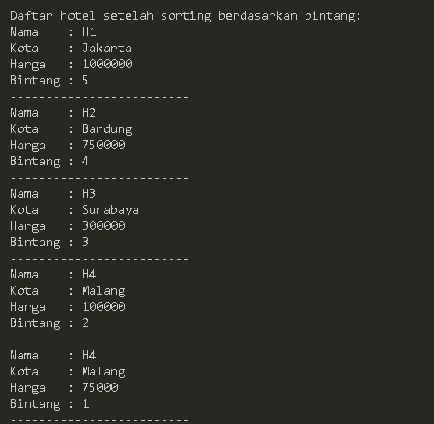

# LAPORAN PRAKTIKUM PERTMUAN 5

- Nama: Muhammad Afif Al Ghifari
- Kelas: TI-1H
- NIM: 2341720168

## 1. PERCOBAAN 1

### 1.1 Praktikum

```java
    //Mahasiswa.java

    public class Mahasiswa {
    String nama;
    int ThnMasuk, umur;
    double ipk;

    Mahasiswa(String n, int t, int u, double i){
        nama = n;
        ThnMasuk = t;
        umur = u;
        ipk = i;
    }

    void tampil(){
        System.out.println("Nama = " + nama);
        System.out.println("Tahun Masuk = " + ThnMasuk);
        System.out.println("Umur = " + umur);
        System.out.println("IPK = " + ipk);
    }
}
```

```java
    //DaftarMahasiswaBerprestasi.java

    public class DaftarMahasiswaBerprestasi {
    Mahasiswa listMhs[] = new Mahasiswa[5];
    int idx;

    void tambah(Mahasiswa m) {
        if (idx < listMhs.length) {
            listMhs[idx] = m;
            idx++;
        } else {
            System.out.println("Data sudah penuh");
        }
    }

    void tampil(){
        for (Mahasiswa m : listMhs) {
            m.tampil();
            System.out.println("-------------------------");
        }
    }

    void bubbleSort(){
        for (int i = 0; i < listMhs.length-1; i++) {
            for (int j = 1; j < listMhs.length-i; j++) {
                if (listMhs[j].ipk > listMhs[j-1].ipk) {
                    Mahasiswa tmp = listMhs[j];
                    listMhs[j] = listMhs[j-1];
                    listMhs[j-1] = tmp;
                }
            }
        }
    }
}

```

```java
    //Main.java

    public class Main {
    public static void main(String[] args) {
        DaftarMahasiswaBerprestasi list = new DaftarMahasiswaBerprestasi();
        Mahasiswa m1 = new Mahasiswa("Nusa", 2017, 25, 3);
        Mahasiswa m2 = new Mahasiswa("Rara", 2012, 19, 4);
        Mahasiswa m3 = new Mahasiswa("Dompu", 2018, 19, 3.5);
        Mahasiswa m4 = new Mahasiswa("Abdul", 2017, 23, 2);
        Mahasiswa m5 = new Mahasiswa("Ummi", 2019, 21, 3.75);

        list.tambah(m1);
        list.tambah(m2);
        list.tambah(m3);
        list.tambah(m4);
        list.tambah(m5);

        System.out.println("Data mahasiswa sebelum sorting = ");
        list.tampil();

        System.out.println("Data mahasiswa setelah sorting desc berdasarkan ipk = ");
        list.bubbleSort();
        list.tampil();
    }
}

```



#### Kode program dan output

### 1.2 Pertanyaan

1.  Terdapat di method apakah proses bubble sort?

    #### Jawab:

        Bubble sort terdapat di dalam method dari class DaftarMahasiswaBerprestasi

2.  Di dalam method bubbleSort(), terdapat baris program seperti di bawah ini:

    ```java
        if (listMhs[j].ipk > listMhs[j-1].ipk) {
                Mahasiswa tmp = listMhs[j];
                listMhs[j] = listMhs[j-1];
                listMhs[j-1] = tmp;
            }
    ```

    untuk apakah proses tersebut?

    #### Jawab:
        Proses tersebut merupakan proses penukaran indeks array

3.  Perhatikan perulangan di dalam bubbleSort() di bawah ini:

    ```java
        for (int i = 0; i < listMhs.length-1; i++) {
            for (int j = 1; j < listMhs.length-i; j++) {
    ```


    a. Apakah perbedaan antara kegunaan perulangan i dan perulangan j?
    #### Jawab:

        Perulangan i mengatur jumlah iterasi total dalam algoritma bubble sort, di mana setiap iterasi akan berjalan sebanyak jumlah elemen dalam array. Sementara itu, perulangan j bertanggung jawab atas perbandingan elemen-elemen dalam setiap iterasi. Perulangan j dimulai dari indeks kedua hingga mencapai batas iterasi i (listMhs.length - i).

    b. Mengapa syarat dari perulangan i adalah i<listMhs.length-1 ?
    #### Jawab:

        Ketentuan tersebut diterapkan untuk memastikan bahwa perulangan tidak melampaui panjang array. Perulangan i dihentikan sebelum mencapai indeks terakhir karena elemen terakhir sudah dibandingkan dengan elemen sebelumnya.

    c. Mengapa syarat dari perulangan j adalah j<listMhs.length-i ?
    #### Jawab:

        Syarat tersebut berfungsi supaya perulangan tidak membandingkan indeks yang sudah dibandingan pada iterasi sebelumnya.

    d. Jika banyak data di dalam listMhs adalah 50, maka berapakali perulangan i akan 
    berlangsung? Dan ada berapa Tahap bubble sort yang ditempuh?
    #### Jawab:

        perulangan i akan berjalan 49 kali

<br>

## 2. PERCOBAAN 2

### 2.1 Praktikum 2

```java
    //DaftarMahasiswaBerprestasi.javac
    
    void selectionSort(){
        for (int i = 0; i < listMhs.length-1; i++) {
            int idxMin = i;
            for (int j = i+1; j < listMhs.length; j++) {
                if (listMhs[j].ipk < listMhs[idxMin].ipk) {
                    idxMin = j;
                }
            }
            Mahasiswa tmp = listMhs[idxMin];
            listMhs[idxMin] = listMhs[i];
            listMhs[i] = tmp;
        }
    }

```



#### Kode dan output program

### 2.2 Pertanyaan

1.  Di dalam method selection sort, terdapat baris program seperti di bawah ini:

    ```java
        int idxMin = i;
            for (int j = i+1; j < listMhs.length; j++) {
                if (listMhs[j].ipk < listMhs[idxMin].ipk) {
                    idxMin = j;
                }
            }
        
    ```
    Untuk apakah proses tersebut, jelaskan!

    #### jawab:
        Kode tersebut merupakan implementasi algoritma pencarian indeks minimum dalam sebuah array objek. Dalam loop, kode membandingkan nilai IPK (indeks prestasi kumulatif) dari setiap elemen array dengan nilai IPK dari elemen minimum yang ditemukan sebelumnya. Jika ditemukan nilai IPK yang lebih kecil, maka indeks minimum diperbarui. Pada akhir iterasi, `idxMin` akan berisi indeks dari elemen dengan nilai IPK terkecil dalam array `listMhs`.

<br>

## 3. PERCOBAAN 3

### 3.1 Praktikum 3

```java
    //DaftarMahasiswaBerprestasi.javac

    void insertionSort() {
        for (int i = 1; i < listMhs.length; i++) {
            Mahasiswa temp = listMhs[i];
            int j = i;
            while (j > 0 && listMhs[j - 1].ipk > temp.ipk) {
                listMhs[j] = listMhs[j - 1];
                j--;
            }
            listMhs[j] = temp;
        }
    }
```



#### Kode dan output program

### 3.2 Pertanyaan

1.  Ubahlah fungsi pada InsertionSort sehingga fungsi ini dapat melaksanakan proses sorting
    dengan cara descending!
    
    #### Jawab:

    ```java
        //DaftarMahasiswaBerprestasi.javac

    void insertionSort() {
        for (int i = 1; i < listMhs.length; i++) {
            Mahasiswa temp = listMhs[i];
            int j = i;
            // Diganti pembandingnya dari 'listMhs[j - 1].ipk > temp.ipk'
            while (j > 0 && listMhs[j - 1].ipk < temp.ipk) {
                listMhs[j] = listMhs[j - 1];
                j--;
            }
            listMhs[j] = temp;
        }
    }
    ```
    
    
    #### Kode dan output program

<br >

## 4. LATIHAN PRAKTIKUM

### 4.1 Soal

Sebuah platform travel yang menyediakan layanan pemesanan kebutuhan travelling sedang
mengembangkan backend untuk sistem pemesanan/reservasi akomodasi (penginapan), salah
satu fiturnya adalah menampilkan daftar penginapan yang tersedia berdasarkan pilihan filter
yang diinginkan user. Daftar penginapan ini harus dapat disorting berdasarkan

1. Harga dimulai dari harga termurah ke harga tertinggi.

2. Rating bintang penginapan dari bintang tertinggi (5) ke terendah (1)

Buatlah proses sorting data untuk kedua filter tersebut dengan menggunakan algoritma
bubble sort dan selection sort.


### jawab:

```java
    //Hotel.java
    public class Hotel {
    String nama, kota;
    int harga;
    byte bintang;

    Hotel(String n, String k, int h, byte b) {
        nama = n;
        kota = k;
        harga = h;
        bintang = b;
    }
}

```

```java
    //HotelService.java
    public class HotelService {
    Hotel rooms[] = new Hotel[5];

    void tambah(Hotel h) {
        for (int i = 0; i < rooms.length; i++) {
            if (rooms[i] == null) {
                rooms[i] = h;
                break;
            }
        }
    }

    void tampilAll() {
        for (Hotel h : rooms) {
            System.out.println("Nama    : " + h.nama);
            System.out.println("Kota    : " + h.kota);
            System.out.println("Harga   : " + h.harga);
            System.out.println("Bintang : " + h.bintang);
            System.out.println("-------------------------");
        }
    }

    // Sorting dari harga termurah
    void selectionSort() {
        for (int i = 0; i < rooms.length - 1; i++) {
            int idxMin = i;
            for (int j = i + 1; j < rooms.length; j++) {
                if (rooms[j].harga < rooms[idxMin].harga) {
                    idxMin = j;
                }
            }
            Hotel temp = rooms[idxMin];
            rooms[idxMin] = rooms[i];
            rooms[i] = temp;
        }
    }

    // Sorting dari bintang tertinggi
    void bubbleSort() {
        for (int i = 0; i < rooms.length - 1; i++) {
            for (int j = 1; j < rooms.length - i; j++) {
                if (rooms[j].bintang > rooms[j - 1].bintang) {
                    Hotel temp = rooms[j];
                    rooms[j] = rooms[j - 1];
                    rooms[j - 1] = temp;
                }
            }
        }
    }
}

```

```java
    //MainHotel.java
    public class MainHotel {
    public static void main(String[] args) {
        HotelService list = new HotelService();

        Hotel h1 = new Hotel("H1", "Jakarta", 1000000, (byte) 5);
        Hotel h2 = new Hotel("H2", "Bandung", 750000, (byte) 4);
        Hotel h3 = new Hotel("H3", "Surabaya", 300000, (byte) 3);
        Hotel h4 = new Hotel("H4", "Malang", 100000, (byte) 2);
        Hotel h5 = new Hotel("H4", "Malang", 75000, (byte) 1);

        list.tambah(h2);
        list.tambah(h5);
        list.tambah(h3);
        list.tambah(h1);
        list.tambah(h4);
    
        System.out.println("Daftar hotel:");
        list.tampilAll();
        System.out.println();

        // System.out.println("Daftar hotel setelah sorting berdasarkan bintang:");
        // list.bubbleSort();
        System.out.println("Daftar hotel setelah sorting berdasarkan harga termurah:");
        list.selectionSort();
        list.tampilAll();
    }
}

```





#### Kode dan output program