# LAPORAN PRAKTIKUM PERTMUAN 7

- Nama: Muhammad Afif Al Ghifari
- Kelas: TI-1H
- NIM: 2341720168

## 1. PERCOBAAN 1

### 1.1 Praktikum

```java
    //Buku17.java
    public class Buku17 {
    int kodeBuku;
    String judulBuku;
    int tahunTerbit;
    String pengarang;
    int stock;

    Buku17(int kodeBuku, String judulBuku, int tahunTerbit, String pengarang, int stock) {
        this.kodeBuku = kodeBuku;
        this.judulBuku = judulBuku;
        this.tahunTerbit = tahunTerbit;
        this.pengarang = pengarang;
        this.stock = stock;
    }

    public void tampilDataBuku() {
        System.out.println("=========================");
        System.out.println("Kode Buku : " + kodeBuku);
        System.out.println("Judul Buku : " + judulBuku);
        System.out.println("Tahun Terbit : " + tahunTerbit);
        System.out.println("Pengarang : " + pengarang);
        System.out.println("Stock : " + stock);
    }
}

```

```java
    //PencarianBuku17.java
    public class PencarianBuku17 {
    Buku17 listBk[] = new Buku17[5];
    int idx;

    void tambah(Buku17 m) {
        if (idx < listBk.length) {
            listBk[idx] = m;
            idx++;
        } else {
            System.out.println("Data sudah penuh");
        }
    }

    void tampil() {
        for (Buku17 m : listBk) {
            m.tampilDataBuku();
        }
    }

    public int FindSeqSearch(int cari) {
        int posisi = 0;
        for (int i = 0; i < listBk.length; i++) {
            if (listBk[i].kodeBuku == cari) {
                posisi = i;
                break;
            } else {
                posisi = -1;
            }
        }
        return posisi;
    }

    public void TampilData(int x, int pos){
        if (pos!=-1) {
        System.out.println("Kode Buku : " + listBk[pos].kodeBuku);
        System.out.println("Judul Buku : " + listBk[pos].judulBuku);
        System.out.println("Tahun Terbit : " + listBk[pos].tahunTerbit);
        System.out.println("Pengarang : " + listBk[pos].pengarang);
        System.out.println("Stock : " + listBk[pos].stock);
        }
    }

    public void TampilPosisi(int x, int pos) {
        if (pos != -1) {
            System.out.println("Data : " + x + " ditemukan pada indeks " + pos);
            TampilData(x, pos);
        } else {
            System.out.println("data : " + x + " tidak ditemukan");
        }
    }

}


```

```java
    //BukuMain17.java
    import java.util.Scanner;

public class BukuMain17 {
    public static void main(String[] args) {
        Scanner s = new Scanner(System.in);
        Scanner s1 = new Scanner(System.in);

        PencarianBuku17 data = new PencarianBuku17();
        int jumBuku = 5;

        System.out.println("----------------------------------------");
        System.out.println("Masukkan data buku secara urut dari kode buku terkecil");
        for (int i = 0; i < jumBuku; i++) {
        System.out.println("-------------------");
        System.out.print("Kode buku \t: ");
        int kodeBuku = s.nextInt();
        System.out.print("Judul buku \t: ");
        String judulBuku = s1.nextLine();
        System.out.print("Tahun terbit \t: ");
        int tahunTerbit = s.nextInt();
        System.out.print("Pengarang \t: ");
        String pengarang = s1.nextLine();
        System.out.print("Stock \t\t: ");
        int stock = s.nextInt();

        System.out.println("---------------------------------------");
        System.out.println("Data keseluruhan buku: ");
        data.tampil();
        System.out.println("_______________________________________");
        System.out.println("_______________________________________");
        System.out.println("Pencarian data: ");
        System.out.print("Masukkan kode buku yang dicari: ");
        int cari = s.nextInt();
        System.out.println("Menggunakan sequential search");
        int posisi = data.FindSeqSearch(cari);
        data.TampilPosisi(cari, posisi);
    }
}
```

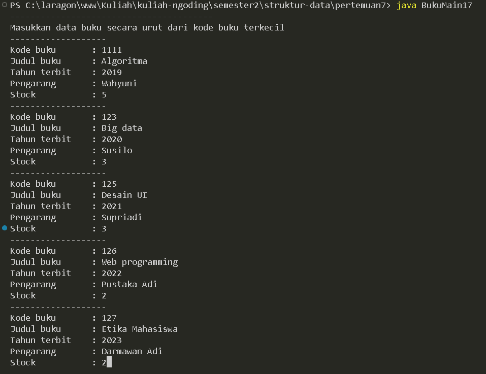
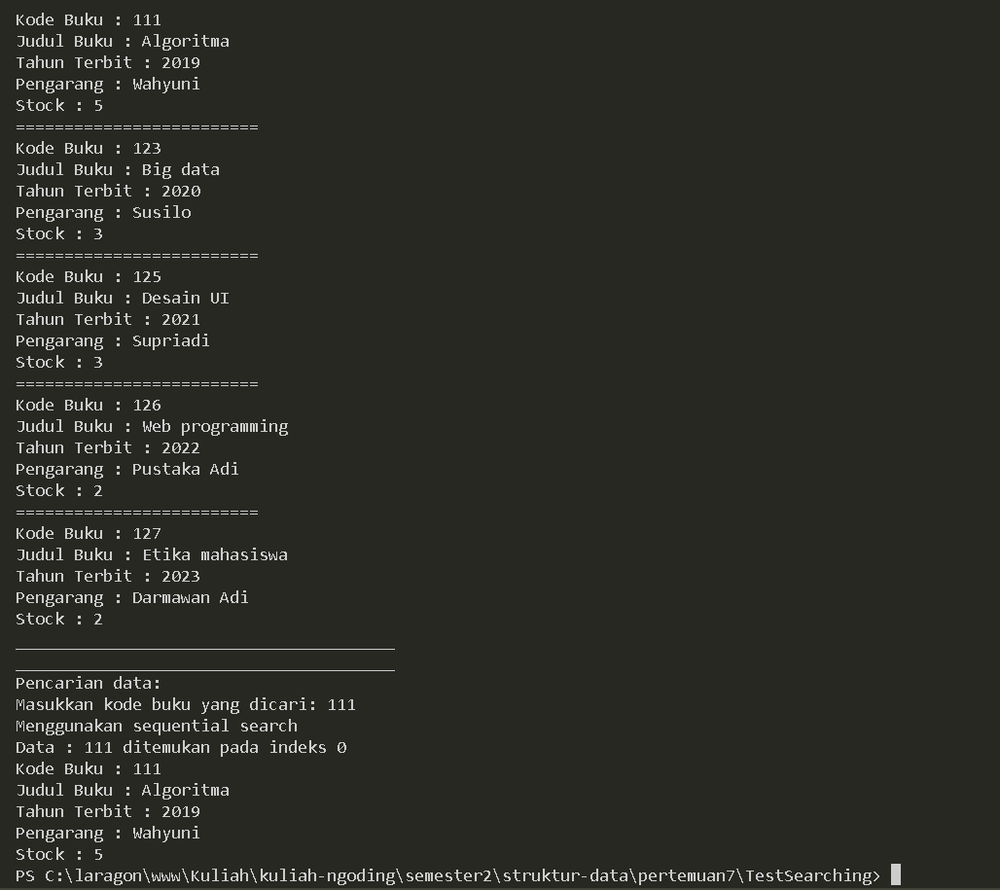
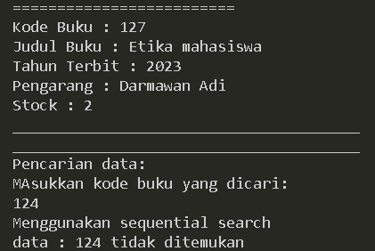

#### Kode program dan output

### 1.2 Pertanyaan

1.  Jelaskan fungsi break yang ada pada method FindSeqSearch!

    #### Jawab:

        break berfungsi untuk memberhentikan proses looping ketika kondisi if telah terpenuhi sebelum looping selesai.

2.  Jika Data Kode Buku yang dimasukkan tidak terurut dari kecil ke besar. Apakah program masih dapat berjalan? Apakah hasil yang dikeluarkan benar? Tunjukkan hasil screenshoot untuk bukti dengan kode Buku yang acak. Jelaskan Mengapa hal tersebut bisa terjadi?

    #### Jawab:

        Program masih bisa dijalankan karena proses pencarian tidak memandang urutan kode buku.

    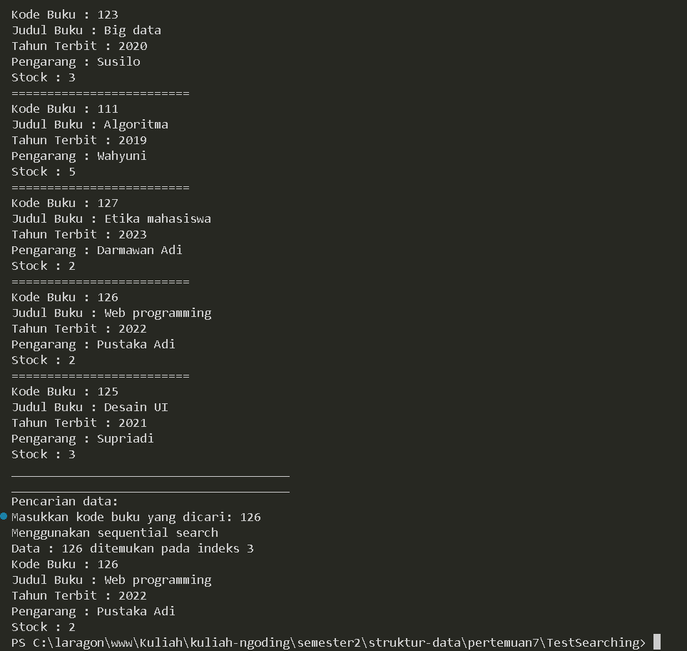

3.  Buat method baru dengan nama FindBuku menggunakan konsep sequential search dengan tipe method dari FindBuku adalah BukuNoAbsen. Sehingga Anda bisa memanggil method tersebut pada class BukuMain seperti gambar berikut :

    ```java
        Buku dataBuku = data.FindBuku(cari);
        dataBuku.TampilDataBuku();
    ```

    #### Jawab:

    ```java
    // Buku17

    //...
        void tambahBuku(Buku17 m) {
        for (int i = 0; i < listBk.length; i++) {
            if (listBk[i] == null) {
                listBk[i] = m;
                break;
            }
        }
    }

        public void tampilAllBuku() {
        for (Buku17 bk : listBk) {
            System.out.println("=========================");
            System.out.println("Kode Buku : " + bk.kodeBuku);
            System.out.println("Judul Buku : " + bk.judulBuku);
            System.out.println("Tahun Terbit : " + bk.tahunTerbit);
            System.out.println("Pengarang : " + bk.pengarang);
            System.out.println("Stock : " + bk.stock);
        }
    }

    public void tampilDataBuku(int pos) {
            System.out.println("=========================");
            System.out.println("Kode Buku : " + listBk[pos].kodeBuku);
            System.out.println("Judul Buku : " + listBk[pos].judulBuku);
            System.out.println("Tahun Terbit : " + listBk[pos].tahunTerbit);
            System.out.println("Pengarang : " + listBk[pos].pengarang);
            System.out.println("Stock : " + listBk[pos].stock);
    }

    public int FindBuku(int cari){
        int pos = 0;
        for (int i = 0; i < listBk.length; i++) {
            if (listBk[i].kodeBuku == cari) {
                pos = i;
                break;
            } else {
                pos = -1;
            }
        }
        return pos;
    }
    ```

    ```java
        //BukuMain17

        //...
        System.out.print("Masukkan kode buku yang dicari: ");
        int cari = s.nextInt();
        System.out.println("Menggunakan sequential search");
        int posisi = dataBk.FindBuku(cari);
        dataBk.tampilDataBuku(posisi);
    ```

    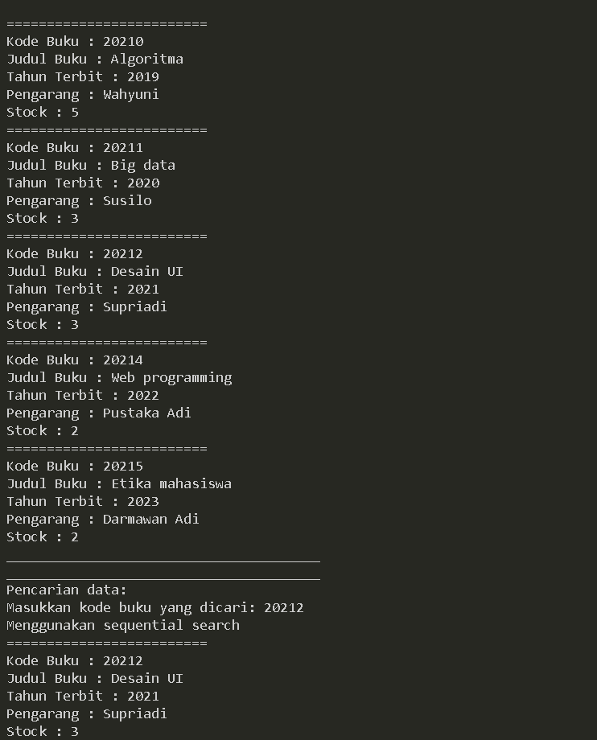

    #### Kode program dan output

<br>

## 2. PERCOBAAN 2

### 2.1 Praktikum 2

```java
    //PencarianBuku17.java

    //...
    public int FindBinarySearch(int cari, int left, int right) {
        int mid;
        if (right >= left) {
            mid = (left + right) / 2;
            if (cari ==  listBk[mid].kodeBuku) {
                return mid;
            } else if(listBk[mid].kodeBuku > cari) {
                return FindBinarySearch(cari, left, mid);
            } else {
                return FindBinarySearch(cari, mid, right);
            }
        }
        return -1;
    }
    //...
```

```java
    //BukuMain17.java

    //...
    System.out.println("Menggunakan sequential search");
    int posisi = data.FindSeqSearch(cari);
    data.TampilPosisi(cari, posisi);
    System.out.println("Menggunakan binary search");
    posisi = data.FindBinarySearch(cari, 0, jumBuku-1);
    data.TampilPosisi(cari, posisi);
```

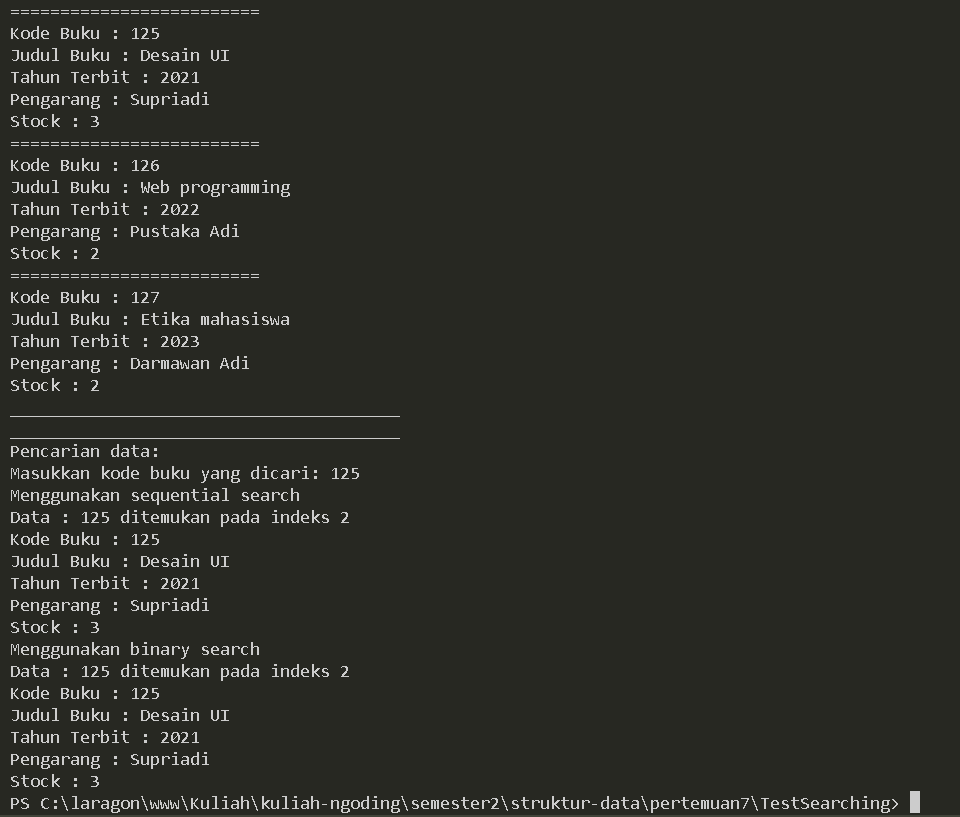

#### Kode dan output program

### 2.2 Pertanyaan

1.  Tunjukkan pada kode program yang mana proses divide dijalankan!

    #### jawab:

    ```java
        //...
        mid = (left + right) / 2;
        //...
    ```

2.  Tunjukkan pada kode program yang mana proses conquer dijalankan!

    #### jawab:

    ```java
        //...
        return FindBinarySearch(cari, left, mid);
        //...
        return FindBinarySearch(cari, mid, right);
        //...
    ```

3.  Jika Kode Buku yang dimasukkan dari Kode Buku terbesar ke terkecil (missal : 20215, 20214, 20212, 20211, 20210) dan elemen yang dicari adalah 20210. Bagaimana hasil dari binary search? Apakah sesuai? Jika tidak sesuai maka ubahlah kode program binary seach agar hasilnya sesuai!

    #### jawab:

        Terjadi error infinite loop saat menjalankan searching.

    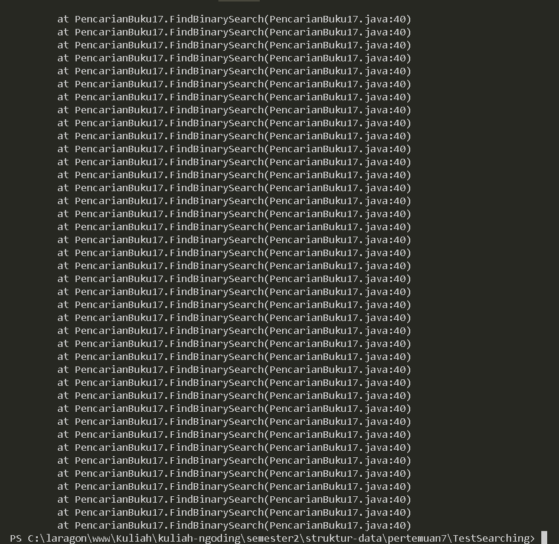

    ```java
        // Perbaikan PencarianBuku17.java

        // ...
            } else if(listBk[mid].kodeBuku < cari) {
        // ...
    ```

    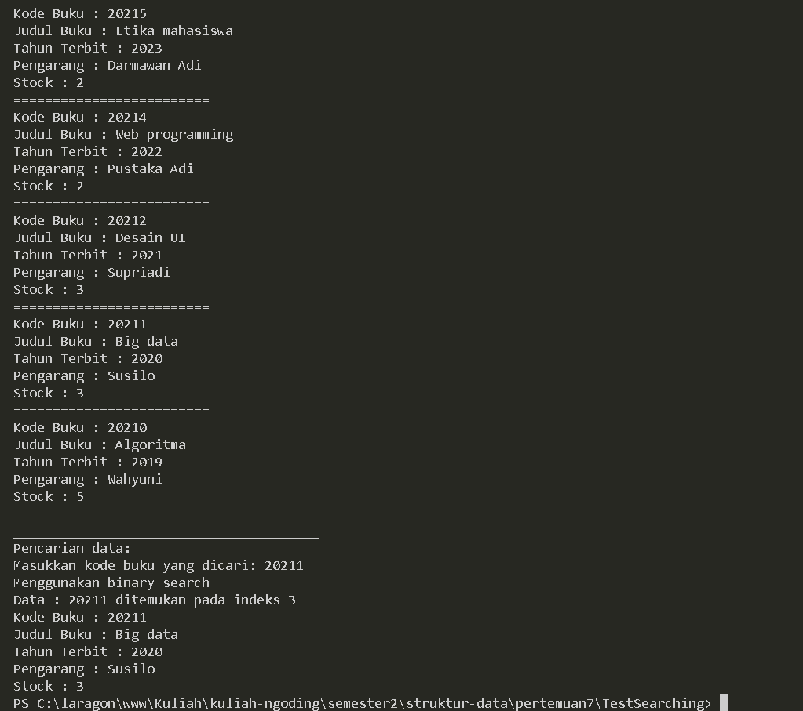

    #### Kode dan output program

4.  Jika data Kode Buku yang dimasukkan tidak urut. Apakah program masih dapat berjalan? Mengapa demikian! Tunjukkan hasil screenshoot untuk bukti dengan kode Buku yang acak. Jelaskan Mengapa hal tersebut bisa terjadi?

    #### jawab:

        Program tidak dapat dijalankan karena kondisi saat dijalankan tidak mendukung untuk data acak sehingga terjadi infinite loop.

    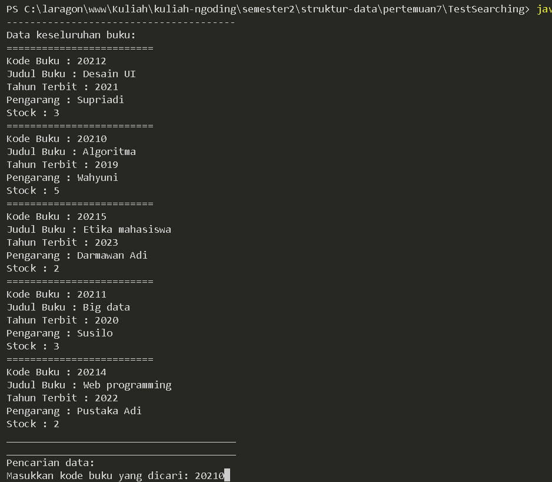
    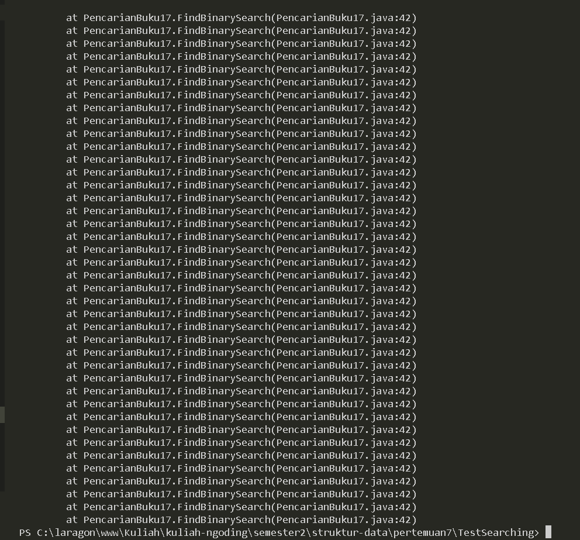

<br>

## 3. PERCOBAAN 3

### 3.1 Praktikum 3

```java
    //MergeSorting17.java

    public class MergeSorting17 {
    public void mergeSort(int[] data) {

    }

    public void merge(int data[], int left, int middle, int right) {
        int[] temp = new int[data.length];
        for (int i = left; i <= right; i++) {
            temp[i] = data[i];
        }
        int a = left;
        int b = middle + 1;
        int c = left;

        while (a <= middle && b <= right) {
            if (temp[a] <= temp[b]) {
                data[c] = temp[a];
                a++;
            } else {
                data[c] = temp[b];
                b++;
            }
            c++;
        }
        int s = middle - a;
        for (int i = 0; i <= s; i++) {
            data[c + i] = temp[a + i];
        }
    }

    public void sort(int data[], int left, int right) {
        if (left < right) {
            int middle = (left + right) / 2;
            sort(data, left, middle);
            sort(data, middle + 1, right);
            merge(data, left, middle, right);
        }
    }

    public void printArray(int arr[]) {
        for (int i = 0; i < arr.length; i++) {
            System.out.print(arr[i] + " ");
        }
        System.out.println();
    }
}

```

```java
    //MergeSortMain17.java

    public class MergeSortMain17 {
    public static void main(String[] args) {
        int data[] = { 10, 40, 50, 30, 70, 20, 100, 90 };
        System.out.println("Sorting dengan merge sort");
        MergeSorting17 mSort = new MergeSorting17();
        System.out.println("Data awal");
        mSort.printArray(data);
        mSort.sort(data, 0, data.length - 1);
        System.out.println("Setelah diurutkan");
        mSort.printArray(data);
    }
}

```

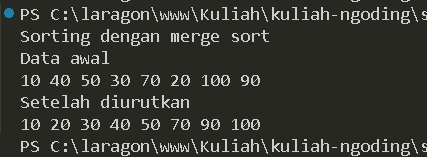

#### Kode dan output program

<br >

## 4. LATIHAN PRAKTIKUM

### 4.1 Soal

1. Modifikasi percobaan searching diatas dengan ketentuan berikut ini

- Ubah tipe data dari kode Buku yang awalnya int menjadi String
- Tambahkan method untuk pencarian kode Buku (bertipe data String) dengan menggunakan
  sequential search dan binary search

### jawab:

```java
    // PencarianBuku17.java

    //...
    public int FindSeqSearch(String cari) {
        int posisi = 0;
        for (int i = 0; i < listBk.length; i++) {
            if (listBk[i].kodeBuku.equals(cari)) {
                posisi = i;
                break;
            } else {
                posisi = -1;
            }
        }
        return posisi;
    }

    public int FindBinarySearch(String cari, int left, int right) {
        int mid;
        if (right >= left) {
            mid = (left + right) / 2;
            if (cari.equals(listBk[mid].kodeBuku)) {
                return mid;
            } else if (listBk[mid].kodeBuku.compareTo(cari) > 0) {
                return FindBinarySearch(cari, left, mid - 1);
            } else {
                return FindBinarySearch(cari, mid + 1, right);
            }
        }
        return -1;
    }

    public void TampilData(String x, int pos) {
        if (pos != -1) {
            System.out.println("Kode Buku : " + listBk[pos].kodeBuku);
            System.out.println("Judul Buku : " + listBk[pos].judulBuku);
            System.out.println("Tahun Terbit : " + listBk[pos].tahunTerbit);
            System.out.println("Pengarang : " + listBk[pos].pengarang);
            System.out.println("Stock : " + listBk[pos].stock);
        }
    }

    public void TampilPosisi(String x, int pos) {
        if (pos != -1) {
            System.out.println("Data : " + x + " ditemukan pada indeks " + pos);
        } else {
            System.out.println("data : " + x + " tidak ditemukan");
        }
    }


```

```java
    // BukuMain17.java

    //...
        System.out.println("_______________________________________");
        System.out.println("_______________________________________");
        System.out.println("Pencarian data: ");
        System.out.print("Masukkan kode buku yang dicari: ");
        String cari = s.nextLine();

        System.out.println("Menggunakan sequential search");
        int posisi = data.FindSeqSearch(cari);
        data.TampilPosisi(cari, posisi);

        System.out.println("Menggunakan binary search");
        posisi = data.FindBinarySearch(cari, 0, jumBuku);
        data.TampilPosisi(cari, posisi);
        data.TampilData(cari, posisi);
```


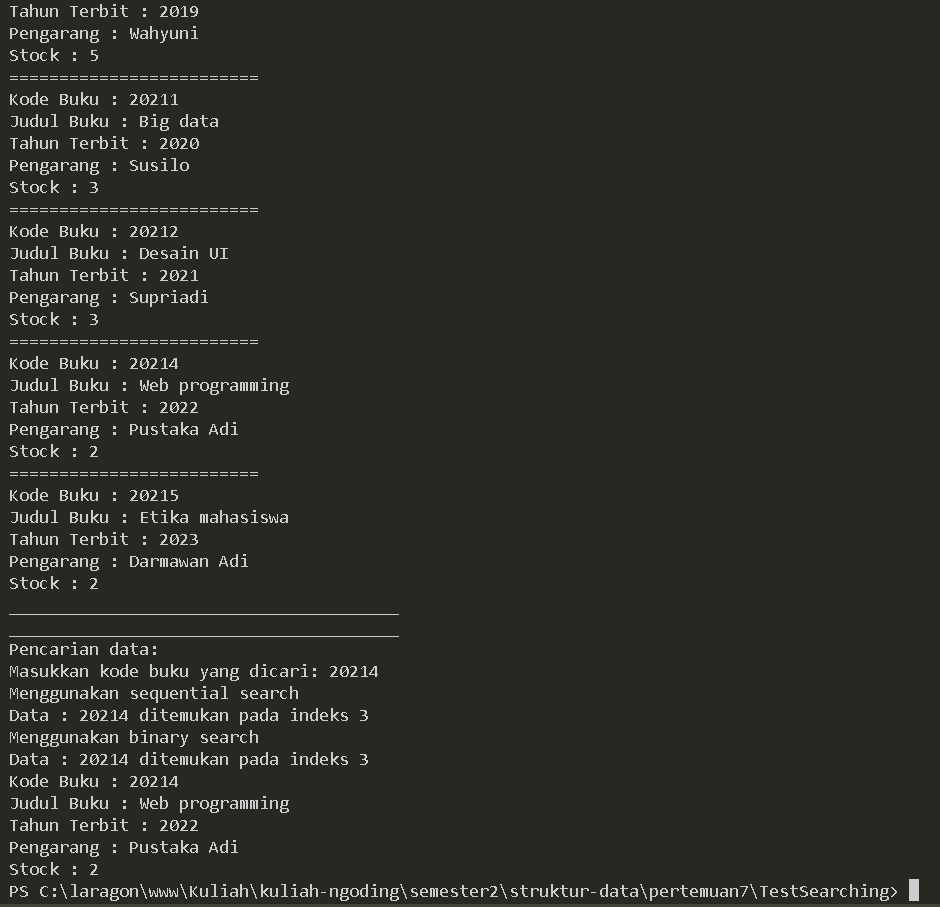

#### Kode dan output program

2. Modifikasi percobaan searching diatas dengan ketentuan berikut ini

- Tambahkan method pencarian judul buku menggunakan sequential search dan binary
  search. Sebelum dilakukan searching dengan binary search data harus dilakukan pengurutan
  dengan menggunakan algoritma Sorting (bebas pilih algoritma sorting apapun)! Sehingga
  ketika input data acak, maka algoritma searching akan tetap berjalan
- Buat aturan untuk mendeteksi hasil pencarian judul buku yang lebih dari 1 hasil dalam
  bentuk kalimat peringatan! Pastikan algoritma yang diterapkan sesuai dengan kasus yang
  diberikan

### jawab:

```java
    // PencarianBuku17.java

    //...
    public int FindSeqJudul(String cari){
        int posisi = -1;
        for (int i = 0; i < listBk.length; i++) {
            if (listBk[i] != null && listBk[i].judulBuku.equalsIgnoreCase(cari)) {
                posisi = i;
                break;
            }
        }
        return posisi;
    }

    public int FindBinaryJudul(String cari, int left, int right) {
        int mid;
        if (right >= left) {
            mid = (left + right) / 2;
            if (cari.equalsIgnoreCase(listBk[mid].judulBuku)) {
                return mid;
            } else if (listBk[mid].judulBuku.compareTo(cari) > 0) {
                return FindBinaryJudul(cari, left, mid - 1);
            } else {
                return FindBinaryJudul(cari, mid + 1, right);
            }
        }
        return -1;
    }

    public void bubbleSort() {
        for (int i = 0; i < listBk.length - 1; i++) {
            for (int j = 1; j < listBk.length - i; j++) {
                if (listBk[j] != null && listBk[j - 1] != null) {
                    if (listBk[j].kodeBuku < listBk[j - 1].kodeBuku) {
                        Buku17 temp = listBk[j];
                        listBk[j] = listBk[j - 1];
                        listBk[j - 1] = temp;
                    }
                }
            }
        }
    }
```

```java
    // BukuMain17.java

    //...
    Buku17 m4 = new Buku17(20214, "Web programming", 2022, "Pustaka Adi", 2);
        data.tambah(m4);
        Buku17 m2 = new Buku17(20211, "Big data", 2020, "Susilo", 3);
        data.tambah(m2);
        Buku17 m5 = new Buku17(20215, "Etika mahasiswa", 2023, "Darmawan Adi", 2);
        data.tambah(m5);
        Buku17 m3 = new Buku17(20212, "Desain UI", 2021, "Supriadi", 3);
        data.tambah(m3);
        Buku17 m1 = new Buku17(20210, "Algoritma", 2019, "Wahyuni", 5);
        data.tambah(m1);

        data.bubbleSort();
        System.out.println("---------------------------------------");
        System.out.println("Data keseluruhan buku: ");
        data.tampil();
        System.out.println("_______________________________________");
        System.out.println("_______________________________________");
        System.out.println("Pencarian data: ");
        System.out.print("Masukkan kode buku yang dicari: ");
        String cari = s.nextLine();

        System.out.println("Menggunakan sequential search");
        int posisi = data.FindSeqJudul(cari);
        data.TampilPosisi(cari, posisi);

        System.out.println("Menggunakan binary search");
        posisi = data.FindBinaryJudul(cari, 0, jumBuku - 1);
        data.TampilPosisi(cari, posisi);
        data.TampilData(cari, posisi);

```

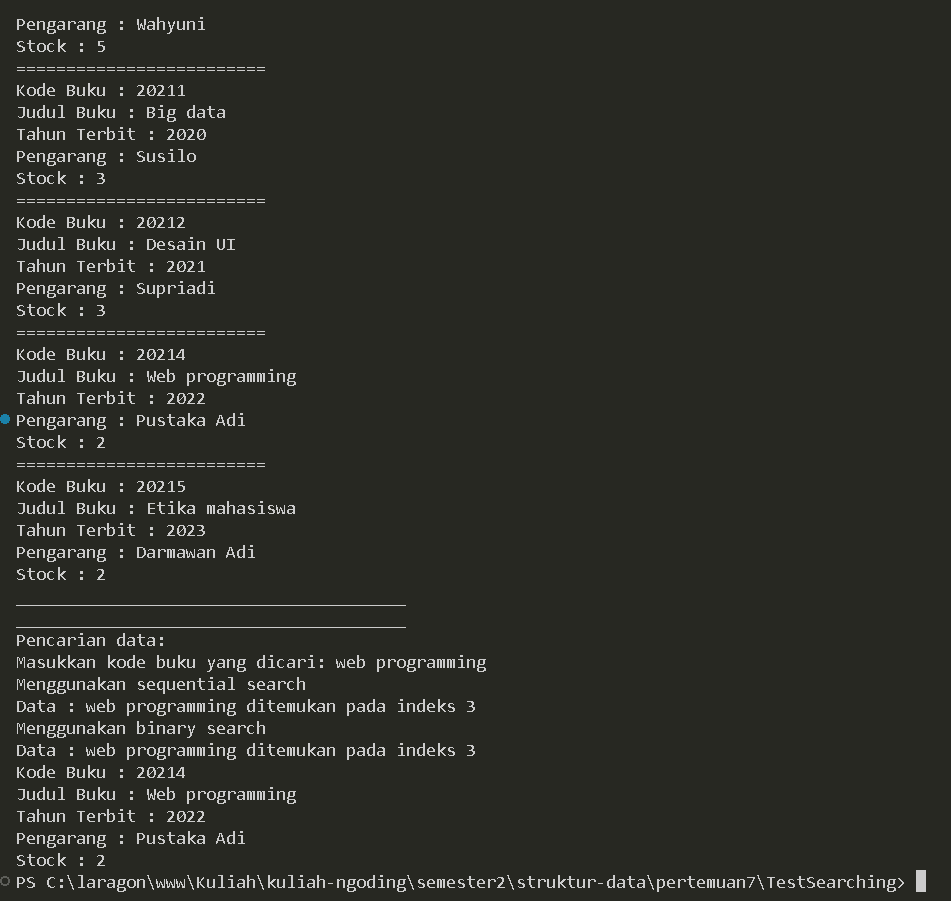

#### Kode dan output program
