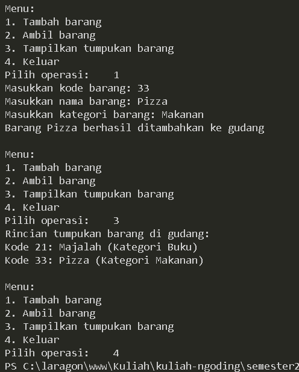

# LAPORAN PRAKTIKUM PERTMUAN 8

- Nama: Muhammad Afif Al Ghifari
- Kelas: TI-1H
- NIM: 2341720168

## 1. PERCOBAAN 1

### 1.1 Praktikum

```java
    //Barang17.java
   public class Barang17 {
    int kode;
    String nama, kategori;

    public Barang17(int kode, String nama, String kategori) {
        this.kode = kode;
        this.nama = nama;
        this.kategori = kategori;
    }
}

```

```java
    //Gudang17.java
    public class Gudang17 {
    Barang17[] tumpukan;
    int size, top;

    public Gudang17(int kapasitas) {
        size = kapasitas;
        tumpukan = new Barang17[size];
        top = -1;
    }

    public boolean cekKosong() {
        if (top == -1) {
            return true;
        } else {
            return false;
        }
    }

    public boolean cekPenuh() {
        if (top == size - 1) {
            return true;
        } else {
            return false;
        }
    }

    public void tambahBarang(Barang17 brg) {
        if (!cekPenuh()) {
            top++;
            tumpukan[top] = brg;
            System.out.println("Barang " + brg.nama + " berhasil ditambahkan ke gudang");
        } else {
            System.out.println("Gagal! Tumpukan barang di gudang penuh");
        }
    }

    public Barang17 ambilBarang() {
        if (!cekKosong()) {
            Barang17 delete = tumpukan[top];
            top--;
            System.out.println("Barang " + delete.nama + " diambil dari gudang");
            return delete;
        } else {
            System.out.println("Tumpukan barang kosong");
            return null;
        }
    }

    public Barang17 lihatBarangTeratas() {
        if (!cekKosong()) {
            Barang17 barangTeratas = tumpukan[top];
            System.out.println("Barang teratas: " + barangTeratas.nama);
            return barangTeratas;
        } else {
            System.out.println("Tumpukan barang kosong");
            return null;
        }
    }

    public void tampilkanBarang() {
        if (!cekKosong()) {
            System.out.println("Rincian tumpukan barang di gudang: ");
            for (int i = top; i >= 0; i--) {
                System.out.printf("Kode %d: %s (Kategori %s)\n", tumpukan[i].kode, tumpukan[i].nama,
                        tumpukan[i].kategori);
            }
        } else {
            System.out.println("Tumpukan barang kosong");
        }
    }
}


```

```java
    //Utama17.java
    import java.util.Scanner;

public class Utama17 {
    public static void main(String[] args) {
        Scanner scanner = new Scanner(System.in);

        Gudang17 gudang = new Gudang17(7);
        boolean run = true;
        while (run) {
            System.out.println("\nMenu: ");
            System.out.println("1. Tambah barang");
            System.out.println("2. Ambil barang");
            System.out.println("3. Tampilkan tumpukan barang");
            System.out.println("4. Keluar");
            System.out.print("Pilih operasi:    ");
            int pilihan = scanner.nextInt();
            scanner.nextLine();

            switch (pilihan) {
                case 1:
                    System.out.print("Masukkan kode barang: ");
                    int kode = scanner.nextInt();
                    scanner.nextLine();
                    System.out.print("Masukkan nama barang: ");
                    String nama = scanner.nextLine();
                    System.out.print("Masukkan kategori barang: ");
                    String kategori = scanner.nextLine();
                    Barang17 barangBaru = new Barang17(kode, nama, kategori);
                    gudang.tambahBarang(barangBaru);
                    break;
                case 2:
                    gudang.ambilBarang();
                    break;
                case 3:
                    gudang.tampilkanBarang();
                    break;
                case 4:
                    run = false;
                    break;
                default:
                    System.out.println("Pilihan tidak valid. Silakan coba lagi.");
            }
        }
    }
}

```




#### Kode program dan output

### 1.2 Pertanyaan

1.  Lakukan perbaikan pada kode program, sehingga keluaran yang dihasilkan sama dengan verifikasi hasil percobaan! Bagian mana saja yang perlu diperbaiki?

    #### Jawab:

    
    

    <br>

    ####

        Dengan cara membalikkan proses print dari index awal ke index akhir.

    ```java
        //Gudang17.java/tampilkanBarang()

        // Sebelum
        for (int i = 0; i <= top; i++) {

        // Sesudah
        for (int i = top; i >= 0; i--) {
    ```

2.  Berapa banyak data barang yang dapat ditampung di dalam tumpukan? Tunjukkan potongan kode programnya!

    #### Jawab:

        Jumlah yang dapat ditampung adalah 7

    ```java
        // Utama17.java
        Gudang17 gudang = new Gudang17(7);
    ```

3.  Mengapa perlu pengecekan kondisi !cekKosong() pada method tampilkanBarang? Kalau kondisi tersebut dihapus, apa dampaknya?

    #### Jawab:

        Pengecekan kondisi !cekKosong() pada method tampilkanBarang diperlukan untuk memastikan bahwa tumpukan barang tidak kosong sebelum menampilkan barang. Jika kondisi tersebut dihapus, maka program akan mencoba menampilkan barang dari tumpukan meskipun tumpukan barang kosong, yang dapat menyebabkan error saat mencoba mengakses data yang tidak ada dalam tumpukan.

4.  Modifikasi kode program pada class Utama sehingga pengguna juga dapat memilih operasi lihat barang teratas, serta dapat secara bebas menentukan kapasitas gudang!

    #### Jawab:

    ```java
        // Utama17.java

        //...
        System.out.print("Masukkan kapasitas gudang: ");
        int kapasitas = scanner.nextInt();
        scanner.nextLine();

        Gudang17 gudang = new Gudang17(kapasitas);
        //...

        //...
            System.out.println("1. Tambah barang");
            System.out.println("2. Ambil barang");
            System.out.println("3. Tampilkan tumpukan barang");
            System.out.println("4. Tampilkan barang teratas");
            System.out.println("5. Keluar");
        //...

        //...
                case 3:
                    gudang.tampilkanBarang();
                    break;
                case 4:
                    gudang.lihatBarangTeratas();
                    break;
                case 5:
                    run = false;
                    break;
        //...
    ```

    
    

    #### Kode program dan output

5.  Commit dan push kode program ke Github

    #### Jawab:

<br>

    ## 2. PERCOBAAN 2

### 2.1 Praktikum 2

```java
    //StackKonversi17.java
    public class StackKonversi17 {
    int size, top, tumpukanBiner[];

    public StackKonversi17() {
        this.size = 32;
        tumpukanBiner = new int[size];
        top = -1;
    }

    public boolean isEmpty() {
        return top == -1;
    }

    public boolean isFull() {
        return top == size - 1;
    }

    public void push(int data) {
        if (isFull()) {
            System.out.println("Stack penuh");
        } else {
            top++;
            tumpukanBiner[top] = data;
        }
    }

    public int pop() {
        if (isEmpty()) {
            System.out.println("Stack kosong");
            return -1;
        } else {
            int data = tumpukanBiner[top];
            top--;
            return data;
        }
    }
}
```

```java
    //Gudang17.java

    //...
    public String konversiDesimalKeBiner(int kode){
        StackKonversi17 stack = new StackKonversi17();
        while (kode>0) {
            int sisa = kode%2;
            stack.push(sisa);
            kode = kode/2;
        }
        String biner = new String();
        while (!stack.isEmpty()) {
            biner += stack.pop();
        }
        return biner;
    }
```


#### Kode dan output program

### 2.2 Pertanyaan

1.  Pada method konversiDesimalKeBiner, ubah kondisi perulangan menjadi while (kode != 0), bagaimana hasilnya? Jelaskan alasannya!

    #### jawab:

    

    ```
        Meskipun hasilnya tetap sama, metode konversi desimal ke biner dapat bervariasi. Ini disebabkan oleh perbedaan dalam pendekatan proses konversi. Misalnya, dengan menggunakan loop `while (kode != 0)`, proses konversi akan terus berlanjut selama nilai kode tidak mencapai 0.
    ```

2.  Jelaskan alur kerja dari method konversiDesimalKeBiner!

    #### jawab:

        1. public String konversiDesimalKeBiner(int kode): Ini adalah deklarasi method yang menerima satu parameter bertipe data integer (kode) dan mengembalikan nilai berupa string yang merupakan representasi biner dari kode.

        2. StackKonversi17 stack = new StackKonversi17();: Membuat sebuah objek dari kelas StackKonversi17 yang digunakan untuk menyimpan sisa hasil bagi dari setiap pembagian kode dengan 2.

        3. while (kode != 0) { ... }: Loop ini akan terus berjalan selama kode tidak sama dengan 0. Di dalam loop ini, setiap iterasi, sisa hasil bagi dari pembagian kode dengan 2 disimpan dalam variabel sisa, kemudian sisa dimasukkan ke dalam stack menggunakan method push(). Selanjutnya, nilai kode dibagi dengan 2 untuk dilakukan iterasi berikutnya.

        4. String biner = new String();: Membuat objek string kosong yang akan digunakan untuk menyimpan hasil biner akhir.

        5. while (!stack.isEmpty()) { ... }: Loop ini akan terus berjalan selama stack tidak kosong. Di dalam loop ini, setiap iterasi, elemen teratas dari stack diambil menggunakan method pop() dan ditambahkan ke string biner.

        6. return biner;: Mengembalikan nilai string biner yang merupakan hasil konversi bilangan desimal ke biner.

<br>

## 3. PERCOBAAN 3

### 3.1 Praktikum 3

```java
    //Postfix17.java

    public class Postfix17 {
    int n, top;
    char[] stack;

    public Postfix17(int total) {
        n = total;
        top = -1;
        stack = new char[n];
        push('(');
    }

    public void push(char c) {
        top++;
        stack[top] = c;
    }

    public char pop() {
        char item = stack[top];
        top--;
        return item;
    }

    public boolean IsOperand(char c) {
        if ((c >= 'A' && c <= 'Z') || (c >= 'a' && c <= 'z') || (c >= '0' && c <= '9') || c == ' ' || c == '.') {
            return true;
        } else {
            return false;
        }
    }

    public boolean IsOperator(char c) {
        if (c == '^' || c == '%' || c == '/' || c == '*' || c == '-' || c == '+') {
            return true;
        } else {
            return false;
        }
    }

    public int derajat(char c) {
        switch (c) {
            case '^':
                return 3;

            case '%':
                return 2;

            case '/':
                return 2;

            case '*':
                return 2;

            case '-':
                return 1;

            case '+':
                return 1;

            default:
                return 0;
        }
    }

    public String Konversi(String Q) {
        String P = "";
        char c;
        for (int i = 0; i < n; i++) {
            c = Q.charAt(i);
            if (IsOperand(c)) {
                P = P + c;
            }
            if (c == '(') {
                push(c);
            }
            if (c == ')') {
                while (stack[top] != '(') {
                    P = P + pop();
                }
                pop();
            }
            if (IsOperator(c)) {
                while (derajat(stack[top]) >= derajat(c)) {
                    P = P + pop();
                }
                push(c);
            }
        }
        return P;
    }
}


```

```java
    //PostfixMain17.java

    import java.util.Scanner;

public class PostfixMain17 {
    public static void main(String[] args) {
        Scanner sc = new Scanner(System.in);
        String P, Q;

        System.out.println("Masukkan ekspresi matematika (infix): ");
        Q = sc.nextLine();
        Q = Q.trim();
        Q = Q + ")";

        int total = Q.length();

        Postfix17 post = new Postfix17(total);
        P = post.Konversi(Q);
        System.out.println("Postfix: " + P);
    }
}


```


#### Kode dan output program

### 3.2 Pertanyaan

1.  Pada method derajat, mengapa return value beberapa case bernilai sama? Apabila return value diubah dengan nilai berbeda-beda setiap case-nya, apa yang terjadi?

    #### jawab:

    

    ```
        Meskipun hasilnya tetap sama, metode konversi desimal ke biner dapat bervariasi. Ini disebabkan oleh perbedaan dalam pendekatan proses konversi. Misalnya, dengan menggunakan loop `while (kode != 0)`, proses konversi akan terus berlanjut selama nilai kode tidak mencapai 0.
    ```

2.  Jelaskan alur kerja method konversi!

    #### jawab:

        1. public String konversiDesimalKeBiner(int kode): Ini adalah deklarasi method yang menerima satu parameter bertipe data integer (kode) dan mengembalikan nilai berupa string yang merupakan representasi biner dari kode.

        2. StackKonversi17 stack = new StackKonversi17();: Membuat sebuah objek dari kelas StackKonversi17 yang digunakan untuk menyimpan sisa hasil bagi dari setiap pembagian kode dengan 2.

        3. while (kode != 0) { ... }: Loop ini akan terus berjalan selama kode tidak sama dengan 0. Di dalam loop ini, setiap iterasi, sisa hasil bagi dari pembagian kode dengan 2 disimpan dalam variabel sisa, kemudian sisa dimasukkan ke dalam stack menggunakan method push(). Selanjutnya, nilai kode dibagi dengan 2 untuk dilakukan iterasi berikutnya.

        4. String biner = new String();: Membuat objek string kosong yang akan digunakan untuk menyimpan hasil biner akhir.

        5. while (!stack.isEmpty()) { ... }: Loop ini akan terus berjalan selama stack tidak kosong. Di dalam loop ini, setiap iterasi, elemen teratas dari stack diambil menggunakan method pop() dan ditambahkan ke string biner.

        6. return biner;: Mengembalikan nilai string biner yang merupakan hasil konversi bilangan desimal ke biner.

3. Pada method konversi, apa fungsi dari potongan kode berikut?

    ```java
        c = Q.charAt(i);
    ```
    #### jawab:
    
        otongan kode c = Q.charAt(i); berfungsi untuk mengambil karakter pada posisi ke-i dari string Q dan menyimpannya dalam variabel c. Dengan demikian, dalam setiap iterasi loop, karakter berikutnya dari string Q akan diambil untuk dianalisis.

<br>

## 4. LATIHAN PRAKTIKUM

### 4.1 Soal

1. Perhatikan dan gunakan kembali kode program pada Percobaan 1. Tambahkan dua method berikut pada class Gudang:


- Method lihatBarangTerbawah digunakan untuk mengecek barang pada tumpukan terbawah
- Method cariBarang digunakan untuk mencari ada atau tidaknya barang berdasarkan kode barangnya atau nama barangnya

### jawab:

```java
    // Gudang17.java

    // ...
    public void lihatBarangTerbawah() {
        if (!cekKosong()) {
            Barang17 barangTerbawah = tumpukan[0];
            System.out.println("Barang terbawah: " + barangTerbawah.nama);
        } else {
            System.out.println("Tumpukan barang kosong");
        }
    }

    public void cariBarang(String cari) {
        if (!cekKosong()) {
            for (int i = 0; i < tumpukan.length; i++) {
                if (tumpukan[i].nama.equalsIgnoreCase(cari)) {
                    System.out.println("Barang ditemukan");
                    System.out.println("Kode: " + tumpukan[i].kode);
                    System.out.println("Kode unik dalam biner: " + konversiDesimalKeBiner(tumpukan[i].kode));
                    System.out.println("Barang: " + tumpukan[i].nama);
                    System.out.println("Kategori: " + tumpukan[i].kategori);
                    break;
                } else {
                    if (i == tumpukan.length - 1 && !tumpukan[i].nama.equalsIgnoreCase(cari)) {
                        System.out.println("Barang tidak ditemukan"); 
                    }
                }
            }
        } else {
            System.out.println("Tumpukan barang kosong");
            
        }
    }
    // ...
   

```

```java
    //Utama17.java

    // ...
            System.out.println("\nMenu: ");
            System.out.println("1. Tambah barang");
            System.out.println("2. Ambil barang");
            System.out.println("3. Tampilkan tumpukan barang");
            System.out.println("4. Tampilkan barang teratas");
            System.out.println("5. Tampilkan barang terbawah"); // Baru
            System.out.println("6. Cari barang"); // Baru
            System.out.println("7. Keluar");
            System.out.print("Pilih operasi: ");
            int pilihan = scanner.nextInt();
            scanner.nextLine();
    // ...

    // ...
        case 5:
            gudang.lihatBarangTerbawah();
            break;
        case 6:
            System.out.print("Masukkan nama barang yang ingin dicari: ");
            String cari = scanner2.nextLine();
            gudang.cariBarang(cari);
            break;
    // ...
   
```


#### Kode dan output program

